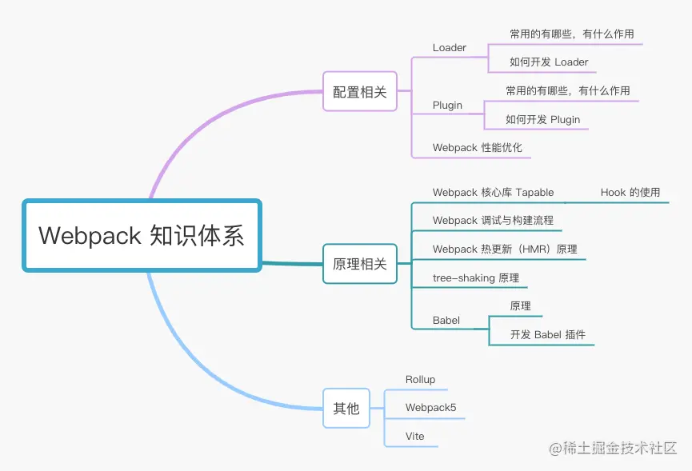
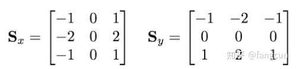
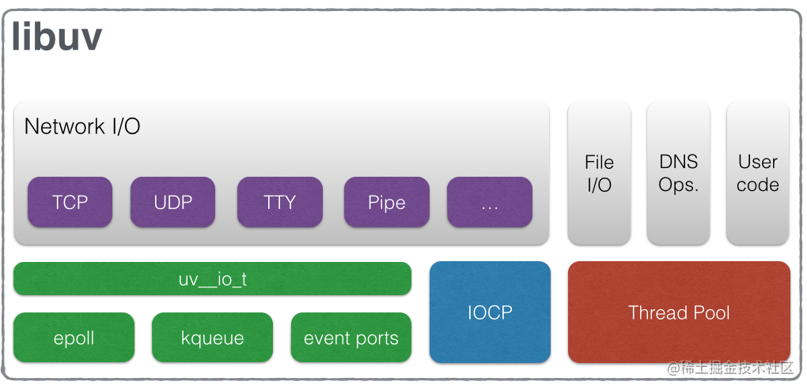
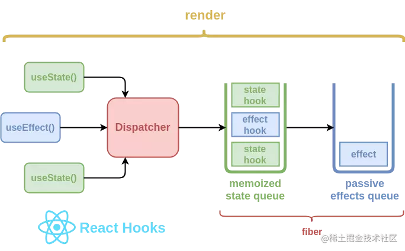

# 2021
## 11.24
### webpack配置路径别名duration
webpack.base.conf.js
resolve -> alias -> 配置项
例子：
```
alias: {
    'vue$': 'vue/dist/vue.esm.js',
    '@': path.resovle(__dirname, 'src'),
}
```
### transition(过渡)

transition-property
transition-duration
transition-timing-function
transition-delay

### animation(动画) + @keyframes

animation-name
animation-duration
animation-timing-function
animation-delay
animation-iteration-count
animation-direction

@keyframes ani {
    20% { opacity: 0.3; }
    40% { border-readius: 100px; }
}

### 3D地图
创建地图
```
const map = new FMap3D.Map(el, {
    zoom: 16, 
    center: [116.461753, 39.908391], 
    pitch: Math.PI / 3 //地图倾斜角度
})
```
鼠标事件:
地图容器接受到鼠标事件之后，会被分发给不同的layer, layer根据事件做出响应。


```
layer.on('click', (feature, event, lnglat) => {
    if(feature) {
        feature.setStyle({
            fill: {
                color: 'red'
            }
        })
    }
})
```

### onclick与addEventListener区别

onclick事件在同一时间只能指向唯一对象
addEventListener可以给一个事件注册多个listener
addEventListener对任何DOM都是有效的，而onclick仅限于HTML
addEventListener可以控制listener的触发阶段，(捕获/冒泡)。对于多个相同的事件处理器，不会重复触发, 不需要手动手机用removeEventListener清楚
IE9使用attachEvent和detachEvent

addEventListener(event, function, useCapture)
useCapture: true(捕获) false(冒泡)

### js原生属性方法

getComputedStyle(element, pseudo-element) 返回当前元素所有最终使用的css属性值
getPropertyValue("color") 取出元素最终计算出的css样式
window.getComputedStyle(a).getPropertyValue("color");

### foreach和map的区别

foreach不会返回执行结果，而是undefined,foreach会修改原来的数组。而map()方法会得到一个新的数组并返回

## 11.25
### FGL
FGL提供两种渲染器:

WebGL渲染器: 将一般物体用WebGL方式渲染到画布上
DOM渲染器: 将普通DOM元素置于正确的世界坐标系下

光源种类:
环境光: 不产生阴影，改变物体的颜色
平行光: 太阳光
聚光灯: 圆锥形的光线
点光源: 球状光线

物体:
由Geometry,Material组成

## 11.26
### WebGL绘制流程
1. 准备数据阶段
2. 生成顶点着色器
3. 图元装配(画出一个个三角形) 顶点坐标 -> 图元
4. 生成片元着色器
5. 光栅化(生成像素点，生成片元) 图元 -> 片元

#### 获取顶点坐标
三维软件导出顶点坐标 -> 将顶点坐标写入缓存区

#### 图元装配
顶点坐标 -> 传入顶点着色器 -> 图元装配

顶点着色器会先将坐标转换完毕，然后由GPU进行图元装配，有多少顶点，这段顶点着色器程序就运行了多少次。

#### 光栅化

图元 -> 生成片元 -> 片元 -> 光栅化 -> 片元

#### 片元着色器处理流程

图元 -> 传入顶点 -> 片元着色器 -> 光栅化
片元着色器是生成多少像素，运行多少次

### Three.js
#### Three.js具体流程
创建场景 -> 配置场景 -> 创建模型 -> 创建材质 -> 生成着色器 -> 渲染

#### Three.js目录结构
```
/build three源码，一份压缩，一份未压缩
/docs 帮助文档, 可以查看构造函数，方法，属性的属性说明
/editor 可视化编辑器，创建在线预览的三维场景
/examples 各种三维的demo
/src three.js引擎每一个主要构造函数对应的源代码
```

### CDN
CDN是建立并覆盖在承载网之上，由分布在不同区域的边缘节点服务群组成的分布式网络
CDN支持多种场景加速: 图片小文件，大文件下载，音视频点播，直播流媒体，全站加速，安全加速

CDN全过程:
1.当终端用户向www.a.com下的指定资源发起请求时，首先向本地DNS发起域名解析请求
2.本地DNS检查缓存中是否有www.a.com的IP地址记录。如果有，则直接返回给终端用户，如果没有，则向授权DNS查询。
3.当授权DNS解析www.a.com时，返回域名CNAME www.a.tbcdn.com对应的IP地址。
4.域名解析请求发送至阿里云DNS调度系统，并为请求分配最佳节点IP地址
5.LDNS获取DNS返回的解析IP地址。
6.用户获取解析IP地址
7.用户向获取的IP地址发起对该资源的访问请求

## 11.29
### three.js
#### 渲染要素
几何体 Geometry
场景对象 Scene
网络模型 Mesh
光源 点光源 环境光
相机设置 
创建渲染器对象

#### 动画
requestAnimationFrame
专门为动画设计的API，不展示的时候不会渲染，与浏览器重绘的频率一致

#### 鼠标操作三维场景旋转缩放
three.js控件OrbitControls.js
可以控制视角，进行旋转缩放平移

#### 光照设置
AmbientLight 环境光
PointLight 点光源
DirectionalLight 平行光
SpotLight 聚光源

#### 顶点
BufferGeometry
1. geometry.attributes 
attributes.postion
attributes.color
attributes.normal
attributes.uv
attributes.uv2
2. geometry.index 顶点索引属性
3. BufferAttribute 对象

## 11.30
#### 照相机
透视投影相机 (远大近小)
THREE.PerspectiveCamera(fov, aspect, near, far)
fov: 张角, aspect: canvas的宽高比 
正交投影  (远近都一样大)

Geometry本质都是一个一个三角形拼接而成的,所以可以通过设置三角形的法线方向向量来表示集合提表面各个位置的法线方向向量

#### 常用材质介绍
点材质: PointsMaterial
线材质: LineBasicMaterial LineDashedMaterial 
网格材质: MeshBasicMaterial MeshLambertMaterial MeshPhongMaterial MeshStandardMaterial MeshPhysicalMaterial MeshDepthMaterial MeshNormalMaterial
精灵Sprite材质: SpriteMaterial
自定义着色器材质: RawShaderMaterial ShaderMaterial

#### 层级模型和组对象
对于每个几何物体，我们可以将其组合成一个Group,Group又可以组成新的Group从而形成树状结构，对多个几何物体进行相同的操作，并可以进行一系列遍历。

## 12.1
### Geometry渲染参数
#### CubeGeometry
width, height, depth, widthSegments, heightSegments, depthSegments
#### PlaneGeomtry
width, height, widthSegments, heightSegments
#### SphereGeometry
radius, segmentsWidth, segmentsHeight, phiStart, phiLength, thetaStart, thetaLength
#### CircleGeometry
参数类似球体
#### Cylinder
radiusTop radiusBottom height radiusSegments heightSegments openEnded
#### 正多面体
指定半径就行
#### ToursGeometry
圆环面 
radius 圆环半径 tube 管道半径 

### 曲线
#### ArcCurve(圆弧线)
ArcCurve(aX, aY, aRadius, aStartAngle, aEndAngle, aClockwise)
getyPoints() 按照一定的细分精度返回沿着圆弧线分布的顶点坐标,返回一组由二维向量或者是三维向量的数组

#### 样条曲线和贝塞尔曲线
样条曲线设置多个顶点，形成一条光滑的曲线
贝塞尔曲线有两个起始点和一个控制点,二次贝塞尔曲线有两个起始点和两个控制点

CurvePath可以把多个圆弧线,样条曲线，直线等组合成一个曲线

TubeGeometry 曲线路径管道成型

LatheGeometry 旋转成型
LatheGeometry(points, segments, phiStart, phiLength)
points  坐标数据组成的数组
segments  圆周方向细分数,默认12
phiStart 开始角度,默认0
phiLength 旋转角度,默认2pai

ShapeGeometry 轮廓填充
根据轮廓的顶点使用三角面Face3自动填充中间区域

```
var shape = new THREE.Shape(points);
var geometry = new THREE.ShapeGeometry(shape, 25);
```

ExtrudeGeometry 拉伸成型
五点可以描述一条曲线,再进行拉伸
```
var geometry = new THREE.ExtrudeGeometry(
    shape, //二维轮廓 
    //拉伸参数
    {
        amount: 123, //拉伸长度
        bevelEnabled: false 
        
    }
)
```

## 12.3
### 纹理贴图
纹理贴图加载器TextureLoader的load方法加载一张图片可以返回一个纹理对象Texture,纹理对象Texture可以作为模型材质颜色贴图.map属性的值
```
var textureLoader = new THREE.TextureLoader();
textureLoader.load(url, function(texture) {
    let material = new THREE.MeshLambertMaterial({
        map: texture,
    })
});
let mesh = new THREE.Mesh(geometry, material);
scene.add(mesh);
```

图片的url要用import引入，如果是字符串则不会进行解析，直接当成字符串处理

访问uv坐标
geometry.attributes.uv

## 12. 6
### uv贴图
uv贴图中的坐标和真实坐标一一对应，通过点的坐标进行关联
### 渲染管线流程
顶点数据->顶点着色器->几何着色器->图元装配->剪切->光栅化->片元着色器
1. 首先接受用户传进来的数据
2. 顶点着色器(常用的三个修饰符attribute,uniform, varying)
attribute只在顶点着色器才有，片元没有(只读,不能声明数组或结构体)
uniforms修饰的是全局变量,一般表示变换矩阵，材质，光照参数，颜色(只读，因为顶点着色器和片元着色器可以共享同一个uniform块,因此在两个着色器中,uniform声明要一致)
varying顶点着色器计算每个顶点的值写入varying变量,然后片元着色器使用该值,因此varying在顶点着色器可写,在片元着色器只读。作为顶点着色器和片元着色器之间传递插值数据,因此也要声明一致。
3. 几何着色器
几何着色器位于顶点着色和片元着色之间,根据顶点信息批量处理几何图形，因此几何着色器输入变量都是数组类型。
4. 图元装配
前面着色阶段处理的都是顶点数据,那么这些顶点是如何构成几何的信息也会被传递到OpenGL,图元装配就是将这些顶点与相关的几何图元之间组织起来，将一堆顶点数据根据原始链接关系还原出网络结构，然后准备下一步的剪裁和光栅化。
5. 剪裁
顶点可能会落在我们绘制的窗口之外,要把它和相关的图元剪切。
6. 光栅化
剪切之后马上要执行的工作就是光栅化，就是将更新后的图元传递到光栅化单元,生成对应的片元。
比如找出三角形所覆盖的像素，这时候完成坐标的转换。
7. 片元着色器
前面讲顶点着色器的输出varying,varying变量在光栅化阶段被线性插值计算后,在片元着色器作为输入
samplers: 一种特殊的uniform,用于呈现纹理...
计算顶点法向量vNormal和入射光方向两个向量的点积,计算得到的diffuse就是点光源的强度


## 12.7
### GLSL语言学习
sampler2D 2D纹理
samplerCube 盒纹理

向量访问的方式
vector.xyzw 
vector.rgba
vector.stpq

需要进行显式的类型转换

函数参数限定符
in复制到函数中可读写
out返回时从函数中复制出来
inout复制到函数中并在返回时复制出来

构造函数
聚合类型对象需要使用构造函数来进行初始化

精度限定
highp, mediump, lowp 即可完成对该变量的精度声明

invariant关键字显式要求计算结果必须精确一致
```
\#pragma STDGL invariant(all)
invariant varying  texCoord
```

限定符的优先级
invariant关键字来显式要求计算结果一致
在一般变量中  invariant > storage > precision
在参数中 storage > parameter > precision

预处理命令
```
#define 定义宏
#undef 取消已定义的宏
#if 如果给定条件
#ifdef 如果宏已经定义,则编译下面代码
#ifndef 如果宏没有定义,则编译下面代码
#elif 如果前面的#if给定条件不为真,当前条件为真,则编译一下代码
#endif 结束一个#if......#else条件编译块
```

内置的特殊变量
glsl程序使用一些特殊的内置变量与硬件沟通.他们大致分成两种,一种是input类型,他负责向硬件(渲染管线)发送数据.另一种是output类型，负责向程序回传数据，以便变成时需要。

vertex Shader中
output类型的内置变量
highp vec4 gl_Position;  (顶点坐标信息vec4)
mediump float gl_PointSize; (顶点的大小float)

fragment Shader中
input类型的内置变量 
mediump vec4 gl_FragCoord 片元在framebuffer画面的相对位置vec4
四维的最后一维是布尔值,非零代表三维空间中的一个点(x,y,z),若是0,则表示一个向量

bool gl_FrontFacing 标志当前图元是不是正面图元的一部分bool
mediump vec2 gl_PointCoord 经过插值计算后的纹理坐标 vec2

output类型的内置变量
mediump vec4 gl_FragColor 设置当前片点的颜色 vec4 RGBA color
mediump vec4 gl_FragData[n] 设置当前片点的颜色,使用glDrawBuffers数据数组 vec4 RBGA color

### 图形绘制管线的三个阶段
应用程序阶段
几何阶段
光栅阶段

1. 应用程序阶段
在该阶段的末端,几何体数据通过数据总线传送到图形硬件
2. 几何阶段
主要负责顶点坐标,光照,剪裁,投影以及屏幕映射,该阶段基于GPU进行计算
3. 基于几何阶段的输出数据,为像素正确配色,以便绘制完整图像,该阶段进行的都是单个像素的操作,每个像素的信息存储在颜色缓冲器中
光照计算涉及视点,光源,和物体的世界坐标,所以通常放在世界坐标中进行计算,而雾化以及涉及物体透明度的计算属于光栅化阶段.

## 12.8### 顶点坐标顺序
模型坐标空间(object space) -> 世界坐标空间(world space) -> 观察坐标空间(camera / eye space) -> 屏幕坐标空间(project space)
给予一个世界坐标来描述四阶矩阵控制 world matrix
观察坐标空间的生成也就是形成视锥体的过程,超出视锥体范围的东西都会被剪裁掉
观察坐标空间 -> 屏幕坐标空间总共有3步
1. 用透视变换矩阵把顶点从视锥体中变换到剪裁空间的CVV中
2. 在CVV进行图元剪裁
3. 屏幕映射: 将经过前述过程得到的坐标映射到屏幕坐标系上

图元装配(Primitive Assembly)
将顶点根据primitive(原始的连接关系)还原出网格结构。网格由顶点和索引组成,在之前的流水线中是对顶点的处理,在这个阶段是根据索引将顶点连接在一起,组成线,面单元。之后就是对超出屏幕外的三角形进行剪裁。

### 图形硬件
深度缓冲区(Z Buffer) -> 模板缓冲区(Stencil Buffer) -> 帧缓冲区(FrameBuffer) -> 颜色缓冲区(color Buffer)
Vertex program -> Fragment program 
前者的输出是后者的输入

### 矩阵
OpenGL有六种坐标
1. 物体或模型坐标系 Object or Model Coordinates
2. 世界坐标系 World Coordinates
3. 眼坐标或相机坐标 Eye or Camera Coordinates
4. 剪裁坐标系 Clip Coordinates
5. 标准设备坐标系 Normalized Devices Coordinates
6. 屏幕坐标系 Window or Screen Coordinates
坐标变换矩阵栈
vertexData -> (LOCAL SPACE 局部坐标) -> ModelMatrix(模型矩阵) -> (World Space 世界坐标) -> ViewMatrix -> (VIEW SPACE 相机坐标) -> ProjectionMatrix(投影矩阵) -> (Clip Space 齐次剪裁坐标) -> (同除以w) -> NDC (Normalized Device Coordinates) -> ViewportTransform(视口变换) -> Screen space => (Fragment Shader)

matrix 本地矩阵 包含了PRS
matrixWorld 是该对象本地矩阵和所有父节点的乘积
叶节点.matrixWorld = scene.matrixWorld * .... * 叶子结点.matrix

position表示本地坐标 getWorldPosition是世界坐标，是对象及其所有父节点position相加

viewMatrix = camera.matrixWorldInverse
在模型矩阵中，位于最右侧的一列元素取决

matrix 本地矩阵
旋转矩阵
cosb -sinb 0 
sinb cosb  0
0    0     1
平移矩阵
1 0 0 Tx
0 1 0 Ty
0 0 1 Tz
0 0 0 1 
缩放矩阵
Sx 0 0 0 
0 Sy 0 0
0 0 Sz 0
0 0 0  1

剪裁坐标和NDC不同，Vertex Shader的输出就是在Clip Space上，接下来 GPU会做剪裁，剔除在Clip Space范围之外的定点，然后GPU再做透视除法将定点转到NDC

### smoothstep函数
smoothstep(start,end,parameter)
```
float smoothstep(float t1, float t2, float x) {
    x = clamp((x - t1) / (t2 - t1), 0.0, 1.0);
    return x * x * (3 - 2*x);
}
```
x = start, y = 0,
x = end, y = 1,
实现更加平滑的渐变


## 12.9
### 画彩虹
```
gl_FragColor = texture2D(map, vec2(st.t, st.s));
```

### loadingmanager
其功能时处理并跟踪已加载和待处理的数据.如果为手动设置加强管理器,则会为加载器创建和使用全局实例加载器管理器
在各个不同的阶段,可以跟踪不同的数据
onStart 
onLoad
onProgress
onError

## 12.13
performance.now()的时间单位是毫秒
纹理平铺的相关属性
THREE.ClampToEdgeWrapping 表示纹理边缘与网格的边缘贴合,中间部分等比缩放。
THREE.RepeatWrapping 重复平铺
THREE.MirroredRepeatWrapping 先镜像再重复平铺

### 精灵模型模拟下雨
随机生成雨滴的位置
把所有雨滴加入group中,在render函数中改变每个雨滴的y坐标

### 帧动画模块
关键帧 KeyframeTrack
剪辑 AnimationClip
操作 AnimationAction
混合器 AnimationMixer

1. 编辑关键帧
KeyframeTrack + AnimationClip
关键帧动画
创建位置关键帧对象
```
let times = [0, 10];
let values = [0, 0, 0, 150, 0, 0]
let posTrack = new THREE.KeyframeTrack('Box.position', times, values)
```
创建颜色关键帧对象
let colorKF = new THREE.KeyframeTrack('Box.material.color', times, values)
创建关键帧数据
let scaleTrack = new THREE.KeyframeTrack('Sphere.scale', times, values)
多个帧动画作为元素创建一个剪辑clip对象,命名default,持续时间20
let clip = new THREE.AnimationClip("default", duration, [posTrack, colorKF, scaleTrack])
2. 播放关键帧
AnimationAction + AnimationMixer
```
let mixer = new THREE.AnimationMixer(group);
let AnimationAction = mixer.clipAction(clip);
通过操作Action设置播放方式
AnimationAction.timeScale = 20;
AnimationAction.play();
```
mixer.update(clock.getDelta());

## 12.14
### geometry的偏移和mesh偏移的区别
geometry的偏移是物体的网格偏移了,但是物体的世界坐标还在原来的位置,这样可以实现一个绕着世界坐标的中心点旋转的物体效果
geometry.translate(x,y,z);
mesh.rotateY(Math.PI * 0.5)
mesh的偏移是将物体的世界坐标改变,因此让其旋转,是在原地旋转
mesh.translateOnAxis(new THREE.Vector3(1,0,1), 30);

### 旋转矩阵的推导及其应用
Xnew = Xold + Tx;
Ynew = Yold + Ty;
二维坐标系下，旋转矩阵是
cos -sin
sin cos
三维坐标系下,旋转矩阵是
绕x轴旋转
1  0  0
0 cos sin
0 -sin cos
绕y轴进行旋转
cos 0 -sin
0   1  0
sin 0  cos
绕z轴进行旋转
cos sin 0
-sin cos 0
  0   0  1

### 旋转一个点
旋转轴
旋转方向
旋转角度

## 12.15
### WeakMap
属性: WeakMap.prototype.constructor
```
let wm = new WeakMap([[k1, v1], [k2, v2]])
```
WeakpMap初始化参数是一个Iterable的对象,可以是二元数组或者其他可迭代的键值对的对象。每个键值对会被加到新的WeakMap里
WeakMap对key有限制,它必须是Object

方法: 
WeakMap的方法也特别少,只有四个: delete, get, has, get
一般用于以DOM节点为键名的场景

### for in 和 for of
使用foreach遍历数组,使用break不能中断循环
for in 遍历对象 index索引为字符串型数字,不能进行几何运算
遍历顺序有可能不是按照实际数组的内部顺序
for in 会遍历数组所有的可枚举属性,包括原型。for in 遍历的是数组的索引,而for of遍历的是数组元素值
for in 更适合遍历对象, for in不适合遍历数组
for of 遍历数组的value
## 12.16
### THREE源码
Core::Object3D
属性parent和children说明,通常需要使用树来管理众多Object3D对象。
比如一辆行驶的汽车是一个Object3D对象，控制汽车行驶路线的逻辑在该对象内部实现，汽车的每个顶点经过模型矩阵的处理后，都位于正确的位置；但是汽车摆动的雨刮器，其不但随着汽车行驶方向运动，而且自身相对汽车也在左右摆动，这个摆动的逻辑无法在汽车这个对象内部的实现。解决的方法是，将雨刮器设定为汽车的chidren，雨刮器内部的逻辑只负责其相对于汽车的摆动。在这种树状结构下，一个场景Scene实际上就是最顶端的Object3D，它的模型矩阵就是视图矩阵（取决于相机）的逆矩阵。

属性matrix和matrixWorld就很好理解了，matrix表示本地的模型矩阵，仅仅表示该对象的运动，而matrixWorld则需要依次向父亲节点迭代，每一次迭代都左乘父亲对象的本地模型矩阵，直到Scene对象——当然，实际上是左乘父亲对象的全局模型矩阵。

## FGL源码阅读
### core
1. Base类
主要的存储结构是weakmap
deepObject对对象进行深度遍历把路径写入到key中,splitObject对对象进行分拆,与deepObject是一个反过程
2. SkyObject类
继承自THREE.Object3D
3. SkyBox类

### Map
1. MeshBasicEarth
INIT 
通过INIT_GEOMETRY和INIT_MATERIAL生成网格模型
并且把配置中的position和scale写入到生成的MESH中

INIT_GEOMETRY
通过配置生成对应的geometry

INIT_MATERIAL
通过配置生成对应的Material,配置中的map可能是对象,或者是一张贴图,根据map的不同类型不同处理

INITIONS
将def,opt合并,形成新的配置参数

setEnvMap
设置环境地图

dispose
删除地图上对应的Mesh实例

2. GeojsonPointMap
与上面类似，不同的是需要遍历json文件来生成球状地图
多了一个CREATE_POINT方法,根据json文件的数据来生成对应的球面坐标

3. GeojsonLineMap
因为是线状图,所以首先就有CREATE_LINE这样的一个方法,循环coordinates数组,数组中的前后两项构成线
同时在INIT_GEOMETRY中添加自定义属性
在fs文件中处理动画相关的亮度
setMaterialUniform

4. GeojsonInteractionMap
INIT_GEOMETRY
生成PlaneBufferGeometry,
并将几何体平移到中心点

5. MyFamilyBuckets 
INIT 
循环initions创建动画,将动画的id加入到map中


## 12.22
vuepress插件
文档实例的最佳实践方案
Demo Container使用Vuepress的chainMarkdown,extendMarkdown API 拓展了其内部的markdown对象

### vuepress-plugin-demo-block
通过Vuepress clientRootMixin API混入页面的mounted,updated生命周期,读取示例代码分离template,script,style代码块
template包裹的代码块直接插入示例节点
script包裹的代码块通过Vue.extend编译出Vue对象,再调用其$mount()方法挂载到示例dom
style包裹的代码块直接插入document
这么做的问题是template代码块中不能包含Vuepress中全局注册的组件

### vuepress-plugin-demo-code
通过Vuepress extendMarkdown API 拓展内部markdown对象,进而识别::: demo xxx :::代码块,将其包裹的示例代码直接插入Markdown文档等待vue-loader处理。

### vuepress-plugin-extract-code
提供了一个RecoDemo组件用于在Markdown中构造示例页面,并通过Vuepress chainMarkdown API给Vuepress内部的markdown添加一个插件,该插件负责,手动解析RecoDemo中的<<< @/docs/.vuepress/demo/demo.vue?template语法

### 插件配置
component
类型: string
默认值: demo-block
包裹代码与示例的组件名称
通过Slot demo(被渲染成示例), Slot description(被渲染成示例描述信息), Slot source(被渲染成示例的源代码)

## 12.23
### Reflect.ownKeys()
返回一个由目标对象自身的属性键的数组
### Map和Object的区别
Object本质上是哈希结构的键值对的集合,它只能用字符串,数字或者Symbol等简单数据类型当作
将dom节点作为键,但是由于对象只接受字符串作为键名,所以键被自动转为字符串[object HTMLDivElement]
Map类继承了Object,并对Object功能做了一些拓展,Map的键可以是任意的数据类型

同名碰撞
对象其实就是在堆开辟了一块内存,其实Map的键存的就是这块内存的地址。只要地址不一样,就是两个不同的键,这就解决了同名属性的碰撞问题,object属性名相同的话,就只能覆盖先前的值

可迭代
Map实现了迭代器,可以同for...of遍历,而Object不行

长度
Map可以直接拿到长度,而Object不行

有序性
填入Map的元素,会保持原有的顺序,而Object无法做到。

可展开
Map可以使用省略号展开,而Object不行。

### 不可迭代对象变成可迭代对象(Symbol.iterator)
设计一个迭代器
迭代器本身是一个对象,这个对象有next()方法返回结果对象,这个结果对象有下一个返回值value,迭代器完成布尔值done,
```
function createIterator(items){
    let i = 0;
    return{
        next(){
            let done = (i>=items.length);
            let value = !done ? items[i++] : undefined;
            return{
                done,
                value
            }
        }
    }
}
let arrayIterator = createIterator([1,2,3])
```
创建迭代器
ES6封装了generator用来创建迭代器。显然生成器是返回迭代器的函数,这个函数通过function后的*号表示,并使用新的内部专用关键字yield指定迭代器next()方法的值
用ES6生成器创建一个迭代器
```
let obj = {
    *createIterator(items){
    for(let i in items){
        yield items[i];
    }
  }
}
```
let someIterator = createIterator([123, 'mge']);
可迭代对象具有Symbol.iterator属性,即具有Symbol.iterator属性的对象都有的默认迭代器
判断是否可迭代
```
const isIterator = obj => obj != null && typeof obj[Symbol.iterator] === 'function';
```

## 12.24
### LatheGeometry
旋转造型,可以利用已有的二维数据生成三维顶点,二位数据可以通过二维向量对象Vector2定义,默认绕y轴旋转
样条曲线插值计算
借助Shape对象的方法.splineThru,把上面的三个顶点进行样条插值计算,可以得到一个光滑的旋转曲面
```
var shape = new THREE.Shape();//创建Shape对象
var points = [...vector2]
shape.splineThru(points);
var splinePoints = shape.getPoints(20); //二维形状
var geometry = new THREE.LatheGeometry(splinePoints,30); //旋转
```

## 12.27
设置index的时候节点按逆时针顺序连接,顺序不对就看不见了
shapeGeometry顶点顺序和加入时相反,shape.arc的圆心是相对于上一个节点的相对坐标
glsl mix(x,y,a)
a控制混合结果 x(1-a)+y*a

Material的公有属性
webgl深度缓冲

## 12.28
### OpenGL的空间变换
#### 世界空间
相对于其他空间来说是不变的，所以,它也被用作空间变换的参考系
#### 模型空间
可以以世界坐标系中的某点来作为模型空间的原点
模型变换(模型-世界变换)
默认情况下模型坐标系的原点位于世界坐标系的原点,我们可以通过一系列缩放,旋转,平移,将模型以任意角度摆在任意位置。
这种情况下,模型的顶点以及模型自身的坐标系都会相对世界坐标系变化。

假设有一个模型坐标系表示为矩阵 M（基于世界坐标系来描述），一个顶点在该模型坐标系上的坐标表示为列向量 D。 那么，该顶点在世界坐标系中的坐标 D‘，有如下变换关系：M·D = D’。M 也称为模型矩阵。模型矩阵本质上是一系列缩放、旋转和*移矩阵的复合矩阵。
#### 视图空间
是以摄像机的角度来定义的一个空间。
正交投影中,摄像机与视图坐标系的位置关系图类似于模型-世界坐标系
世界坐标系是父坐标系

视图变换的实质就是将某个顶点在世界空间中的描述，转换为在视图空间中的描述。假设有一个顶点在在世界坐标系中的坐标表示为列向量 D‘，一个视图坐标系表示为矩阵 V（基于世界坐标系来描述的），那么该顶点在视图坐标系 V 中的坐标 D，有如下变换关系：V·D = D’（道理和模型变换类似）。设 V 的逆矩阵为 V’，可以推导出变换关系 V‘·D‘ = D，V’ 也被我们称为视图矩阵。

采用模型视图矩阵的优点
渲染一个模型时，我们通常需要将模型坐标转换成世界坐标，世界坐标转成视图坐标
将模型矩阵和视图矩阵结合在一起就形成了模型视图矩阵
1. 一次矩阵变换比两次矩阵变换更高效
2. 一次矩阵变换的精确性更高

透视投影的剪裁规则
在变换到裁剪空间之后，我们将赋予齐次坐标的 w 分量更加丰富的含义：作为一个临界值来判断一个经过裁剪变换后的顶点是否位于视景体内。如果变换后的坐标值 x、y、z 均在区间 [-w, w] 内，则表明该顶点在视景体内。否则，表明该顶点不在视景体内，将会被抛弃。

正交投影的剪裁规则
如果变换后的坐标值 x、y 、z 均在区间 [-1, 1] 内，则表明该顶点在视景体内。而且这里的 w 为 1，所以其裁剪的判断规则与透视投影中是一致的。

### 标准设备坐标空间（NDC Space）
对于正交投影，任意顶点在裁剪空间的坐标值 x、y 、z 均在区间 [-1, 1] 内，这种情况下无需任何变换，裁剪空间本身也是标准设备坐标空间。

对于透视投影，我们只需要对顶点在裁剪空间的坐标执行齐次坐标标准化，使其 w 分量变为 1。对应的 x、y、z 也将会缩小到范围 [-1, 1] 内。这种情况下，标准化的过程其实也是将顶点从裁剪空间坐标变换到到标准设备坐标空间的过程。

## 12.30
### PlaneGeometry的绘制顺序 右下 -> 左下 -> 右上 -> 左上 

## 1.5
### this.$router和this.$route的区别
this.$router相当与全局的路由器对象,包含了很多属性和对象,任何页面都可以调用其push(), replace(), go() 等方法
this.$route表示当前路由对象,每一个路由都会有一个route对象,是一个局部对象,可以获取对应的name,path,params,query等属性

### v-for和v-if优先级的高低
v-for优先级更高

### import
import * as xxx from 
这种导入是把所有的输出包裹到对象中

es6 重命名 当引入的两个模块变量名相同时，可以使用重命名的方式

## 1.6
### 本地测试npm包
npm link 可以在本地项目和本地npm模块之间建立连接,进入包内 npm link,包会被映射到全局中的node_global -> node_modules中
进入本地项目中, npm link 模块名 (package.json中的name)

## 1.18
### THREE新版本和旧版本orbitControls的区别
新版本 1.35
旧版本 0.92

旧版本使用需要使用引入orbitControls作为以来
新版本则是直接导出构造函数

旧版本还需要每一帧更新control
```
this.$controls.update();
this.$renderer.render(this.$scene, this.$camera);
```

## 1.20
### Material 学习
基于深度着色的MeshDepthMaterial
可以通过相机的near和far参数来控制物体是否可见
改变场景中的所有的物体的材质
```
var scene = new THREE.Scene();
scene.overrideMaterial = new THREE.MeshDepthMaterial();
```
#### blending属性
NoBlending:z-buffer值较大的像素将会遮挡z-buffer值较小的像素,没有纹理融合的效果,设置纹理透明度无效
NormalBlending:默认选项,根据z-buffer正常显示纹理,这是标准混合模式,它单独使用顶层,而不将其颜色与其下面的层混合
AdditiveBlending:此混合模式只是将一个图层的像素值添加到另一个图层,如果值大于1，则显示白色。线性减淡颜色值,由于它总是产生与输入相同或更浅的颜色，因此它也被称为"加亮"
SubtractiveBlending:此混合模式将一个图层的像素值减去另一个图层像素值，如果为负数，则显示黑色。
MultiplyBlending:颜色混合,源图像的RGB分量与目标图像RGB分量的相乘。

#### 深度缓冲区
深度测试的意义在于舍弃片元与否。
深度写入的意义在于深度测试的基础上，要不要覆盖深度缓冲，即重新设立深度测试的标准。
深度写入可以保证像素级的深度关系
GPU的渲染流程

片元 -> 模板测试 -> 深度测试 -> 混合 -> 颜色缓冲区

blending: THREE.AdditiveBlending 把源和目标的RGB三通道分别进行相加
混合设置要传给WebGLRenderer渲染材质的RGB和透明度, 所以材质参数中要开启透明度设置

深度测试的大概流程：

开始深度测试 -> 是否开启了深度测试 -> 比较该片元的深度和已经存在于深度缓冲区中的深度值(如果当前 fragment 的 Z 值小于取出来的值则更新 depth buffer 里面的值, 如果大于取出来的值说明该点在一个物体后面这个 fragment 将会被丢弃) -> 是否通过了深度测试 -> 是否开启了深度写入 -> 将深度值写入深度缓冲区

混合的大概流程: 

开始混合 -> 是否开启了混合 -> 得到片元的颜色值 和 已经存在与颜色缓冲区的颜色值 -> 进行混合操作 -> 更新颜色缓冲区的值

AlphaTest(透明度测试)

仅渲染在一定范围内的像素,和深度测试一样,也可以定义比较的规则


半透明模型和不透明模型
在进行不透明物体渲染时,我们需要开启深度缓冲区,进行深度写入操作,保证场景中的不透明物体间有正常的深度关系。
半透明模型需要需要遵循画家算法由远及近进行绘制,最终效果才会正确

## 1.24

### z-fighting
两个图形在同一个像素上的深度相同而出现闪烁
解决z-fighting的思路
1.设置不同的深度
2.设置合适的near和far值
near和far与深度缓冲也密切相关,深度缓冲其实是非线性的,靠近相机的地方精度越高,

### 四元数
q = ((x,y,z), w) 


## 1.29
### 矩阵变换
Object3D的3种矩阵对象
Object3D.matrix 相对于其父对象的局部模型变换矩阵
Object3D.matrixWorld 对象的全局模型变换矩阵
Object3D.modelViewMatrix 表示对象相对于相机坐标系的变换,


## 2.8
### 齐次坐标
点位置: (x,y,z,w) w不为0
向量: (x,y,z,0)
用矩阵来表示三维空间中的对象
### 四元数
表达式(a, b, c, d)
a = sin(theta / 2) * A.x
b = sin(theta / 2) * A.y
c = sin(theta / 2) * A.z
d = cos(theta / 2)


## 2.10
### 屏幕射线的计算
1. 首先确定相机的原点
2. 随后计算点击像素点坐标在world frame中的坐标
3. 最后,在world frame中使用点击的像素点的世界坐标减去相机位置,标准化后得到方向矢量
   
### 射线和几何体相交检测
射线和几何体相交检测实际上是要计算出屏幕射线和构成几何体的所有三角形是否相交,只要射线和其中至少一个三角形相交，我们就认为射线和几何体相交。
通常使用绑定容积进行保守检测计算。 bounding volume通常为围绕几何体的球体胡后者方形体, 这些sphere或者box一般根据几何体的顶点数据近似获得。

使用几何体的顶点表达来获得Bounding Volume, 不管是sphere还是box,比较容易确定。

ray-geometry相交检测的原理
屏幕射线和几何体的多个面中有一个相交就相交

## 2.17
### 齐次坐标与仿射变换
在三维空间一个点(x, y, z)可以在齐次坐标中用一族来表示
仿射变换是两种简单变换的叠加，一个是线性变换， 一个是平移变换

### console.log() 的延迟打印问题
chrome的控制台出于性能考虑,对引用数据类型的数据读取是存在延迟的,默认读取一层数据,当你点击展开时，会重新去堆内存中读取属性值和下一层的数据


## 2.22
### Vue中extend和mixins,extends
Vue.component是用来注册或获取全局组件的方法
```
Vue.component('global-component', Vue.extend(baseOptions));
Vue.component('global-component', baseOptions);
上面两行代码等价
//获取注册的组件
var MyComponent = Vue.component('my-component')
```
Vue.extend扩展Vue构造器,从而用预定义选项创建可复用的组件构造器

mixins是合并一个对象，mixins中的data会合并到data中,有冲突的话，data中数据覆盖mixins中的数据，钩子函数则是先执行mixins的钩子函数

### composition-api
ref  (用来包装基础数据类型)
reactive (用来包装引用数据类型)
toRefs  (把一个响应式对象转换成普通对象, 该普通对象的每个property都是一个Ref)
toRef   (将reactive包装后的引用数据类型的值, 通过ref包装为响应式, 但可新增属性)
readonly  (被readonly包装后, 变为只读属性, 不可更改数据 ）
readonly() 和 Object.freeze() 冻结属性有些相似
不同的 是 Object.freeze() 直接将原数据冻结
readonly() 返回一个新的数据，不改变原数据
watchEffect 
computed
生命周期


### Object.freeze,Object.seal,Object.preventExtensions
Object.freeze过程
1.设置Object.preventExtensions(),禁止添加新属性
2.设置writable为false,禁止修改
3.设置configurable为false,禁止配置
4.禁止更改访问器属性
Object.freeze禁止了所有可设置内容
Object.isFrozen()判断一个对象是否是冻结对象

Object.seal过程
1.设置Object.preventExtension(), 禁止添加新属性
2.设置configurable为false, 禁止配置
3.禁止更改访问器属性

Object.freeze 禁止修改对象的所有属性
Object.seal   可以修改属性，但不能新增，删除属性

### 函数传参
基本类型传值，复杂数据类型传引用

## 2.24
### 自定义插件
外界调用Vue.use(), 就会调用本身的install方法，同时传一个Vue这个类的参数
```
const Loading={
    install:function(Vue){
        Vue.component('Loading',LoadingComponent)
    }
}
```
外界在use这个组建的时候，就会调用本身的install方法,同时传一个Vue这个类的参数
全局组件
```
Vue.component('globalcomponent',globalcomponent)
```
局部组件
在组件中注册子组件 
```
components: {subcomponent}
```
编写一个插件需要注意的东西

插件哪些数据是需要从外界获取的，那些属性是computed,watch,数据更新之后如何响应式的更新
遍历所有的子节点，props接收所有的属性
### 碰撞检测
碰撞检测，最主要的就是包围盒，常用的包围盒有Sphere包围盒,AABB包围盒,OBB包围盒,k-Dops
Sphere包围球法: 包含目标对象的最小球体，紧密性差，包围的目标对象会产生大量的冗余空间，剔除效率低，但是其构
造简单、存储空间小且由于球的对称性，不受旋转变化的影响，只需要根据平移量对球心位置进行变化，不需要对包围球结构进
行任何更新操作，适用于检测精度要求不高的运动环境，且很容易计算两个物体的包围球是否发生碰撞。
AABB六边形包围法: 是一个简单的六面体
OBB: 更加精确，但计算也更多

### MVC MVP MVVM
MVC Model View Controller
MVVM Vue实现的是MVVM模式
在Vue中,
View指的是各种template, 
ViewModel指的是对应的js,声明绑定的元素及绑定的数据, 
Binder处理template与js的绑定逻辑，
Model指的是获取数据的逻辑

# 2022

## 9.27
### DevServer 
before方法: 能够在其他所有中间件之前执行自定义的中间件
### resolve
使用resolve字段来配置模块的相关解析策略。本质上是通过resolve库的使用
来解析模块路径,帮助webpack找到bundle中以require/import引入的模块代码。
配置别名
resolve.alias
extensions扩展名选项在resolve追踪到的文件如果没有扩展名时,会尝试在其提供的扩展名选项中进行匹配

### webpack5.x 模块缓存 
多处引用同一模块，最终只会产生一次模块执行和一次导出。 所以, 会在运行时中保存
一份缓存。删除此缓存，则会产生新的模块执行和新的导出。

```
var d1 = require('dependency')

```
### pnpm与npm,yarn
pnpm是一种更高效快捷的包管理器
1. 安全: 代码执行前对其进行检查，以确保安装的完整性
2. 离线模式: pnpm将所有已下载包的压缩文件保存在本地镜像仓库,以实现离线使用,只需要配置--offline参数
3. 快速： 速度是npm和yarn的三倍
pnpm软链接，但是通过软链接把每个包自身的依赖组合在一起，而且每个包只会共享同一份依赖，同时pnpm会把所有直接或间接依赖的项目都注册到package.json里


### ECS + Studio

Studio: pnpm link:ecs
pnpm serve

ECS: npm link
pnpm serve

## 9.28
### localforage 与常用浏览器存储方案对比

Cookie 
缺点: 存储空间有限 4k
每次向服务器都会被携带，增加Web请求大小
只能存储字符串

Web Storage
缺点: 操作过程是同步的会阻塞主线程
存储大小约5MB
只能存储字符串

IndexedDB
浏览器提供的本地数据库，它可以被网页脚本创建和操作。IndexedDB允许储存大量数据,提供查找接口,还能建立索引

支持事务:
只要有异步失败,整个事务都取消，数据库回滚到事务发生之前的记录,
不存在只改写部分数据的情况

localForage的好处
异步离线存储，以免阻塞应用程序
用法上靠近promise,方便执行回调
写法简单,类似Web Storage API
支持存储多种类型数据

## 9.29
### ts回顾
React组件Props
React定义接口，保证各个参数都有

类型断言
```
let num1 = res as number
```

断言
类型断言
类型推断


接口
最好约束一个规范，约束对象或者函数的类型
```
interface Post {
    title: string,
    content: number,
    subTitle?: string,
    readonly task: string,
}
```

泛型
```
function reverse<T>(items: T[]): T[] {
} 
```
保持类型一致

联合类型 string[] | string
交叉类型 extend是一种非常常见的模式

```
function extend(T extends object, U extends object)(first: T, second: U): T & U {
    const result = <T & U>{};
    for(let id in first) {
        (<T>result)[id] = first[id];
    }
    for(let id in second) {
        if(!result.hasOwnProperty(id)) {
            (<U>result)[id] = second[id];
        }
    }
    return result;
}

const x = extend({ a: 'hello' }, { b: 42 });
const a = x.a;
const b = x.b;
```

ts支持元组

类型别名
```
type StrOrNum = string | number;
let sample: StrOrNum;
sample = 123;
sample = '123';
```

### canvas 
canvas创建一个固定大小的画布，会公开一个或多个渲染上下文，使用渲染上下文来绘制和处理要展示的内容
绘制路径(path)
图形的基本元素是路径。
```
function draw(){
    var canvas = document.getElementById('tutorial');
    if (!canvas.getContext) return;
    var ctx = canvas.getContext("2d");
    ctx.beginPath();
    ctx.moveTo(50, 50);
    ctx.lineTo(200, 50);
    ctx.lineTo(200, 200);
    ctx.fill(); //填充闭合区域。如果path没有闭合，则fill()会自动闭合路径。
}
```

### SVG

SVG基于XML语言
SVG代码以`<svg>`元素开始，包括开启标签`<svg>`和`</svg>`,这是根元素。width和height属性可设置此SVG文档的宽度和高度。
version属性可定义所使用的SVG的版本,xmlns属性可定义为SVG命名空间。
rect用来创建矩形，circle创建一个圆
SVG在HTML页面，SVG文件可通过以下标签嵌入HTML文档，`<embed>,<object>或者<iframe>`

SVG预定义元素
rect circle ellipse line polyline polygon path 

SVG填充 
nonzero 和 evenodd
nonzero 计算某点发出射线和顺时针，逆时针路径相交数量是否相等
evenodd 计算某点发出射线相交的数量是奇数还是偶数

SVG渐变 
线性渐变linearGradient


### configureWebpack与chainWebpack
两个只是修改webpack配置的方式不同
configureWebpack通过操作对象的形式,来修改的webpack配置,该对象将会被webpack-merge合并入最终的webpack配置
chainWebpack通过链式编程的形式,来修改默认的webpack配置
```
configureWebpack: {
  resolve: {
    // 别名配置
    alias: {
      'assets': '@/assets',
      'common': '@/common',
      'components': '@/components',
      'network': '@/network',
      'configs': '@/configs',
      'views': '@/views',
      'plugins': '@/plugins',
    }
  }
}
```
chainWebpack
Vue CLI内部的webpack配置是通过webpack-chain维护的。
这个库提供了一个webpack原始配置的上层抽象,使其可以定义具名的loader规则和具名插件，并有机会在后期进入这些规则并对它们的选项进行修改
```
config.plugin(name).use(WebpackPlugin, args)
```
name是webpack-chain 里的key,就是要加入的插件在 webpack-chain 配置里的 key ，就是我们自定义插件的名字,一般我们都保持跟插件名称相同。


## 10.11
### three camera lookAt API
场景中添加了控制器OrbitControls,想要改变相机的聚焦点设置camera.lookAt()是无效的，
需要改变控制器的target属性,需要改变控制器的target
OrbitControls的实例
cameraControls.target.set(0, 1, 0);

### webGL
初始化着色器函数

创建顶点着色器对象 -> 创建片元着色器 -> 引入顶点,片元着色器代码 -> 编译顶点,片元着色器 -> 创建程序对象program 
-> 附着顶点着色器和片元着色器到program -> 链接program -> 使用program -> 返回program

drawArrays(mode, first, count)
从向量数组中绘制图元
mode的取值: 
gl.POINTS  绘制一系列点 
gl.LINE_STRIP  绘制一个线条
gl.LINE_LOOP 绘制一个线圈
gl.LINES 间断线段
gl.TRIANGLE_STRIP 绘制一个三角带
gl.TRIANGLE_FAN 绘制一个三角扇
gl.TRIANGLES 绘制一系列三角形

first: 指定从哪个点开始绘制

count: 绘制需要使用到多少点

### attribute的作用
var aposLocation = gl.getAttribLocation(program, 'apos');
//创建缓冲区对象
var buffer = gl.createBuffer();
//绑定缓冲区对象,激活buffer
gl.bindBuffer(gl.ARRAY_BUFFER, buffer);
//顶点数组data数据传入缓冲区
gl.bufferData(gl.ARRAY_BUFFER, data, gl.STATIC_DRAW);
//缓冲区中的数据按照一定的规律传递给位置变量pos
gl.vertexAttribPointer()
//允许数据传递
gl.enableVertexAttribArray(aposLocation);


//开始绘制图形
gl.drawArrays(gl.LINE_LOOP,0,4);

drawArrays整体执行顺序
内存顶点数据 -> 显存缓冲区 -> 顶点着色器 -> 片元着色器 -> 帧缓冲区 -> 显示器

## 10.12
var indexesBuffer = gl.createBuffer();
gl.bindBuffer(gl.ELEMENT_ARRAY_BUFFER,gl.indexesBuffer);
gl.bufferData(gl.ELEMENT_ARRAY_BUFFER, indexes, gl.STATIC_DRAW);

### webgl API
#### bufferData
创建并初始化了Buffer对象的数据存储区
gl.bufferData(target, ArrayBuffer, usage)

target指定Buffer绑定目标
value: gl.ARRAY_BUFFER(包含顶点属性的BUffer, 如顶点坐标,纹理坐标数据或顶点颜色数据) | gl.ELEMENT_ARRAY_BUFFER: 用于元素索引的Buffer
srcData: 一个ArrayBuffer, SharedArrayBuffer或者ArrayBufferView类型的数组对象,将被复制到Buffer的数据存储区。如果为null,数据存储区仍被创建,但是不会进行初始化和定义。
usage: gl.STATIC_DRAW(缓冲区的内容可能经常使用, 而不会经常更改) | gl.DYNAMIC_DRAW(缓冲区的内容可能经常被使用，并且经常更改) | gl.STREAM_DRAW 缓冲区的内容可能不会经常使用。

gl.drawElements(mode, count, type, offset)  
mode: 绘制模式 gl.LINE_LOOP, gl.LINES, gl.TRIANGLES
count: 绘制顶点个数 整型数
type: 数据类型
offset: 从第几个点开始绘制 整数型，以字节为单位

#### vertexAttribPointer
告诉显卡从当前绑定的缓冲区中读取顶点数据
webgl.vertexAttribPointer(index, size, type, normalized, stride, offset)

#### enableVertexAttribArray
可以打开属性数组列表中指定索引处的通用顶点属性数组
在WebGL中,作用于顶点的数据会存储在attributes。这些数据仅对JavaScript代码和顶点着色器可用。属性由索引号引用到GPU维护的属性列表
这个方法的主要作用就是激活一个属性，方便将来API能够获取。


## 10.13
### WebGL纹理贴图

gl.getAttribLocation(program, 'a_Position');
gl.getAttribLocation(program, 'a_TexCoord');
gl.getUniformLocation(program, 'u_Sampler');

var image = new Image();
image.src = 'texture.jpg';
image.onload = texture;

### 辅助函数initShaders内部流程

在使用webgl渲染着色器的时候,将渲染的详细流程封装在一个函数，方便调用,有助于理解WebGL原生API如何将字符串形式的GLSL ES代码显卡中运行的着色器代码

1. 创建着色器对象 gl.createShader(type),所有的着色器对象都必须通过调用该函数创建
2. 设置着色器程序的源代码 gl.shaderSource(shader, source),通过该函数向着着色器指定GLSL ES源代码
3. 编译着色器: gl.compileShader(shader),向着色器传入源代码后,须对其进行编译才可以使用,将GLSL代码编译成二进制的可执行文件WebGL系统使用
4. 创建程序对象: gl.createProgram()
5. 为程序对象分配着色器对象: gl.attachShader(program, vertexShader); gl.attchShader(program, fragmentShader);
6. 链接程序对象: gl.linkProgram(program); 链接顶点着色器和片元着色器
7. webgl系统使用程序对象: gl.useProgram(program) 通过该函数告诉WebGL系统绘制时使用哪个程序对象


### webgl最后渲染阶段
片元着色器 - 模板测试 - 深度测试 - 混合测试 - 颜色缓冲区

模板测试(stencil test)
本质是镂空,核心是持有一个模板缓冲,每个像素和片段都有一个模板值,每个模板值是8位，值范围是0-255,也就是可以有256种不同的值，
可以设置我们想要的模板值来丢弃或保留一个片段。

stencilFunc(func, ref, mask)

stencilOp: 根据测试结果决定要如何处理缓存中的数据
根据测试结果决定要如何处理缓冲中的数据

stencilOp(fail, zfail, zpass)
fail 指定模板测试不同过的行为
zfail 指定当前模板测试通过但是深度测试未通过的行为
zpass 指定当前模板测试通过，深度测试也通过的情况

在渲染管线，模板测试发生在片元处理器和透明度测试之后,深度测试之前

模板测试是一个不可编程,但是可以配置的管线阶段
ReadMask和writeMask两个掩码是对模板值和参考值的额外处理,

深度测试：只保留离眼睛近的片元，同一个屏幕坐标位置的所有片元离观察点远的会被抛弃。
如果开启深度测试的同时还开启了a融合,如果想要a融合起作用，需要关闭深度测试，a融合会在深度测试之后进行
a融合是把先后绘制的RGB值分别乘以一个系数得到新的RGB值

混合测试: 
多个有透明度的物体颜色混合: 启动混合需要关闭深度写入
color(RGBA) = (sourceColor * sfactor) + (destinationColor * dfactor) * RGBA

开启模板缓冲的代码
```
var gl = canvas.getContext("webgl", { stencil: true });
```

```
//清除着色缓冲与深度缓冲
gl.clear(gl.COLOR_BUFFER_BIT | gl.DEPTH_BUFFER_BIT);

//清除模板缓存
gl.clear(gl.STENCIL_BUFFER_BIT);
//关闭深度检测
gl.disable(gl.DEPTH_TEST);
//允许模板测试
gl.enable(gl.STENCIL_TEST);

//设置模板测试参数
gl.stencilFunc(gl.ALWAYS, 1, 1);
//设置模板测试后的操作
gl.stencilOp(gl.KEEP, gl.KEEP, gl.REPLACE);
ms.pushMatrix();
ms.scale(0.3, 0.3, 0.3);
//绘制反射面地板
rectdb.drawSelf(ms, texMap["db"]);
ms.popMatrix();

//设置模板测试参数
gl.stencilFunc(gl.EQUAL, 1, 1);
//绘制镜像体
drawmirror();
//禁用模板测试 这里关闭
gl.disable(gl.STENCIL_TEST);
//开启混合
gl.enable(gl.BLEND);
//设置混合因子
gl.blendFunc(gl.SRC_ALPHA, gl.ONE_MINUS_SRC_ALPHA);
ms.pushMatrix();
ms.scale(0.3, 0.3, 0.3);
//绘制半透明反射面地板
rectdb.drawSelf(ms, texMap["tm"]);
ms.popMatrix();
//开启深度检测
gl.enable(gl.DEPTH_TEST);
//关闭混合
gl.disable(gl.BLEND);

//绘制实际物体
drawball();
```

模板缓冲实现区域高亮

几何碰撞
比较直接的方案是采用几何碰撞计算，判断绘制物是否在高亮区域内以决定叠加哪种颜色，但几何计算CPU消耗高且无法解决跨区域内外的物体渲染问题

垂直投影映射
若一个绘制物区域内外需要显示不同颜色,那可以在片元着色时进行处理，一种可行方案是在帧缓冲中渲染


### git hooks简介与使用
git hooks,即git 钩子,定义为能在特定的重要动作时触发自定义脚本
git的hook分为两种，客户端hooks和服务端hooks
客户端钩子由提交和合并这样的操作所调用,而服务端钩子作用于接收被推送的提交这样的联网操作

hook类型
1.applypatch-msg
它接收单个参数: 包含请求合并信息的临时文件的名字。你可以用该脚本来确保提交信息符合格式,或直接用脚本修正格式错误

2.commit-msg
钩子在启动提交信息编辑器之前,默认信息被创建之后运行。它允许你编辑提交者所看到的默认信息。

3.post-update
仅在所有的ref被push之后执行一次。它与post-receive很像,但是不接收旧值与新值。
主要用于通知。每个被push的repo都会生成一个参数,参数内容是ref的名称。

4.pre-applypatch
实际上的调用时机是应用补丁之后,变更commit之前。如果以非0状态退出,会导致变更成为uncomitted状态。可用于在实际进行commit之前检查代码树的状态或用它在提交前检查快照。

5.pre-commit
钩子在键入提交信息前运行。它用于检查即将提交的快照。例如,检查是否有所遗漏,确保测试运行，以及核查代码。如果该钩子以非零值退出,git将放弃此次提交,不过你可以用git commit --no-verify来绕过这个环节。

6.prepare-commit-msg
钩子在启动提交信息编辑器之前,默认信息被创建之后运行。它允许你编辑提交者所看到的默认信息。该钩子接收一些选项: 存有当前提交信息的文件路径，提交类型和修补提交的SHA-1校验。

7.pre-push
钩子会在git push运行期间,更新了远程引用但尚未传送对象时被调用。它接受远程分支的名字和位置作为参数，同时从标准输入中读取一系列待更新的引用。

8.pre-rebase
钩子基于变基之前,以非零值退出可以终止变基过程。你可以使用这个钩子来禁止对已经推送尚未提交变基

9.pre-receive
处理来自客户端的推送操作时，最先被调用的脚本是pre-receive。它从标准输入获取一系列被推送的引用

10.update
update脚本和pre-receive脚本十分相似,不同之处在于它会为每一个准备更新的分支各运行一次。

11.post-receive
post-receive挂钩在整个过程完结以后运行，可以用来更新其他系统服务或者通知用户。它的用途包括给某个邮件列表发信，通知持续集成的服务器，或者更新问题追踪系统 --- 甚至可以通过分析提交信息来决定某个问题是否应该被开启,修改或关闭。

12.post-checkout
更新工作树后调用checkout时调用，或者执行git clone后调用。主要用于验证环境,显示变更,配置环境。在git checkout成功运行后,post-checkout钩子会被调用。

13.post-rewrite
本hook在git命令重写已经被commit的数据时调用。post-rewirte钩子会被那些会替换提交记录的命令调用 git commit --amend 和 git rebase


## 10.17
### Webhook
git push之后,git webhook机制发出请求，告知Jenkis服务器你要自动构建
webhook与异步编程中"订阅-发布模型"非常类似,一端触发事件,一端监听执行。


## 10.18
### canvas MeasureText方法和TextMetrics对象

CanvasRendringContext2D.measureText()方法
ctx.measureText(text) 需要测量的string
TextMetrics对象

TextMetrics.width只读
使用CSS像素计算的内联字符串的宽度,基于当前上下文字体考虑
TextMetrics.actualBoundingBoxLeft
double类型,平行于基线，从CanvasRenderingContext2D.textAlign属性确定的对齐点到文本矩形边界左侧的距离,使用CSS像素计算。


## 10.20
### async
async等到的不是一个promise对象,await表达式的运算就是它等到的东西
如果它的等到的是一个Promise对象,await就忙起来了，它会阻塞后面的代码，等着Promise对象resolve,然后得到resolve的值，作为await表达式的运算结果
async函数，本质是Generator的语法糖

async正常使用
```
let a = async () => {
    let a = await Promise.resolve(1);
    let b = await 2;
    return a + b;
}
async的返回值是一个promise,
a().then(res => console.log(res))
```

async错误处理
```
let a = async () => {
    await Promise.reject(1)
    console.log('这里不会执行')
}
a().catch(err => console.log(err))
```
async函数的实现原理就是将Generator函数和自动执行器包装在一个函数里
async function fn(args) => {
   
} 等同于
function fn(args) {
    return spawn(function * () {
        ....
    })
}
```
function spawn(genF) {
    return new Promise((resolve, reject) => {
        //genF是Generator函数,gen是生成的遍历器对象
        let gen = genF();
       //定义分步函数
       let step = (nextF) => {
        try {
            let next = nextF()
        } catch(err) {
            return reject(e);
        } 
        if(next.done) {
            return resolve(next.value)
        }
        Promise.resolve(next.value).then(
            v => {step{ () => gen.next(v) }},
            e => {step{ () => gen.throw(e) }}
        )
       }
       step( () => gen.next() )
    })
}
```

### Generator函数
1. generator函数特征
function关键字与函数名之间有一个星号
函数体内使用yield表达式，定义不同的内部状态
直接调用Generator函数并不会执行,也不会返回运行结果,而是返回一个遍历器对象(Iterator Object)
依次调用遍历器对象的next方法,调用Generator函数内部的每一个状态

yield表达式本身总是返回undefined,


### SVG动画

在svg要实现动画要用到两个元素:<animateMotion>和<animateTransform>
<animateMotion>元素的作用是使元素沿着动作路径移动
<animateTransform>元素的作用是变动了目前元素上的一个变形属性，从而允许动画控制转换,缩放，旋转或斜切


色调映射加色相
环境光
GLTF 2.0


## 10.25
### HDR(High Dynamic Range) 
一般来说，当存储在帧缓冲中时，亮度和颜色的值是默认被限制在0.0和1.0之间
但如果有多个光源使某个特定区域,其中有多个光源使这些数值总和超过了1.0
如果亮度和颜色值一直被限制在1.0,则会造成场景的混乱，难以分辨
通过是片段的颜色值超过1.0，我们有了一个更大的颜色范围，这也被称作HDR(High Dynamic Range 高动态范围)

HDR渲染转换成LDR,低动态范围。
HDR -> LDR 的过程叫做色调映射,现在有很多的色调映射算法

### PBR（Physically-Based-Rendering）
PBR = BRDF + IBL 
基于物理的渲染,这样的渲染更加真实,更加写实
双向反射分布函数BRDF
迪士尼的BRDF原则 = 镜面高光 * 几何遮蔽 * 菲涅尔效应


### 色调映射
全局方法
指的是整幅图像，都采用相同映射函数的方法。
Gamma校正就是一种全局色调映射方法
常见的色调映射算法: Gamma校正,对数校正,直方图规定化，分段灰度变换

局部方法
映射前颜色相同的像素点，映射后颜色可能不同
局部算法一般较全局方法更加复杂,速度相对较慢

色调映射针对高动态图像,突出主体

## 10.26
### Webpack第N遍复习

常见loader(开始报菜名)
1. raw-loader 加载文件原始内容
2. file-loader 把文件输出到一个文件夹中,在代码中通过相对URL去引用输出的文字
3. url-loader 与file-loader类似，区别是用户可以设置一个阈值,大于阈值交给file-loader处理，
小于阈值时返回文件base64形式编码
4. source-map-loader 加载额外的Source Map文件,以方便断点调试
5. svg-inline-loader 将压缩的SVG内容注入代码中
6. image-loader 加载并且压缩图片文件
7. json-loader 加载JSON文件
8. babel-loader 将ES6转换成ES5
9. ts-loader 将Typescript转换成JavaScript
10. css-loader 加载css,支持模块化,压缩,文件导入等特性
11. style-loader 将css代码注入到JavaScript中
12. postcss-loader 扩展CSS语法,使用下一代CSS

常见Plugin
1. define-plugin 定义环境变量
2. html-webpack-plugin 简化HTML文件创建
3. uglifyjs-webpack-plugin 不支持ES6压缩
4. terser-webpack-plugin 支持压缩ES6
5. webpack-parallel-uglify-plugin 多进程压缩执行代码压缩,提升构建速度
6. mini-css-extract-plugin 分离样式文件,css提取为独立文件,支持按需加载
7. serviceworker-webpack-plugin 为网页应用增加离线缓存功能
8. clean-webpack-plugin 目录清理

Webpack构建流程
Webpack的运行流程
初始化参数: 从配置文件和Shell语句中读取与合并参数,得出最终的参数
开始编译: 用上一步得到的参数初始化Compiler对象,加载所有配置的插件,执行对象的run方法开始编译
确定入口: 根据配置中的entry找出所有的入口文件
编译模块: 从入口文件出发,调用所有配置的Loader对模块进行编译,再找出该模块的依赖的模块,再递归本步骤
直到所有入口依赖的文件都经过了本步骤的处理
完成模块编译: 在经过第4步使用Loader翻译完所有模块后,得到了每个模块被翻译后的最终内容以及它们之间的依赖关系
输出资源: 根据入口和模块之间的依赖关系,组装成一个个包含多个模块的Chunk,再把每个Chunk转换成一个单独的文件加入到输出列表,这步是可以修改输出内容的最后机会
输出完成: 在确定好输出内容,根据配置输出的路径和文件名,把文件内容写入文件系统


文件监听原理
在发生源码变化时,自动重新构建处新的输出文件
原理: 轮询判断文件的最后编辑时间是否变化,如果某个文件发生了变化,并不会立刻告诉监听者,而是先缓存起来,
等aggregateTimeout后再执行

HMR
不用刷新浏览器而将新变更的模块替换掉旧的模块

HMR的核心就是客户端从服务端去更新后的文件,准确的说是chunk diff,实际上WDS与浏览器之间维护了一个Websocket,当本地资源发生变化时,WDS会想浏览器推送更新,并带上构建时的hash,让客户端与上一次资源进行对比。客户端对比差异后向WDS发起Ajax请求来获取更改内容(文件列表,hash),这样客户端就可以再借助这些信息继续向WDS发起jsonp请求获取该chunk的增量更新。

后续的部分(拿到增量更新之后如何处理,哪个状态该保留,哪些又需要更新)又HotModulePlugin来完成,提供了
相关API以供开发者针对自身场景进行处理,像react-hot-loader和vue-loader都是借助这些API来实现HMR

对bundle体积进行监控和分析
webpack-bundle-analyzer 生成bundle的模块组成图,显示所占体积

文件指纹
文件指纹是打包输出的文件名的后缀
Hash: 和整个项目的构建相关,只要项目文件有修改,整个项目构建的hash值就会更改
Chunkhash: 和Webpack打包的chunk有关,不同的entry会生成不同的chunkhash
Contenthash: 根据文件内容来定义hash,文件内容不变,则contenthash不变

JS的文件指纹设置
设置output的filename,用chunkhash
JS -> Chunkhash
CSS -> contenthash
IMG -> hash

优化Webpack的构建速度
1.多进程构建 thread-loader
2.压缩代码 
多进程并行压缩  webpack-paralle-uglify-plugin uglify-webpack-plugin terser-webpack-plugin 开启parallel参数
通过mini-css-extract-plugin提取Chunk的CSS代码到单独文件,通过css-loader的minimize选项开启cssnano压缩CSS。
3.图片压缩
基于Node库的imagemin
配置image-webpack-loader
4.缩小打包作用域
exclude/include(确定loader规则范围)
resolve.modules 指明第三方的绝对路径(减少不必要的查找)
resolve.mainFields只采用main字段作为入口文件描述字段(减少搜索步骤,需要考虑到所有运行时依赖的第三方模块的入口文件描述字段)
resolve.extensions 尽可能减少后缀尝试的可能性
noParse 对完全不需要解析的库进行忽略(不去解析但仍会打包到bundle中,注意被忽略掉的文件里不应该包含import,require,define等模块化语句)
IgnorePlugin(完全排除模块)
合理使用alias

提取页面公共资源
基础包分离:
使用html-webpack-externals-plugin,将基础包通过CDN引入,不打入bundle中
使用SplitChunksPlugin进行分离,替代了CommonsChunkPlugin插件

DLL:
使用DllPlugin进行分包,使用DllReference(索引链接)对manifest.json引用,让一些基本不会改动的代码打包成静态资源,避免反复编译浪费时间。
HashModuleIdsPlugin可以解决模块数字id问题

充分利用缓存二次构建速度
babel-loader开启缓存
terser-webpack-plugin开启缓存
使用cache-loader或者hard-source-webpack-plugin

Tree-shaking
打包过程中检测工程中没有引用过的模块并进行标记,在资源压缩时将它们从最终的bundle中去掉开发中尽可能使用ES6 Module模块,提高tree shaking效率

禁用babel-loader的模块依赖解析,否则Webpack接收到的就都是转换过的CommonJs形式的模块,无法进行tree-shaking
使用PurifyCSS或者uncss去除无用CSS代码
prugecss-webpack-plugin 和 mini-css-extract-plugin配合使用

Scope hoisting
构建后的代码会存在大量闭包,造成体积增大,运行代码时创建的函数作用域变多,内存开销变大。Scope hoisting将所有模块的代码按照
引用顺序放在一个函数作用域里,然后适当的重命名一些变量以防止变量名冲突
必须是ES6的语法,因为有很多第三方库仍采用CommonJS形式的模块,无法进行tree-shaking

动态Polyfill
建议采用polyfill-service只给用户返回需要的polyfill

plugin编写
compiler暴露了和Webpack整个生命周期相关的钩子
compilation暴露了与模块和依赖有关的粒度更小的事件钩子
插件需要在其原型上绑定apply方法,才能访问到compiler实例
传给每个插件的compiler和compilation对象都是同一个引用,若在一个插件中修改了它们身上的属性,会影响后面的插件
找出合适的事件点去完成想要的功能
emit事件发生时,可以读取到最终输出的资源,代码块,模块及其依赖,并进行修改(emit事件是修改Webpack输出资源的最后时机)
watch-run 当依赖的文件发生变化时会触发

异步的事件需要在插件处理完任务时调用回调函数通知和Webpack进入下一流程,不然会卡住

Webpack常见配置
配置本地服务
```
devServer: {
   contentBase: path.resolve(__dirname, 'public'),  //静态文件目录
   compress: true,  //启动压缩gzip
   port: 8080,  //端口号
   open: true  //是否自动打开浏览器
}
```

## 2022.11.1
### GLTF2.0
GLTF主要包括以下元素
scenes,nodes 场景基本结构
cameras 相机
meshes 三维几何
buffers,bufferViews,accessors 数据块
materials 材质
textures,images,samplers 纹理,图片,采样器
skins 蒙皮
animations 动画
GLTF中元素的关系图


scenes,nodes
GLTF中可以定义若干个场景,每个场景引用若干个节点,节点以树形结构的方式组织
buffers,bufferViews,accessors
buffers包含了场景的几何数据,一般是二进制数据的形式。
bufferViews中的数据可以使用glBindBuffer绑定到openGL的缓冲区,accessor可以指定该缓冲区定义了顶点的属性数据,
并通过glVertexAttribPointer告诉顶点着色器该如何解释和使用该缓冲区的数据。


## 2022.11.3
### rollup常见优化

配置peerDepsExternal,这个插件依赖package.json的peerDependencies生成到external配置中。
这个插件还有一个配置,可以把dependencies也加入到external中,可以把dependencies也加入到
external中,当时还在想为什么还有这种需求
```
peerDepsExternal({
    includeDependencies: !isProd,
})
```

rollup-plugin-visualizer 生成html可视化打包的整体情况

rollup打包图片不是太合适，图片资源较多的话不建议rollup打包

### Webpack,rollup,vite对比
rollup是一款ES Moduels打包器,从作用上看,rollup在除js以外的模块支持不是很好，更适合打包纯js文件,一般用来打包类库
rollup的插件机制设计得更加干净简洁,单个模块的resolve,load,transform跟打包环节完全解耦,所以Vite才能在开发时模拟rollup的插件机制,并且兼容大部分Rollup插件

vite主要特点:
快速的冷启动: vite会直接启动开发服务器,不需要进行打包操作,所以不需要分析模块的依赖,不需要编译,因此启动速度非常快
及时的模块热更新
真正的按需编译: 利用现代浏览器支持ES Module特性,当浏览器请求某个模块的时候,再根据需要对模块的内容进行编译,这种方式大大缩短了编译时间

vite优点:

1.vite热更新,实现按需编译,按模块更新

在Vite中,HMR是在原生ESM上执行的。当编辑一个文件时,Vite只需要精确地使已编辑的模块与其最近的HMR边界之间的链失效,使HMR更新始终快速,无论应用大小。

Vite同时利用HTTP头来加速整个页面的重新加载,源码模块的请求会根据304 Not Modified进行协商缓存,
而依赖模块请求则会通过Cache-Control： max-age = 100000 进行强缓存,因此一旦缓存它们将不需要再次请求。

热更新原理:在热模块HMR方面,当修改一个模块的时候,仅需让浏览器重新请求该模块即可,无需像webpack那样需要把该模块的相关依赖模块全部编译一次,效率更高


## 2022.11.8
### React Hooks
渲染属性
```
  <DataProvider>
     {data => (
       <Cat target={data.target} />
     )}
  </DataProvider>
```
高阶组件
一个函数接收一个组件作为参数,经过一系列加工返回一个新的组件

State Hooks
useState是react自带的一个hook函数,它的作用就是用来声明状态变量。
useState这个函数接收的参数是我们的状态初始值,它返回了一个数组,这个数组的第0项是当前的状态值,
第1项是可以改变状态值的方法函数

```
const [count, setCount] = useState(0);
```

useContext

该钩子的作用是,在组件之间共享状态。

useReducer(): Action钩子


Effect Hooks
副作用清除
我们在useEffect副作用函数返回一个新的函数,这个新的函数将会在组件下一次渲染之后执行
```
 useEffect(() => {
    ChatAPI.subscribeToFriendStatus(props.friend.id, handleStatusChange);
    // 一定注意下这个顺序：告诉react在下次重新渲染组件之后，同时是下次调用ChatAPI.subscribeToFriendStatus之前执行cleanup
    return function cleanup() {
      ChatAPI.unsubscribeFromFriendStatus(props.friend.id, handleStatusChange);
    };
  });
```


## 2022.11.11
### openGL内置坐标变量比较

gl_Position, gl_FragCoord, gl_PointCoord 分别描述渲染管线中的顶点,片元,点域图元(PointSprite)光栅化的片元在各自坐标系中的大小

gl_Position是世界坐标,gl_FragCoord是屏幕坐标(单位是像素),gl_PointCoord描述的是点域图元光栅化后的片元,表示的坐标定义的片元坐标(坐标是相对的,范围是[0,1])


## 11.14
### ThreeJS中阴影的显示
渲染器开启阴影渲染: renderer.shadowMapEnabled = true;
灯光需要开启投射阴影: light.castShadow = true;
物体开启投射阴影和接收阴影 mesh.castShadow = mesh.receiveShadow = true;
对于平行光
还需要设置light.shadow.camera下的6个属性: near, far, left, right, top, bottom
材质要设置成感光材质

### WebAssembly 和 JavaScript
WebAssembly优势
快速高效: WebAssembly被设计为Size和Load Time进行优化的格式,可以在各个硬件平台上以native speed运行
安全性: WebAssembly是运行在沙盒内的
开放性: WebAssembly开放标准,不受任何一家厂商控制
WebAssembly的主要作用是实现一些高性能组件

## 11.17
### 边缘检测技术
边缘检测是用来识别图像明暗变化形成的区域的技术。它可以用来检测物体的边界和表面的拓扑变化。
Sobel算子是基于卷积的最简单的边缘检测技术之一。Sobel算子利用图像像素亮度的差分进行工作。
它使用了两个3乘3过滤器。使用这两个过滤器的结果是垂直成分和水平成分的亮度差分。
我们可以使用这些差分数据发现物体的边缘。当差分数据大于某个值时,我们认为这个像素位于物体边缘上。
Sobel算子使用的3乘3过滤核如下所示

分别使用两个矩阵对图像进行计算记为x,y
g = sqrt(x * x + y * y)
如果g的值大于某个设定的值,我们就认为这个像素处于边缘上,将它在生成的图像中高亮
我们需要两次渲染来完成它,在第一次渲染时,我们将图像渲染到纹理中,第二次渲染时,我们对纹理使用过滤器,并将过滤后的结果输出到屏幕上
创建和窗口大小相同的帧缓冲对象。第一遍处理时,将场景渲染到纹理中。在这里,我们将纹理的缩放过滤都设置为GL_NEAREST,来避免openGL进行插值处理。

### shader 的 in 和 out
in: 表示从外部输入到本Shader中
out: 本Shader的数据要向后传递
shader处理数据
VBO(buffer缓冲) 连续内存
VAO(Array) VAO解释了连续内存如何切块,换行
VAO把VBO转换成了数据库表
每一行都对应一个显卡核心 = 每个核心运行一个shader
VAO保证有16个4分量的定点的属性

## 11.21
### Phong shading model
ambient light color, diffuse light color, specular light color
环境光的强度
Ia = La * Ka 入射光强和反射系数的乘积
漫反射强度
Id = Ld * Kd(s * n) s是入射光的单位向量
n是单位法向量
镜面反射强度
Is = Ls * Ks* pow((r * v), f)


## 11.24
### 纹理过滤
纹理过滤是物体在比较远的地方需要等比例缩小,多个像素映射到单个像素的规则
GL_NEAREST(临近过滤)是openGL默认的纹理过滤方式,该规则会选择最接近纹理坐标的那个像素
GL_LINEAR(线性过滤)它会基于纹理坐标附近的纹理像素,计算出一个插值,一个纹理像素的中心距离纹理坐标越近,那么这个纹理像素的颜色对最终样本颜色的贡献越大

### 多级渐远纹理(mipmap)
mipmap是一系列的纹理图像,后一个纹理图像是前一个的二分之一
当观察的距离超过阈值之后,openGL会使用不同的多级渐远纹理
mipmap的好处
得到的颜色更加精确并且性能更好
mipmap采用迭代的方式进行进行插值计算，上一级的纹理经过线性过滤之后得到下一级的纹理
设置多级渐远纹理的过滤方式
GL_NEAREST_MIPMAP_NEAREST
GL_LINEAR_MIPMAP_NEAREST

Mipmap的缺点
占用显存,可使用ue的纹理流缓存优化(IO换显存)

UE4的纹理流缓存(多级渐变纹理的内存优化)
UE4的纹理流缓存是动态的,在摄像机位置离物体远时,纹理流缓存会动态刷新
目前位置的多级渐变纹理,所以在远的时候缓存区小,近的时候缓存大

### three.js缓存
获取某个时刻的渲染结果作为缓存
var bufferScene = new THREE.Scene();
var bufferTexture = new THREE.WebGLRenderTarget(width, height)

renderer.setRenderTarget(bufferTexture)
renderer.render(bufferScene, camera)

renderer.setRenderTarget(null)

## 11.29
### 自定义后期通道
两个效果组合器bloomComposer和finalComposer,其中bloomComposer用来生成辉光效果,并将其渲染结果作为着色器材质的输入
传递给finalComposer。finalComposer则用来渲染整个场景,在材质通道ShaderPass将辉光效果整合到scene内

```
const initComposer = () => {
    bloomComposer = new EffectComposer(renderer)
    bloomComposer.renderToScreen = false;

    const renderScene = new RenderPass( scene, camera);

    const bloomoPass = new UnrealBloomPass(
        new THREE.Vector2(window.innerWidth, window.innerHeight),
        1.5,
        0.4,
        0.85
    );
    bloomPass.threshold = params.bloomThreshold;
    bloomPass.strength = params.bloomStrength;
    bloomPass.radius = params.bloomRadius;


    
}
```

## 12.6
### 图形学基础
抗锯齿
对原本的三角形做模糊处理在进行采样可以抗锯齿
时域与频域
频域是描述信号在频率方面特性时用到的一种坐标系
时域是描述数学函数或物理信号对时间关系的一种坐标系

### 纹理相关
纹理太小: 进行双线性插值,在水平和竖直都进行插值
纹理太大: mipmap


### 光线追踪
为什么需要光线追踪
光栅化难以将以下的效果做好
软阴影
毛玻璃材质的反射
间接光照

光线投射的步骤:

从出射点穿过成像平面打出一根光线到场景中
找到与场景中的最近交点
将交点和光源连接，判断物体是否在阴影中
计算着色情况写回像素中

递归光线追踪
光线不仅仅只会反射,还会折射,然后再与其他物体进行反射
光线每次反射折射都会有能量损耗,不然经过无限次的累加只会变成白色
递归过程需要设置一个最大次数


## 12.10
### 光，材质，着色器

BRDF 双向反射分布函数
radiance 辐射
inradiance 入射辐射

Blinn-Phong Material
Ambient + Diffuse + Specular = Blinn-Phong Reflection

Problem of Blinn-Phong
能量保守 
渲染不真实

基于预运算的全局光照 

Spherical HarMonics （球面调和函数） 
所有函数都可以描述成任意基函数的和
当用到的基函数个数越多，其跟描述的原函数就越接近
球谐函数的性质： 正交性，旋转不变性
而描述不同方向的光照时,我们一般用二阶或者三阶,
二阶是4个系数,三阶是9个系数
扩展到rgb就是27个系数
空间中的每个探针带一组SH系数，就可以描述这个位置的大致光照情况

SH Lightmap:Precomputed GI

Light Probe 光照采样

在游戏中，是不会使用实时全局光照 Realtime Global Illumination(资源耗费大,并不是完全实时)
为了弥补非静态物体的间接光照效果,需要使用光照探针

场景光源设置为Mixed Global Illumination
光源一般如果同时覆盖动态和静态物体,一定要设置为Mixed模式
物体和光源都设置好后,在场景中添加光照探针组,并且Generate LightMap生成光照贴图

光照探针的大致原理: 在某一光照探针的所在位置点上对光照信息进行采样,然后从该光照探针相邻的其他光照探针的位置上对光照信息进行采样,
把这些采样得到的光照信息进行插值运算，便可算出这些光照探针之间某个位置的光照信息。

光照探针作用
光照探针存储有关场景中照明的烘焙信息
光照贴图存储有关光线照射场景中表面的光照信息,但光照探测器存储有关光线穿过场景中空白空间的信息
光照贴图只存储mesh表面的光影信息,而光照探针,存储空白空间的光影信息,包括直接光和间接光,是对光照贴图的补充

## 12.19
### nodejs基础
核心模块,第三方模块,自定义模块
核心模块: nodejs内置模块,可以理解为nodejs的基础API,例如我们常用的path, os, fs
第三方模块: nodejs包管理工具安装的npm包
自定义模块: 这个通常指的是我们自己定义的文件模块

模块的加载编译
文件解析路径: 检查是否存在缓存 -> 检查是否为核心模块 -> 检查扩展名 -> 解析执行
缓存优先原则: 由文件解析路径我们可以看出nodejs会先检查内存中的缓存是否存在,如果存在则加载缓存

事件驱动
事件驱动其实是软件架构中一种常用的架构模式,简单的说就是通过创建事件并监听这个事件,根据事件的状态来进行处理
nodejs中大部分核心API都是围绕惯用的异步事件驱动架构构建的,另外node中的核心模块events可以自定义创建事件

全局变量
require(id)
内建模块直接从内存加载
文件模块通过文件查找定位到文件
包通过package.json里面的main字段查找入口文件

nextTick
process.nextTick 方法允许你把一个回调放在下一次事件轮询队列的头上

Buffer
如果没有提供编码格式,文件操作以及网络操作就会将数据作为Buffer类型返回

toString
默认转为UTF-8格式,还支持ascii, base64等等

events
const EventEmitter = require('events').EventEmitter

流

流是基于事件的API,用于管理和处理数据
流是能够读写的
是一个基于事件实现的一个实例

理解流的最好方式就是想象一下没有流的时候怎么处理数据
fs.readFileSync 同步读取文件,程序会阻塞,所有数据被读到内存
fs.readFile 阻止程序阻塞,但仍会将文件所有数据读取到内存中
希望少内存读取大文件,读取一个数据块到内存处理完再去索取更多的数据


流的类型
内置: 许多核心模块都实现了流接口,如fs.createReadStream
HTTP: 处理网络技术的流
解释器: 第三方模块XML,JSON解释器
浏览器: Node流可以被拓展使用在浏览器
Audio: 流接口的声音模块
RPC(远程调用): 通过网络发送流是进程间通信的有效方式
测试: 使用流的测试库


使用静态服务器

使用流
```
http.createServer((req, res) => {
    fs.createReadStream(`${__dirname}/index.html`).pipe(res);
}).listen(8000);
```

使用流基类
可读流 - JSON行解析器
继承自stream.Readable类
并实现一个 _read(size)方法

```
const fs = require('fs')
const readable = fs.createReadStream('./original.txt');
const writeable = fs.createWriteStream('./copy.txt');
readable.pipe(writeable);
```


## 12.20
### 光照探针
LightMap,静态物体的灯光烘焙，因为光照探针是对lightMap烘焙的一个补充
光照探针，是对lightMap的补充,我们在烘焙的时候，动态物体收到的光照影响是不能直接烘焙进bakedLightMap,用实时光照就会产生强大的额外开销
光照探针的主要用途是为场景中的移动对象提供高质量的光照（包括间接反射光）

## 12.21
### Express中间件
Express通过中间件接收客户端发来的请求,并对请求做出响应,也可以将请求交给下一个中间件继续处理
Express中间件指业务流程中的中间处理环节,可以把中间件理解为客户端请求的一系列方法。
中间件机制可以实现那些应用
1.路由保护
2.网站维护公告
3.自定义404页面

中间件主要有中间件方法和请求处理函数这两个部分构成,中间件方法由Express提供,负责请求拦截,请求处理函数由开发人员编写,负责处理请求

app.get()中间件
当客户端向服务器发送GET请求时,app.get()中间件方法会拦截GET请求,并通过app.get()中间件中的请求处理函数对GET请求进行处理
同一个请求路径可以设置多个中间件,表示对同一个路径进行多次请求

app.post()中间件
同上

app.use()中间件
既处理GET请求又处理POST请求

express.static()中间件处理静态资源
express.static()是express框架提供的内置中间件,它接收静态资源访问目录作为参数
使用express.static()内置中间件可以方便的托管静态文件,在客户端访问服务器的静态资源时使用
express.static()参数是静态资源所在的目录,它需要作为app.use()的参数使用
框架会直接读取静态资源下的文件内容

中间件处理错误
app.use((err, req, res, next) => {
    console.log(err.message);
})

进行文件读取操作,返回文件读取失败的错误信息
```
app.get("/readFile", (req, res, next) => {
    // 读取a.txt文件
    fs.readFile("./a.txt", "utf8", (err, result) => {
        if (err !== null) { // 如果错误信息不为空，将该信息传给下一个中间件
            next(err);
        } else {
            res.send(result);
        }
    })
})
// 错误处理中间件
app.use((err, req, res, next) => {
    // 设置响应状态码为500，并发送错误信息
    res.status(500).send(err.message);
})
```

Express模块化路由
const route = express.Router();
route对象下可以定义二级路由
app.use()注册route模块化路由
```
// 定义route对象
const route = express.Router();
// 在route路由下创建二级路由
route.get("/index", (req, res) => {
    res.send("欢迎来到主页");
})
// app.use()注册route模块化路由
app.use("/route", route);
```

接收GET请求参数
Exepress框架中的req.query用于获取GET请求参数,框架内部会将GET参数转换为对象并返回。
利用req.query获取GET请求参数的
app.get("/query", (req, res) => {
    res.send(req.query);
})

req.body获取POST请求参数,需要借助第三方body-parser将POST参数转换为对象形式。利用req获取POST请求
body-parser是一个解析HTTP请求体的模块,使用这个模块可以处理POST请求参数,使用起来非常方便
app.use(bodyParser.urlencoded({ extend: false }));

nodemon模块
安装nodemon模块后，当源程序改变，会自动重启服务器


3D模型格式： FBX,GLTF,GLB
GLTF: 一种JSON开源格式,已成为基于Web端的事实标准。描述存储模型和材质,动画数据,骨骼,蒙皮,场景层次以及灯光
GLB: 是GLTF的二进制文件,用于传输
FBX: Autodesk FBX,闭源格式。支持3D模型,场景层次,材质照明,动画,骨骼,蒙皮及混合形状。

## 12.22
### Koa2
Koa2框架是基于Node.js的下一代Web开发框架
通过async/await语法高效编写 Web Server
中间件机制,能合理拆分业务代码
使用Koa2编写代码
const Koa = require('koa');
const app = new Koa();
// 处理请求和响应 ctx => context 上下文
// use是这里的中间件
app.use( ctx => {
    ctx.body = '<h1>Hello World!</h1>'
})

app.listen(3000)

Koa2路由的本质就是中间件
处理不同的URL,处理不同的HTTP方法,解析URL上面的参数

Koa的中间件可以看成是一个洋葱模型

要想下一个中间件执行，则需要用到async和await
使用koa-router实现路由
使用ctx.body渲染页面

compose另一个应用场景
说洋葱模型之前一个函数式编程内容: 
原理是借助数组的reduce对数组的参数进行迭代

洋葱模型实现

能将有length属性的对象转换成数组(这个对象一定要有length属性)

let compose = function() {
    let args = [].slice.call()
}

### THREE的HDR压缩方法
在THREE中使用HDR需要经过PMREMGenerator处理才能使用
HDR原本的加载路径
RGBELoader -> PMREMGenerator -> 设置scene.environment
优化后的路径
TextureLoader -> 设置texture属性 -> 设置scene.environment


### three性能优化
https://blog.csdn.net/u014361280/article/details/124285654

1.创建大量物体时,使用基类BufferGeometry
2.合理执行render
3.减少不必要执行的代码在周期性渲染函数中的执行
4.减少模型面数,必要时用发现贴图增加模型细节
5.共享几何体和材质
6.渲染帧率优化
7.网格合并
8.尽量重用Material和Geometry
9.删除模型时,将材质和几何体从内存中清楚


### 模块联邦与微前端
模块联邦提供了一种Module跨站点实时共享的手段,Module提供者和Module消费者
站点可以生产某些模块给其他站点使用,同时也可以使用其他站点提供的某些模块
如何提供和加载Module,这就是模块联邦所能解决的问题
如何划分Module,这个就是目前所缺乏的
这里的模块指的是业务单元

微前端的两种使用方式
app-build-team 采用静态编译的方式集成
app-runtime-team 采用动态注入的方式集成

使用Lerna + Monorepo管理


## 12.26
### libuv

libuv的主要工作分为以下两部分:
围绕epoll, 处理那些被epoll支持的IO操作
线程池,处理那些不被epoll支持的IO操作



epoll简介

epoll是由linux内核提供的一个系统调用,我们的应用程序可以通过它:
告诉系统帮助我们同时监控多个文件描述符
当这其中的一个或多个文件描述符I/O可操作状态改变时,我们的应用程序会接收到来自系统的事件提示(event notification)


epoll的两种触发模式: 水平触发(Level-triggered),边缘触发(Edge-triggered)

我们通过一个例子来理解,比如我们有一个File descriptor表示刚建立的客户端链接,随后客户端给我们发送了5Bytes的内容

边缘触发不会唤醒应用，直到下一次客户端推送了一些内容
水平触发会不断触发,直到读完缓冲区为止
边缘触发是epoll默认的触发模式

局限性
epoll并不能够作用在所有的IO操作上,比如文件的读写操作,就无法享受epoll的便利性

所以libuv的工作可以大概概括为:

将各种操作系统上的类似epoll的系统调用抽象出统一的API(内部API)
对于可以利用系统调用的IO操作,优先使用统一后的API
对于不支持或者支持度不够的IO操作,使用线程池的方式模拟出异步API


### Node核心

模块编译
.js 通过fs模块同步读取文件后编译执行
.node文件 C/C++编写的扩展文件,通过dlopen()方法加载后编译生成的文件
.json文件 通过fs模块同步读取文件后, 使用JSON.parse()解析后返回结果

异步I/O
node利于单线程,远离多线程死锁,状态同步等问题。利用异步I/O,让单线程远离阻塞,以更好的使用CPU

阻塞I/O和非阻塞I/O
OS中对于I/O只有两种方式: 阻塞和非阻塞，非阻塞I/O想要获取数据则需要重复调用I/O操作来获取


## 12.27
### 软阴影
软阴影是因为现实中没有理想的点光源,把点光源拆成多个点光源来模拟,阴影边缘开始变得柔和了
软阴影实际是一种概率问题,而在计算机中如果想模拟多个点光源，造成的消耗是非常大的
所以，为了计算概率, 我们需要采样(阴影贴图)
阴影贴图也存在问题,物体接触阴影的地方和阴影本身脱节,物体看起来悬空

three中设置软阴影

```
var renderer = new THREE.WebGLRenderer();
renderer.shadowMap.shadowMapEnabled = true;
renderer.shadowMap.type = THREE.PCFSoftShadowMap;
```

light.shadow.radius = 10;

光照贴图的阴影不能算着物体的移动而移动
光照贴图创建假阴影

```
let map  = new THREE.TextureLoader.load('/')
planeGround.material.lightMap = map;
//指定uv映射

将纹理的那一部分映射到表面,只有这样才能将光照贴图与其他贴图分别开来
```

Shadowmap的原理与实现
阴影类型
CSM阴影和SSSM阴影

光源处想象成一台相机,通过该相机生成一张深度图,把需要投射阴影的物体渲染上去
深度相同时，那么Va是本身的渲染颜色额，Vb是Shadow map中词典的深度值b小于本身的深度值，
因此处在阴影中
解决自阴影的常见做法是bias因子

three中实时渲染效果不佳

阴影烘焙和假阴影只能适合静态物体,阴影不会随物体移动
阴影贴图用alphaMap设置为加载的阴影贴图,基础材质是black

## 12.30
### three阴影实现
数学基础
切比雪夫不等式

任意一个数据集中,位于其平均数+-m个标准差范围内的比例总是至少为1 - 1 / (m * m)

软阴影算法
VSM
PCSS中的第一部和第三步都需要对纹理进行多次的查询,且第三步中想要阴影越软,需要查询的范围越大
频繁的访问显存中的纹理会导致IO上的瓶颈,VSM的提出是为了解决这种多次查询带来的问题,其从统计的角度
出发,用一个概率分布来描述这一块区域中的深度,来代替原先的精确查询


纹理的多次查询,其本身的意义并非在于得到Shadow Map上查询区域内记录的每个像素深度值,我们希望得到的其实是阴影测试的结果
也就是说,我们想要得到的是查询区域中,深度大于当前着色点深度的范围占整个区域的比例
我们不需要知道每个像素的深度值,只需要知道这个比例关系即可

# 2023
## 1.6
### node错误监控
try catch
catch只能捕获同步错误,对于异步导致的错误情况,检测不到

浏览器监控错误
window.onerror 或者说 error事件的 addEventListener, 就是我们常用的在window层面监听错误的监控。

node层错误监控
process.on('uncaughtException')
process.on('unhandleRejection')

process相关的信息

//获取平台信息
process.arch  //x64
process.platform //darwin

//获取内存使用情况
process.memotyUsage()

//获取命令行参数
process.argv


### stream
流是基于事件的API,用于管理和处理数据

流是能够读写的
是基于事件实现的一个实例

fs.readFileSync 同步读取文件,程序会阻塞,所有数据被读到内存
fs.readFile 阻止程序阻塞,但仍会将文件所有数据读取到内存中
希望少内存读取大文件,读取一个数据块到内存处理完再去索取更多的数据

静态web服务器

想要通过网络高效且支持大文件的发送一个文件到一个客户端

使用流
```
const http = require('http')
const fs = require('fs')
const zlib = require('zlib')

http.createServer((req, res) => {
    res.writeHead(200, {
        'content-encoding': 'gzip',
    });
    fs.createReadStream(`${__dirname}/index.html`).pipe(zlib.createGzip()).pipe(res);
}).listen(8000);
```


使用流基类
可读流-JSON行解析器
继承自steam.Readable类
并实现一个_read(size)方法

可写流
可写的流可用于输出数据到底层I/O
继承自stream.Writable
实现一个_write方法向底层源数据发送数据

双工流
双工流允许发送和接收数据
继承自stream.Duplex
实现_read 和 _write方法

转换流
继承自stream.Transform
实现_transform方法

测试流
使用Node内置的断言模块测试

### 文件系统
POSIX文件系统

```
const fs = require('fs')
const assert = require('assert');

const fd = fs.openSync('./file.txt', 'w+');
const writeBuf = new Buffer('some data to write');
const writeSync(fd, readBuf, 0, writeBuf.length, 0);

const readBuf = new Buffer(writeBuf.length);
fs.readSync(fd, readBuf, 0, writeBuf.length, 0);
assert.equal(writeBuf.toString(), readBuf.toString());

fs.closeSync(fd);

```

### 读写流
```
const fs = require('fs');
const readable = fs.createReadStream('./txt')
const writable = fs.createWriteStream('./txt')
readable.pipe(writable) 
```

### 文件监控
fs.watchFile比fs.watch低效，但更好用

### 文件锁
协同多个进程同时访问一个文件,保证文件的完整性以及数据不能丢失:

强制锁 在内核级别执行
咨询锁 非强制,只在涉及到进程订阅了相同的锁机制
node-fs-ext通过flock锁住一个文件

使用锁文件
进程A尝试创建一个锁文件,并且成功了
进程A已经获得了这个锁,可以修改共享的资源
进程B尝试创建一个锁文件,但失败了,无法修改共享的资源

Node实现锁文件
使用独占标记创建锁文件
```
fs.writeFile(
    'config.lock', 
    process.pid,
    { flogs: 'wx'},
    (err) => {
        if( err ) return console.error(err);
    }
)
```
使用mkdir创建锁文件
```
fs.mkdir('config.lock', (err) => {
    if(err) return console.error(err);
    fs.writeFile(`/config.lock/${process.pid}`, (err) => {
        if(err) return console.error(err);
    })
})
```

递归文件操作


监视文件和文件夹
```
const fs = require('fs');
fs.watch('./watchdir', console.log); //稳定且快
fs.watchFile('./watchdir', console.log); //跨平台
```

逐行地读取文件流
```
const fs = require('fs');
const readline = require('readline');
const rl = readline.createInterface({
    input: fs.createReadStream('/etc/hosts'),
    crlfDelay: Infinity
})

rl.on('line', (line) => {
    console.log(`cc ${line}`)
    const extract = line.match()
})
```

TCP客户端

NodeJS使用net模块创建TCP连接和服务

启动与测试TCP
```
const assert = require('assert');
const net = require('net');
let client = 0;
let expectedAssertions = 2;

const server = net.createServer(function( client ) {
    clients++;
    const clientId = clients;
    console.log('Client connected', clientId);

    client.on('end', function() {
        console.log('Client disconnected:', clientId);
    });

    client.write('Welcome client: ' + clientId);
    client.pipe(client);
})


```

UDP客户端

利用dgram模块创建数据包socket,然后利用socket.send发送数据

文件发送服务
```
const dgram = require('dgram')
const fs = require('fs');
const port = 41230;
const defaultSize = 16;

function Client(remoteIP) {
    const inStream = fs.createReadStream(__filename)
    const socket = dgram.createSocket('udp4');

    inStream.on('readable', function() {
        sendData();
    });

    function sendData() {
        const message = inStream.read(defaultSize); //读取数据块
        
        if(!message) {
            return socket.unref();
        }

        socket.send(message, 0, message.length, port, remoteIP, function() {
            sendData();
        });
    }
}

function Server() {
    const socket = dgram.createSocket('udp4');

    socket.on('message', function(msg) {
        process.stdout.write(msg.toString());
    })

    socket.on('listening', function() {
        console.log('Serve ready:', socket.address());
    })

    socket.bind(port);
}

if(process.argv[2] === 'client') {
    new Client(process.argv[3]);
} else {
    new Server();
}
```

HTTP客户端

使用http.createServer 和 http.createClient 运行HTTP服务


## 1.11
### 粒子系统
粒子系统是个体发射器的集合
Particle System 
Spark Emitter + Flame Emitter + Smoke Emitter

Particle Spawn Position （粒子发射位置）

Particle Spawn Mode （粒子发射模式）

Simulate 
1.Gravity + Viscous Drag + Wind Fields
2.Simulate controls how the particles change over time
Each frame: Acceleration updates Velocity
Velocity updates position
3.position & rotation
4.color & size
5.collision

Particle Type
1.Billboard Particle
2.Mesh Particle
3.Ribbon Particle 样条曲线插值
Catmull-Rom interpolation

Particle Rendering
Particle Sort
Global
sort by emitter

Full-Resolution Particles
优化为Low Resolution Particles

GPU Particle
Processing Particles on GPU
Particle Pool is a single buffer storage containing particles data
通过视锥剪切

粒子碰撞
Depth Buffer Collision

Particle Animation Texture 状态机存储所有的动画形态

Navigation Texture  runtime behavior
群体模拟

## 1.12
### 卷曲噪声
在速度和动画控制上,通常首选程序方法为湍流流体设置动画,而不是模拟。
我们提供一种基于柏林噪声的非常简单的方法来高效的生成不可压缩湍流速度长,严格遵守固体边界，
并且其振幅可以根据需要在空间中进行调节

噪声算法
1.梯度噪声
2.细胞噪声


## 1.16
### useEffect详解
1. 不传递第二个参数 
所有更新都会执行

2. 传递空数组
仅在挂载和卸载时执行

3. 传递一个值
当前值更新的时候执行

4. 传入有多个值的数组
会比较每一个值, 有一个不相等就执行

5. 返回一个函数，在组件卸载时调用

### UseMemo

主要用于渲染过程优化，两个参数依次是计算函数和依赖状态列表，当依赖的状态发生变化时，才会触发计算函数的执行。
如果没有指定依赖,则每一次渲染过程都会执行该计算函数

### useContext
context 是在外部 create ，内部 use 的 state，它和全局变量的区别在于，如果多个组件同时 useContext，
那么这些组件都会 rerender，如果多个组件同时 useState 同一个全局变量，则只有触发 setState 的当前组件 rerender。


### useRef
useRef返回一个可变的ref对象,其.current属性初始化为传递的参数。返回的对象将持续整个组件的生命周期，事实上useRef是一个非常有用的API,

### HOC
高阶组件源于函数式编程,由于React中的组件也可以视为函数,因此天生就可以通过HOC的方式来实现代码复用。
可以通过属性代理和反向继承来实现，HOC可以很方便的操控渲染结果,
也可以对组件的props/state进行操作,从而可以很方便的进行复杂的代

### Render Props
renderProps就是将render方法作为props传递到子组件的方案,相比HOC的方案，renderProps可以保护原有的组件层次结构
renderProps返回的是render函数中的东西,而HOC返回的是被包裹的组件

React Hooks设计理念

基本原理


通常我们优化组件性能时,会优先采用纯组件的方式来减少单个组件的渲染次数

class Button extends React.PureComponent {}

React Hooks中采用useMemo代替,可以实现仅在某些数据变化时重新渲染组件,等同于自带了shallowEqual的shouldComponentUpdate

自定义Hooks
由于每一个Hooks API都是纯函数的概念,使用时更关注输入和输出,因此可以更好的通过组装函数的方式,
对不同特性的基础Hooks API进行组合,创造拥有新特性的Hooks

useState维护组件状态
useEffect处理副作用
useContext 监听 provider 更新变化

```
 const onSlide = (dir) => {
    console.log(dir)
  }
  const { domRef:domRef1 } = useSlide(onSlide,'v');
  const { domRef:domRef2 } = useSlide(onSlide,'h');

  return (
        <div className="App">
          <input type="range" ref={domRef1}/>
          <input type="range" ref={domRef2} style={{transform:'rotate(-90deg)',marginTop:'55px'}}/>
        </div>
      )
```

### React Fiber
React会递归比对VirtualDOM树,找出需要变动的节点,然后同步更新它们,这个过程成为Reconcilation(协调)

和操作系统的进程调度类似,让短进程优先执行

而对于长进程，React通过Fiber架构,让自己的Reconcilation过程变成可被中断。适时让出CPU执行权，
除了可以让浏览器及时地响应用户的交互

协程

协程不是系统级线程,很多时候被称为轻量级线程,微线程,纤程(fiber)等,
其实协程和线程并不一样,协程本身是没有并发或者并行能力的,它只是一种控制流程的让出机制。

普通函数的执行过程中无法被中断和恢复

而React Fiber的思想和协程的概念是契合的: React渲染的过程可以被中断,可以将控制权教会浏览器,
让位给高优先级的任务,浏览器空闲后再恢复渲染。

合作式调度

requestIdleCallback API
通过超时检查的机制来让出控制权。解决办法是: 确定一个合理的运行时长，然后在合适的检查点检测是否超时(比如每执行一个小任务)，如果超时就停止执行，将控制权交换给浏览器
但是在浏览器繁忙的时候, 可能不会有盈余时间, 这时候requestIdleCallback回调就不会被执行。

任务优先级

Immediate(-1) - 这个优先级的任务会同步执行, 或者说要马上执行且不能中断
UserBlocking(250ms) 这些任务一般是用户交互的结果, 需要即时得到反馈
Normal (5s) 应对哪些不需要立即感受到的任务，例如网络请求
Low (10s) 这些任务可以放后，但是最终应该得到执行. 例如分析通知
Idle (没有超时时间) 一些没有必要做的任务 (e.g. 比如隐藏的内容), 可能会被饿死

一个执行单元

基于Fiber构建的执行单元，假设用户调用setState更新组件,这个待更新的任务会放入队列中，
然后通过requestIdleCallback请求浏览器调度

```
updateQueue.push(updateTask);
requestIdleCallback(performWork, {timeout});
```

现在浏览器有空闲或者超时了就会调用performWork来执行任务:

```
function performWork(deadline) {

  // 2️⃣ 循环取出updateQueue中的任务
  while (updateQueue.length > 0 && deadline.timeRemaining() > ENOUGH_TIME) {
    workLoop(deadline);
  }

  // 3️⃣ 如果在本次执行中，未能将所有任务执行完毕，那就再请求浏览器调度
  if (updateQueue.length > 0) {
    requestIdleCallback(performWork);
  }
}

```

workLoop 的工作大概猜到了， 它会从更新队列中弹出更新任务来执行，
每执行完一个'执行单元', 就检查一下剩余事件是否充足, 如果充足就进入执行下一个执行单元,
反之则停止执行,保存线程,等下一次有执行权时恢复


我们需要对React现有的数据结构进行调整，模拟函数调用栈, 将之前需要递归进行处理的事情分解成增量的执行单元，将递归转换成迭代.

使用链表结构只是一个结果，而不是目的，React 开发者一开始的目的是冲着模拟调用栈去的。

调用栈最经常被用于存放子程序的返回地址。在调用任何子程序时，主程序都必须暂存子程序运行完毕后应该返回到的地址。
因此，如果被调用的子程序还要调用其他的子程序，其自身的返回地址就必须存入调用栈，在其自身运行完毕后再行取回。
除了返回地址，还会保存本地变量、函数参数、环境传递

React Fiber 也被称为虚拟栈帧(Virtual Stack Frame), 你可以拿它和函数调用栈类比一下, 两者结构非常像:

         函数调用栈        Fiber

基本单位  函数          Virtual DOM 节点


输入      函数参数      Props


本地状态  本地变量      State


输出      函数返回值    React Element


下级      嵌套函数调用  子节点(child)


上级引用   返回地址     父节点(return)

Fiber 和调用栈帧一样, 保存了节点处理的上下文信息，因为是手动实现的，所以更为可控，我们可以保存在内存中，随时中断和恢复。
Fiber 就是我们所说的工作单元，performUnitOfWork 负责对 Fiber 进行操作，并按照深度遍历的顺序返回下一个 Fiber。

两个阶段的拆分

两个阶段: Reconcilation 和 commit

协调阶段: 可以认为是Diff阶段,这个阶段可以被中断，这个阶段会找出所有节点变更,例如节点新增,删除,属性变更等等
这些变更React称为副作用。
以下生命周期钩子会在协调阶段被调用

constructor
static getDerivedStateFromProps
shouldComponentUpdate
render

提交阶段
getSnapshotBeforeUpdate() 严格来说, 这个就是进入commit阶段前调用
componentDidMount
componentDidUpdate
componentWillUnmount

也就是说，在协调阶段可能被中断,恢复,恢复重做, React协调阶段的生命周期钩子可能会被调用多次

例如componentWillMount可能会被调用两次,例如componentWillMount可能会被调用两次

因此建议 协调阶段的生命周期钩子不要包含副作用。


## 1.28
### CircleCI
持续集成是一种软件开发实践,它基于将代码频繁集成到共享代码仓库中。然后通过自动构建验证每个签入。
VCS -> CI SERVER -> APP SERVER

开发人员在本机检查代码并提交到代码仓库
代码仓库向CI系统发送请求(webhook)
CI服务器运行任务(测试, 覆盖率, 检查语法等)
CI服务器发布已保存的工件已进行测试
如果构建或者测试失败, CI团队会向团队发出报警


## 1.29
### ESbuild
js是单线程串行,esbuild是新开一个进程,然后多进程并行,充分发挥多核优势
go是纯机器码,肯定要比JIT
JIT(即时编译器)
Java代码的执行过程中,首先进行前端编译,通过编译器将.java文件编译成字节码,即.class文件
然后, 进行后端编译, 将字节码编译成机器码,在此过程中，有一个编译器将热点代码编译成本地平台相关的机器码，并进行优化。
不使用AST，优化了构建流程

Esbuild有命令行, js调用, go调用

在Webpack中使用esbuild
使用esbuild-loader替换babel-loader, ts-loader

首先你需要在plugin中引用esbuild-plugin,将esbuild的相关方法挂载在webpack中


## 2.3
### 切线空间 Tangent Space

切线空间最重要的用途之一，即法线映射
纹理坐标就定义与切线空间。普通2维纹理坐标包含U,V
其中U坐标增长的方向,即切线空间中的tangent轴，V坐标增加的方向，为切线空间中的bitangent轴。
模型中不同的三角形,都有对应的切线空间,其tangent轴和bitangent轴分别位于三角形所在平面上，
结合三角形面对应的法线,我们称tangant轴,bitangent轴,以及法线轴(N)所组成的坐标系即切线空间


## 2.8
### redux
redux的诞生是为了给React应用提供【可预测化的状态管理】机制。
Redux会将整个应用状态存储到一个地方，称为store
这个store里面保存一颗状态树
组件改变state的唯一方法是通过调用store的dispatch方法,触发一个action,
这个action就被对应的reducer处理,于是state完成更新
组件可以派发行为给store,而不是直接通知其他组件
其它组件可以通过订阅store中的状态来刷新自己的视图

创建reducer
可以使用单独的一个reducer,也可以将多个reducer合并成一个reducer,即combineReducers()
action发出命令后将state放入reducer加工函数中,返回新的state,对state进行加工处理
```
import { combineReducers } from 'redux'
combineReducers({
    nearby: nearbyReducer,
    orderdetail: orderdetailReducer
}) 
```
创建action
用户是接触不到state的,只能被view触发, 所以, 这个action可以理解为指令, 
需要发出多少动作就有多少指令
action是一个对象，必须有一个叫type的参数，定义action类型

创建的store, 使用createStore方法
store可以理解为有多个加工机器的总工厂
提供subscribe, dispatch, getState这些方法
```
import { createStore, compose, applyMiddleware } from 'redux';
import thunk from 'redux-thunk';
import reducer from './reducer';

const store = createStore(reducer, compose(applyMiddleware(thunk)));
```
React Redux将组件区分为容器组件和UI组件
容器组件只会处理逻辑
UI只负责显示和交互，内部不处理逻辑，状态完全由外部掌握

两个核心
Provider 
一般我们都将顶层组件包裹在Provider组件中,这样的话，所有组件就都在react-redux的控制之下了
但是store必须作为参数放到Provider组件中去

```
import { Provider } from "react-redux";
ReactDOM.createRoot(document.getElementById("root")).render(
    <Provider store={store}>
       ....
    </Provider>
)
```


connect
这个才是react-redux比较难的部分,在React-Redux中，UI组件负责渲染，而与store的通信全部依靠容器组件。
因此，我们需要一个容器组件，这里我们使用[connect]建议一个容器组件


mapStateToProps
把state映射到props中去,其实也就是把Redux中的数据映射到React中的props

mapDispatchToProps
各种dispatch也变成了props让你可以直接使用

### redux-saga

redux-saga是一个redux的中间件，而中间件的作用是为redux提供额外的功能
由于在reducers中的所有操作都是同步的并且是纯粹的，即reducers都是纯函数，纯函数是指一个函数的
返回结果只依赖于它的参数,并且在执行过程中不会对外部产生副作用。

但是在实际的应用开发中，我们会有异步操作。

redux-saga提供了一些辅助函数, 用来在一些特定的action被发起到Store时派生任务
takeEvery 和 takeLatest

takeEvery
takeEvery就像是一个流水线的洗碗工，过来一个脏盘子就直接执行后面的洗碗函数,
一旦你请了这个洗碗工他会一直执行这个工作，绝对不会停止接盘子的监听过程和触发洗盘子函数

takeLatest

我们只想得到最新那个请求的响应


## 2.9
### Dva
Dva基于redux, redux-saga 和 react-router的轻量级前端框架
dva是基于react + redux 最佳实践上实现的封装方案, 简化了redux和redux-saga使用上的诸多繁琐操作

数据流向


dva是一个函数, 通过执行它可以拿到一个app对象
app.model()添加一个模块,
app.router()接收函数, 然后渲染函数返回值
app.start('#root'), 通过app.router获取组件,通过app.router获取组件, 然后通过ReactDom渲染到容器
```
app.model({
    namespace: 'counter',
    state: { current: 0, highest: 0},
    reducers: {
        save(state, action) {
            return { current: state.current + action.payload };
        }
    }
})


let express = require('express');
let cors = require('cors');
let app = express();
app.use(cors());
app.get('/amount', function( req, res) {
    res.send({ num: 5});
})
app.listen(3000);

function getAmount() {
    return fetch('http://localhost:3000/amount', {
        headers: {
            "Accept": "application/json"
        }
    }).then(res = res.json());
}

effects: {
    *add(action, { call, put }) {
        let { num } = yield call(getAmount);
        yield put({ type: 'save', payload: num });
    }
}
reducers中的save方法
this.props.dispatch({ type: 'counter/save', payload: 2})
```

## 2.15
### RBAC权限模型(Role-Based Access Control)
1.RBAC0模型
   多对多  多对多
用户 -> 角色 -> 权限
一个用户拥有若干角色，每一个角色拥有若干权限。

2.RBAC1模型
角色继承

3.RBAC2模型
对角色进行约束控制

### ORM
ORM框架采用元数据来描述对象与关系映射的细节
Object Relational Mapping 
对象关系映射，它解决了对象和关系型数据库之间的数据交互问题
面向对象编程的时候，数据很多时候都存储在对象里面，具体来说是存储在对象的各个属性中,


## 2.16
### nestjs装饰器
装饰器是一种特殊的类型声明

类装饰器
主要是通过@符号添加装饰器
他会自动把class的构造函数传入到装饰器的第一个参数target
decorators(target)

属性装饰器
同样使用@符号给属性添加装饰器
decorators（target， key)

参数装饰器
同样使用@符号给属性添加装饰器
decorators(target, key, index)

方法装饰器
decorators（target, key, descriptor）

### swagger
写接口的时候自动帮你生成接口文档

### 数据对象
DTO（数据传输对象）

用于表现层和应用层之间的数据交互，简单来说Model面向业务，我们通过业务来定义Model。
而DTO是面向界面UI, 是通过UI的需求来定义的。
通过DTO，我们实现了表现层与Model之间的解耦，表现层不引用Model

BO(Business Object) 业务对象
承载业务数据的实体

PO(persistence Object) 持久化对象
数据最终要存储，无论以何种形式存储，都必须要持久化。
持久化，把数据（内存中的对象）保存到可永久保存的存储设备中（如磁盘）

DAO(Data Access Object) 数据访问对象
包含一些数据库的基本操作，CRUD， 和数据库打交道。
负责将PO持久化到数据库，也负责将从将数据库查询结果映射为PO

VO(Value Object) 值对象

POJO(Plain Old Java Object) 简单的JAVA对象

DAO，Entity，Service， Controller

Entity: 实体层
Entity层是实体层，也就是所谓的model, 也成为pojo层， 是数据库在项目中的类
该文件包含实体的属性和对应属性的set, get方法

DAO层:  持久层 主要与数据库进行交互
DAO层 = mapper层，现在用Mybatis逆向工程生成的mapper层, 其实就是DAO层。DAO层调用entity层，
DAO中会定义实际使用到的方法，比如增删改查。DAO层的数据源和数据库的连接的参数都是在配置文件中进行配置的

Service层: 业务层 控制业务
Service层主要负责业务模块的逻辑应用设计。先设计放接口的类，再创建实现的类，然后在配置文件中进行配置其实现的关联。
servive层调用dao层的接口，接受DAO层返回的数据，完成项目的基本功能设计

Controller层: 控制层 控制业务逻辑
Controller层负责具体的业务模块的流程控制，controller层负责前后端的交互，接受前端请求，调用service层，
接收service层返回的数据，最后返回具体的页面和数据到客户端

Controller层
Controller层负责具体的业务模块的流程控制，controller层负责前后端的交互, 接受前端请求， 调用service层，
接收service层返回的数据，最后返回具体的页面和数据到客户端。

Controller层像是一个服务员，他把客人（前端）点的菜（数据、请求的类型等）进行汇总什么口味、咸淡、量的多少，
交给厨师长（Service层），厨师长则告诉沾板厨师（Dao 1）、汤料房（Dao 2）、配菜厨师（Dao 3）等（统称Dao层）
我需要什么样的半成品，副厨们（Dao层）就负责完成厨师长（Service）交代的任务。


## 2.21
### Nestjs
要创建一个Nest应用实例，我们使用了NestFactory核心类。
nestjs有两个开箱即用的HTTP平台: express和fastify
无论使用那种平台，它都会暴露自己的API。
它们分别是NestExpressApplication 和 NestFastifyApplication

#### 控制器
控制器负责处理传入的请求和向客户端返回响应
控制器的目的是接收应用的特定请求。路由机制控制那个控制器接收哪些请求。
通常，每个控制器有多个路由，不同的路由可以执行不同的操作

为了创建一个基本的控制器，我们使用类和控制器。装饰器将类与所需的元数据相关联，并使Nest能够创建路由映射

路径前缀与装饰器@Get('profile')组合会为GET /customers/profile 请求生成路由映射
在上面的示例中，当对此端点发出 GET 请求时， Nest 会将请求路由到我们的自定义的 findAll() 方法。

Nest使用两种不同的操作响应选项的概念:

标准: 使用这个内置方法, 当请求处理程序返回一个JavaScript对象或数组, 它将自动序列化为JSON。
但是，当它返回一个JavaScript基本类型(例如string, number, boolean)时,
Nest将只发送值，而不尝试序列化它。这使响应处理变得简单: 只需要返回值, 其余的由Nest负责。

类库特有的:
我们可以在函数签名处通过@Res()注入类库特定的响应对象(例如, Express)。
使用此方法, 你就能使用由该响应对象暴露的原生响应处理函数。例如，使用Express,
您可以使用response.status(200).send() 构建响应

处理程序有时需要客户端的请求细节

为了与底层HTTP平台之间的类型兼容，Nest提供了@Res()和@Response()装饰器
在请求处理函数中注入@Res或者@Response时，会将Nest至于该处理函数的特定于库的模式下，并负责管理响应。
这样做时,必须通过调用response对象发出某种响应,否则HTTP服务器将挂起。

Nest 为所有标准的 HTTP 方法提供了相应的装饰器：@Put()、@Delete()、@Patch()、@Options()、以及 @Head()。
此外，@All() 则用于定义一个用于处理所有 HTTP 请求方法的处理程序。

状态码
响应的状态码总是默认200，除了POST请求(默认响应状态码为201)，我们可以通过在处理函数外添加@HttpCode()装饰器来轻松更改此行为
通常状态码不是固定的，而是取决于各种因素。在这种情况下，您可以使用类库特有的response

Headers
@Header('Cache-Control', 'none')

重定向
@Redirect('https://docs.nestjs.com', 302)

子域路由
@Controller装饰器可以接收一个host选项,以要求传入请求的HTTP主机匹配某个特定的值

请求负载
确定DTO模式,DTO是一个对象,它定义了如何通过网络发送数据。

#### 提供者
Provider只是一个用@Injectable装饰器注释的类
服务负责数据存储和检索
Provider是通过类构造函数注入的

自定义提供者

可选提供者
类可能依赖于一个配置对象，如果没有传递，则应使用默认值。
在这种情况下，关联变为可选的，provider不会因为缺少配置导致错误。

注册提供者
```
@Module({
    controllers: [CatsController],
    providers: [CatsService],
})
```

#### 模块
模块是具有@Module装饰器的类。@Module装饰器提供了元数据。
每个Nest应用程序至少一个模块,即根模块。

功能模块
@module装饰器接收一个描述模块属性的对象
providers   由 Nest 注入器实例化的提供者，并且可以至少在整个模块中共享
controllers    必须创建的一组控制器

共享模块
在Nest中，默认情况下，模块是单例，因此您可以轻松地在多个模块之间共享同一个提供者实例。

全局模块
@Global

动态模块
DynamicModule

#### 中间件
Client Side ->  Middleware -> Route Handler

中间件函数的作用
1.执行任何代码
2.对请求和响应对象进行更改
3.结束请求-响应周期
4.调用堆栈中的下一个中间件函数
5.如果当前中间件函数没有结束请求-响应周期,它必须调用next()将控制传递给下一个中间件函数,否则，请求将被挂起


中间件不能在@Module装饰器中列出。我们必须使用模块类的configure()方法来设置它们
包含中间件的模块必须实现NestModule接口。
我们将LoggerMiddleware设置在ApplicationModule层上。

中间件消费者
MiddlewareConsumer是一个帮助类。它提供了几种内置方法来管理中间件。
他们都可以被简单的链接起来。forRoutes可接受一个字符串,多个字符串,对象,一个控制器类甚至多个控制器类。

configure(consumer: MiddlewareConsumer) {
    consumer.apply(LoggerMiddleware).forRoutes(CatsController);
}

函数式中间件
consumer.apply(cors(), helmet(), logger).forRoutes(CatsController);

#### 异常过滤器
内置的异常层负责整个应用程序中所有抛出的异常。
当捕获到未处理的异常时，最终用户将收到友好的响应。

开箱即用
此操作由内置的全局异常过滤器执行,该过滤器处理类型HttpException的异常。
每个发生的异常都由全局过滤器处理,当这个异常无法被识别时，返回500

Nest提供了一个内置的HttpException类,它从@nestjs/common包中导入。
对于典型的基于HTTP REST/GrapgQL API的应用程序,最佳实践是在发生某些错误情况时发送标准HTTP响应对象。

自定义异常可以继承自HttpException
@Catch(HttpException)
export class HttpExceptionFilter implements ExceptionFilter {

}

所有的异常过滤器都应该实现通用的ExceptionFilter<T> 接口。
@Catch()装饰器绑定所需的元数据到异常过滤器上。它告诉Nest这个特定的过滤器
正在寻找HttpException而不是其他的。

绑定过滤器
我们将HttpExceptionFilter绑定到CatsController的create() 方法上

#### 管道
管道是具有@Injectable()装饰器的类。管道应实现PipeTransform接口。
管道有两个典型的应用场景:
转换: 管道将输入数据转换为所需的数据输出
验证: 对输入数据进行验证, 如果验证成功继续传递;验证失败则抛出异常

内置管道:
Nest自带九个开箱即用的管道,即他们从@nestjs/common包中导出。


#### 守卫
守卫是一个使用@Injectable()装饰器的类。守卫应该实现CanActivate接口。
守卫有一个单独的责任。它们根据运行时的某些条件来确定给定的请求是否由路由处理程序处理。
这通常称为授权。在传统的Express应用程序中,通常由中间件处理授权。
守卫可以访问ExecutionContext实例,因此确切的知道接下来要执行什么。


#### 拦截器
拦截器是使用@Injectable装饰器注解的类。拦截器应该实现NestInterceptor接口
传递的拦截器是类型而不是实例，让框架承担实例化责任并启用依赖注入。
另一种可用的方法是传递立即创建的实例:

@UseInterceptors(new LogginInterceptor())


## 3.2
### 低代码引擎
设计器
功能: 入料, 编排,组件配置,画布渲染

低代码引擎的编辑器将产出两份数据

资产包数据assets: 包含物料名称,包名及其获取方式
页面数据schema: 包含页面结构信息,生命周期和代码信息

渲染模块: 使用资产包,页面数据和低代码运行时，并且允许维护者在低代码编辑器中用低代码的方式继续维护
出码模块: 不依赖低代码运行时和页面数据,直接生成可直接运行的代码,并且允许维护者用源码的方式继续维护,但无法再利用低代码编辑器

编辑态扩展简述

物料扩展

物料是页面搭建的原料，按照粒度可分为组件,区块和模板:
组件: 组件是页面搭建最小的可复用单元,其只对外暴露配置项
区块: 区块是一小段符合低代码协议的schema,其内部会包含一个或多个组件,用户向设计器中拖入一个区块后可以随意修改其内部内容
模块: 模板和区块类似，也是一段符合低代码协议的 schema，不过其根节点的 componentName 需固定为 Page，它常常用于初始化一个页面；


低代码整体流程

1.拖拽生成schema
拖拽生成正确的schema才能交给渲染引擎正确渲染出组件

拖拽事件注册到整个画布上
物料中的每一行添加拖拽开始事件即可

发布订阅者模式，让每一个交互组件去观察拖拽事件，并在拖拽时被通知


## 8.31
### Node fs模块相关函数
1. path.resolve()
../ 退回上一步
/ 从这里开始拼接
其余情况正常拼接

path.join()
使用__dirname 必须放在最左侧，join拼接不会管顺序

2. process.cmd()
当前工作目录

3. fs.readdirSync( path, options )
返回目录下的文件名数组 字符串

### VueCompiler插件

codemirror 显示代码
Vuecompiler 编写代码框的模版和样式

## 2023.1.23
### 地形，大气和云
地形
HeightField
LOD
level of detail
Adaptive Mesh Tessellation

## 2023.1.15
### IOC
Spring提供了一个容器，称为IoC容器，用来充当IoC思想的外部。
IoC容器负责对象的搭建，初始化一系列工作，被创建或者被管理的对象在IoC容器中统称为Bean。
目标：充分解耦
使用IoC容器管理Bean（IoC）。
在IoC管理容器内将有依赖关系的Bean进行关系绑定（DI）。
最终效果：使用对象时不仅可以直接从IoC容器中获取，并且获取到的bean 已经绑定了所有的依赖关系。

### 装饰器
类装饰器
属性装饰器
方法装饰器
参数装饰器
访问器装饰器

## 2023.1.1
### Node的事件循环
Node事件循环的顺序
外部输入数据 -> poll -> check -> close callback -> timer -> I/O callbacks -> idle -> poll

poll
1.回到timer阶段执行回调
2.执行I/O回调
并且在进入该阶段时如果没有设订timer

## 12.3
### 渲染实践
投影 -> 光栅化 -> 着色

SIMD 和 SIMT
(single instruction multiple Data)
(single instruction multiple Threads)

GPU架构
![./GPU.PNG]

submesh 
展示同一个模型中的不同子mesh
resourcepool
shader pool
texture pool
mesh pool

GPU Batch rendering
visiblity culling

BVH culling

PVS (Potential visibility set)
二叉空间分割
BSP (Binary Space Partitioning)
门,窗作为分割节点

纹理压缩
block compress

modeling
3D Max MAYA Blender
sculpting
polymodeling
scanning
Procedural Modeling
Houdini
Unreal

Cluster-Based Mesh Pipeline

## 11.25
### gameplay
动态物体 (dynamic)
静态物体 (static)
环境 (Environment) 
Environment 分为 sky, vegetable, terrian

Object 分为 Property 和 behavior

组件组成Object 位移，模型，动画,物理

Game Object 每个tick运行各种系统
parallelized processing

场景管理: 四叉树 八叉树 BVH()

### 引擎时序性
pretick
posttick
保证输入一定的时候，游戏的行为一致
## 11.24
### qiankun实现原理
手写qiankun的registerMicroApps()和start()方法
registerMicroApps是用来根据传入的子应用的信息数组来注册子应用
start启动这些子应用
微前端的运行原理:
1.监听路由变化
2.匹配子应用
3.加载子应用
4.渲染子应用

## 11.20
### 游戏引擎架构
rendering 
physics 
gameplay 
music 
online-gameing
Motion Matching
Procedual Content Generation (PCG)
Data-Oriented Programming(DOP)
Job System
Lumen
Nanite

引擎分层架构
工具层 ( 各种editor 各种设计工具)
功能层 (Drive the ticks tick包含logic input camera motor charactar controller 
animation physics render network I/O memory GC )
资源层 (GUID 全局唯一编号)
核心层 ( 内存管理,数学库 )
平台层 ( Graphics API )

## 2022.10.23
webpack分包
1.ESModule分多入口打包 + 魔法注释
2.DLLPLugin和DllReferencePlugin
分离依赖包
生成manifest.json映射文件
## 2022.10.19
### Tree Shaking
优化配置项
optimization: {
    //模块只导出被使用的成员
    usedExports: true，
    //压缩打包结果 
    minimize: true,
    //合并模块
    concatenateModules: true

}
Tree-Shaking实现的前提是ES Modules
## 2022.10.3
### webpack
webpack.config.js 采用COMMONJS规范
bundle.js是一个立即执行函数
函数接收一个参数modules,接收所有的模块，调用函数时传入数组，每个函数对应一个模块
webpack工作入口函数 installedModules缓存加载过的模块
加载源代码中的入口模块和挂载工具函数
最后调用模块入口函数，传入的ID为0
每个模块打包之后都变成一个函数，形成自己的私有作用域

css-loader只会把CSS模块加载到JS代码中,而不会使用这个模块

clean-webpack-plugin插件,该插件模块到处CleanWebpackPlugin

### webpack 打包过程
webpack CLI 启动打包流程
载入Webpack核心模块,创建Compiler对象
使用Compiler对象开始编译整个项目
从入口文件开始,解析模块依赖,形成依赖关系树
递归依赖树,将每个模块交给对应的Loader处理
合并Loader处理完的结果,将打包结果输出到dist目录

make阶段
SingleEntryPlugin中调用了Compilation对象的addEntry方法,开始解析入口
addEntry方法中又调用了_addModuleChain方法,将入口模块添加到模块依赖列表中
紧接着通过Compilation对象的buildModule方法进行模块构建
buildModule方法中执行具体的Loader,处理特殊资源加载
build完成过后,通过acorn库生成模块代码的AST语法树
根据语法树分析这个模块是否还有依赖的模块,如果有则继续循环build每个依赖
所有依赖解析完成，build阶段结束
最后合并生成需要输出的bundle.js写入dist目录
## 7.19
### electron的模块

模块主要分为主进程中能用的模块，渲染进程中可用的模块，主进程和渲染进程中都可以用的模块。


## 7.3
### PM2
PM2是一个内建了负载均衡器的node进程管理工具，可以利用它来简化很多node应用管理的繁琐任务,如性能监控，自动重启，负载均衡，而且使用非常简单

### electron
过程模型
主进程
每个electron应用都有一个主进程,作为应用程序的入口点。主进程在Node.js环境中运行，这意味着它能够require模块化和使用所有Node.js API。
窗口
主进程的主要目的是使用BrowserWindow模块创建和管理应用程序窗口，该窗口在单独的渲染器进程中加载网页。
当一个BrowserWindow实例被销毁时，其相应的渲染器进程也会终止。
应用
主进程还通过electron的app模块控制应用程序的生命周期。该模块提供了大量事件和方法
渲染进程
与主进程不同的是，它可以有多个，每个都是在一个单独的进程中运行的。它们也可以被掩盖。
electron的整体流程
主进程通过创建BroswerWindow实例来创建网页。每一个BrowserWindow实例被摧毁时，对应的渲染过程也被终止。
渲染进程只能管理每个相应的页面，在一个渲染过程中崩溃不会影响其他渲染进程。
渲染进程通过IPC与主进程通信在网页上执行GUI操作。

进程间通信
ipcMain, ipcRenderer


## 2022.6.30
### AST与babel插件开发
所谓抽象语法树就是通过JavaScript Parser
进行babel插件开发的时候时,通常我们会借助babel的一些库去进行代码的parser以及transform ast,generator code

常用库
@babel/core  babel核心库
@babel/parser babel解析器
@babel/types 手动构建AST和检查AST节点类型的方法
@babel/traverse 对AST进行遍历，维护了整棵树的状态
@babel/generator 这个模块用于代码的生成，通过AST生成新的代码返回

babel工作流程
Parse -> Transform -> Generator 
Parse js代码进行词法分析生成一系列tokens,之后再进行语法分析将tokens组合成一颗AST抽象语法树
Transform 遍历旧的AST进行增删改查,将新的JS节点转化成浏览器兼容的语法节点
Generator 将新的AST转化成新的代码


## 2022.6.27
### Composition API
setup
setup作为组件中compositionAPI的起点
从生命周期角度来看,setup会在beforeCreate钩子函数之前执行
在template模板中需要使用的数据和函数，需要在setup中返回
reactive(复杂类型 对象)
setup中默认普通的数据不是响应式，需要用reactive函数
ref函数(除对象以外的类型)
对于简单数据类型包裹一层对象，转换成响应式
在setup函数中，通过value属性，才可以访问到ref对象的值
在模板中，ref可以直接使用，不需要额外的.value
toRef函数
使用 toRef函数，将 reactive 函数的响应式对象中的指定属性转换为响应式数据
toRefs函数
toRefs
对一个响应式对象的所有内部属性都做响应式处理，保证展开或者解构出的数据也是响应式
对一个响应数据，进行结构或者展开，会丢失他的响应式特性
计算属性computed函数
computed函数调用时，要接收一个处理函数，处理函数中，需要返回计算属性的值
传入的实参是一个函数

### tree-shaking
tree-shaking更关注于无用模块的消除，消除那些引用了但没有被使用的模块
tree-shaking的消除原理是依赖于ES6模块的特性
ES6 module特点
只能作为模块顶层的语句出现
import的模块名只能是字符串常量
模块之间的依赖关系是静态的
函数消除和类消除
无用的函数可以进行消除，而类不能进行消除
设置sideEffects: false或者是设置成一个数组[],告诉webpack在遇到这些模块的时候进行副作用分析评估

tree-shaking的配置
1.ES6 模块化
2.编译器没有将ES2015模块语法转换成CommonJS的语法
3.在项目的package.json文件中，添加"sideEffects"属性
4.mode设置为production,压缩代码和tree-shaking

### babel-loader
Babel是一个JavaScript编译器，能够让我们放心的使用新一代JS语法
babel-loader 在webpack里应用babel解析ES6的桥梁
@babel/core babel核心模块
@babel/preset-env babel预设，内置一组babel插件的集合

babel只转换ES6语法，不会转换新的API（Set, Map, Promise）,新的API需要用到@babel/polyfill 和 @babel/plugin-transform-runtime

babel-polyfill的useBuiltIns,默认为false
另外的两个取值变成了entry和usage，取这两个值的时候我们需要额外指定core-js这个参数。默认使用core-js2.0,它会实现一系列内置方法和新增API(Promise)

usage
entry是全量引入polyfill,usage可以实现按需添加，使用usage时,我们不需要额外在项目入口中引入polyfill了，它会根据我们项目中使用到的进行按需引入(但每个js文件都会引入造成重复)

```
{
    "presets": [
        ["@babel/preset-env", {
            "useBuiltIns": "usage",
            "core-js": 3
        }]
    ]
}
```

@babel/plugin-transform-runtime
该插件会智能化的分析我们的项目中所使用到需要转译的js代码，从而实现模块化从babel-runtime中引入所需的polyfill实现。


## 2022.3.26
### await 
去执行await的函数,把await后面的语句放入到微队列中,当一步操作完成之后,
再返回来执行await后面的语句

## 2022.3.22
### 隐式类型转换规则

## 2022.3.7
### addEventListener的第三个参数表示是否捕获阶段触发

### 自定义事件
1. Event() 构造函数，创建一个新的事件对象
````
var ev = new Event("look", {"bubbles": true, "cancelable": false});

document.dispatchEvent("look");
elem.dispatchEvent(ev);
````

2. CustomEvent() 创建一个自定义对象
```
obj.addEventListener("cat", function(e) {
    process(e.detail)
})

var event = new CustomEvent
```

3. document.createEvent() 


### DllPlugin

一个dll包,就是一个单纯的依赖库,它本身不能运行,是用来给你的app引用的

打包dll的时候,Webpack会将所有的包做一个索引，写在一个manifest文件中,就可以了

Dll打包的好处,要依赖没有变化，线上的dll代码就不需要随着版本发布频繁更新
只需要编译app部分的代码

### Happypack

Happypack的作用就是将文件解析任务分解成多个子进程并发执行。
子进程处理完任务后再将结果发送给主进程。
所以可以大大提升Webpack的项目构建速度。

将常用loader替换成happypack/loader

首先需要创建HappyPack插件
单个loader的使用实例
```
new HappyPack({
    id: 'babel',
    loaders: ['babel-loader?cacheDirectory']
})

rules: [
    use: ['happypack/loader?id=babel']
]
```
使用多个loader时

new HappyPack({
    id: 'styles',
    loaders: ['style-loader', 'css-loader', 'less-loader']
})
threads: 开启的进程数
threadPool: 共享进程池,即多个HappyPack
实例都是用同一个共享进程池中的子进程去处理任务

use: [
    'cache-loader', 'babel-loader'
]

HardSourceWebpackPlugin({
    //在高速缓存中写入,设置缓存在磁盘中存放的路径
    cacheDirectory: './../.cache/hard-source/[confighash]',
})

ModuleConcatenationPlugin()

### Scope Hoisting
Scope Hoisting它可以让webpack打包出来的代码更小,运行更快,它可以被称作为"作用域提升"。

new webpack.optimize.Module

## 2022.3.6
### webpack-dev-server 的 proxy用法
1. 请求代理
proxy: {
    '/api': 'http://localhost:3000'
}
2. 多个路径代理到同一个target下，
proxy: [{
  context: ['/auth', '/api'],
  target: 'http://localhost:3000'
}]
3. 重写路径
pathRewrite: {'^/api' : ''}
4. 是否在https上运行
secure: false

## 2022.3.5
### canvas图片跨域问题
1. 使用base64
2. 设置image的crossorigin属性
### JS中创建事件的方法
let myEvent = new Event('event_name');
但是为了能够传递数据,就选哟使用CustomEvent构造器
let myEvent = new CustomEvent('event_name', {
    detail: {

    },
})
事件监听
window.addEventListener('event_name', function(event) {
    console.log('得到数据为: ', event.detail)
})
事件的触发
if(window.dispatchEvent) 
window.dispatchEvent(myEvent)
else
window.fireEvent(myEvent)
## 2022.3.4
### debounce在vue中的坑
debounce放在methods中
组件生成实例的时候，调用methods中的方法，最后调用this.$options.methods.resize(),在vue内部,组件实例化的时候其实就干了下面这个事 
```
this.resize = this.options.methods.resize.bind(this)
```
resize应该是相互独立的
则可以在created中声明

## 2022.3.2
### 箭头函数不能做构造函数的原因
因为箭头函数没有自己的prototype原型对象，
而在使用new 的时候, 需要创建一个空对象，并将空对象的__proto__指向构造函数的prototype 
所以不能做构造函数

## 2022.2.27
### async与await
async返回一个promise对象,如果在函数中return一个直接量,
async会把这个直接量通过promise.resolve()封装成promise对象
await 等待的不是一个 Promise Like 对象的时候，相当于 await Promise.resolve(...)。

## 2022.2.7
### http中的keep-alive
http是用完就会关闭，通常一个网页可能会有很多组成部分，我们希望在短时间内得到复用，这就是HTTP协议中的keep-alive属性
HTTP1.0默认是关闭的，需要在http头中加入"Connection: Keep-Alive",才能启用Keep-Alive。
HTTP1.1默认启用Keep-Alive,如果加入"Connection: close",才关闭

### TCP协议中的keep-alive
TCP的连接在于保活,心跳。
对于一方的keep-alive探针,另一方必须响应
对方回应了ACK，说明一切OK
对方回应RST,连接已经不存在
没有回复,说明socket已经被关闭


## 2022.2.6
### CSRF
验证 HTTP Referer 字段；
在请求地址中添加 token 并验证；
在 HTTP 头中自定义属性并验证。


## 2022.2.5
### vuex与eventbus的区别
vuex 和传统的 event-bus 的不同点除了 vuex 实现了更加友好的响应式状态之外，还禁止了 vuex 里面数据的直接修改，大大增强了信任度（有点像promise的status），通过增加 mutations 和 actions 这种“中间层”，它能更好的控制中间的变化，比如实现时间旅行、状态回退和状态保存的功能。

另外，需要说明的是，mutation 和 action 的不同点不仅在于 mutation 里面只能写同步代码，action 里面只能写异步代码，还在于 mutation 里面的方法的第一个参数是state（因为只需要修改 state 就可以了），而 action 里面的方法的第一个参数是store（因为还需要调用 commit 方法）

### 事件委托的优势
①document对象很快就可以访问，而且可以在页面生命周期的任何时间点上为他添加事件处理程序。
②在页面设置事件处理程序所需时间更少。只添加一个事件处理程序所需的DOM引用更少，所花的时间也更少。
③整个页面占用的内存空间更少，能够提升整体性能。
最适合采用事件委托技术的事件包括click、mousedown、mouseup、keydown、keyup和keypress。

### cookie的samesite属性
可以设置三个值Strict,Lax,None

## 2022.2.3
### IntersectionObserver API
无限滚动
```
const io = new IntersectionObserver((entries) => {
    if(entires[0].intersectionRatio > 0.001) {
        if(entries[0].target.dataset.site === 'end) {
            this.showStart += 10;
        } else {
            this.showStart = (this.showStart - 10 <= 1) ? 1 : (this.showStart - 10);
        }
    }
})
```
惰性加载
```
function query(selector) {
    return Array.from(document.querySelectorAll(selector));
}

var observer = new IntersectionObserver(
    function(changes) {
        changes.forEach(function(change) {
            let container = change.target;
            let content = container.querySelector('template').content;
            container.appendChild(content);
            observer.unobserve(container);
        })
    }
);

query('.lazy-loaded').forEach(function(item) {
    observer.observe(item);
})


```
## 2022.1.22
### 浅拷贝与深拷贝
浅拷贝 
1.Object.assign
2.Array.prototype.slice
数组中基础类型是深拷贝,而引用类型是剪开被
3.Array.prototype.concat
深拷贝
4. 扩展运算符
和Array.prototype.slice类似
深拷贝
JSON.parse(JSON.stringify())

## 2022.1.3
### vue-cli
vue-cli的组件
1. CLI(@vue/cli)是一个全局安装的npm包
2. CLI服务(@vue/cli-service)是一个开发环境依赖
CLI服务是构建于webpack和webpack-dev-server之上的。
### webpack
1. output
```
ouput: {
    path: path.resolve(__dirname, 'dist'),
    filename: 'name.bundle.js'
}
```
多入口文件
```
output: {
    filename: '[name].js',
    path: __dirname + '/dist',
}
```
path: 用来存放打包后文件的输出目录
publicPath: 指定资源文件引用的目录(相对于服务器根目录的位置)
如果你在用style-loader或者css sourceMap,你就需要设置publicPath为服务器的绝对路径

devServer: 启动devServer时,资源还是会打包,但它打包资源之后,资源不会放在本地目录里面，而是放在内存里面,所以我们的devSever是回到内存中查找我们打包好的内容，它还会到本地目录中查找内容,devServer中有一个contentBase属性可以控制它取哪里访问本地目录的资源，devServer中的publicPath的值是服务器打包资源后的输出路径

可以通过配置outpupt选项,告知webpack如何向硬盘写入编译文件.注意,即使可以存在多个entry起点,但只能指定一个output配置.

output提供的是占位符，name指的是entry定义的chunk的名字,即entry下的属性名,hash则指的是打包这一次的hash值,chunkhash指的是当前文件的hash值
```
output: {
    filename: '[name].js',
    path: __dirname + '/dist',
}
```


2. loader
```
module: {
    rules: [{ test: /\.txt$/, use: 'raw-loader'}],
}
```
在webpack中配置rules,必须定义在module中
loader还可以在import中显式指定loader
```
import Styles from 'style-loader!css-loader?modules!./style.css';
```
使用！前缀,将禁用loader
使用！！前缀,将禁用所有的已配置的loader,
使用-！前缀，将禁用所有已配置的preLoader和loader,但是不经用postLoaders

自定义loader
测试自定义loader
```
resolveLoader: {
    modules: ['node_module', path.resolve(__dirname, 'loaders')],
}
```

3. plugin可以打包优化，资源管理，注入环境变量
```
plugins: [
    new HtmlWebpackPlugin({template: './src/index.html'})
]
```
plugin详解
webpack插件是一个具有apply方法的JavaScript对象。apply方法会被webpack compiler调用,并且在整个编译生命周期都可以访问compiler对象
```
class ConsoleLogOnBuildWebpackPlugin {
  apply(compiler) {
    compiler.hooks.run.tap(pluginName, (compilation) => {
      console.log('webpack 构建正在启动！');
    });
  }
}
```
4. entry
配置可以单个字符串，数组，对象
描述入口的对象
dependOn: 当前入口所依赖的入口。它们必须在该入口被加载前被加载。
import: 启动时需加载的模块
runtime: 运行时chunk的名字。如果设置了，就会创建一个新的运行时chunk。
runtime和dependOn不应在同一入口上同时使用
runtime不能指向已存在的入口名称
dependOn不能循环引用

常见场景
```
entry: {
    main: './src/app.js',
    vendor: './src/vendor.js',
},
```
在vendor.js中存入未做修改的必要library或文件,然后将它们导报在一起成为单独的chunk。内容哈希保持不变,浏览器可以独立的缓存它们，从而减少了加载时间。
在webpack4之后，使用optimazation.splitChunks选项，将vendor和app模块分开,并为其创建一个单独的文件。

optimization.splitChunks
默认使用webapck v4+ 提供的全新的通用分块策略
splitchunksPlugin的配置选项

splitChunks.automaticNameDelimiter
chunk名称中间的分割符

splitChunks.chunks
取值可以是all, async, initial,
设置为all,意味着chunk可以在异步chunk和非异步chunk之间共享,也可以是一个函数去控制

splitChunks.maxAsyncRequests
按需加载时的最大并行请求数

splitChunks.maxInitialRequests
入口点的最大并行请求数

splitChunks.minChunks
拆分前必须共享模块的最小chunks数

splitChunks.hidePathInfo
为由maxSize分割的部分创建名称时,阻止公开路径信息

splitChunks.minSize
生成chunk的最小体积


## 2021.12.26
### 前端工程化
#### 通用脚手架和专用脚手架
Yeoman
yo -> generator-webapp,generator-venv 
使用yeoman自定义脚手架工具
构建自己的脚手架工具
继承yeoman-generator重写class
使用模板和命令行交互
EJS模板语法
<%= title %>
generator 挂载载全局中 npm link

每一个Generator都是基于nodeJs开发的npm模块,可以发布供其他人使用
yeoman主要有有三个部分组成: yo(脚手架), grunt/gulp(构建工具), bower(包管理器)

### Babel原理
大多数estree Parser遵循estree规范,babel主要分为解析,转换,生成三个过程
1. 解析
将代码转换成AST
词法分析: 将代码分割为token流,即语法单元生成的数组
语法分析: 分析token流并生成AST
2. 转换
访问AST的节点进行变换操作产生新的AST,
3. 生成
以新的AST为基础生成代码

### 错误监控
1. 资源加载错误,通过addEventListener('error', callback, true)在捕获阶段捕获资源加载失败错误
2. js执行错误,通过window.onerror捕获js错误
3. promise错误,通过addEventListener('unhandledrejection', callback)捕获promise错误,手动抛出相关错误信息


### 前端安全防护之安全沙箱
安全沙箱属于浏览器层面的安全架构,有了安全沙箱的存在,可以尽可能的降低攻击带来的伤害程度
安全沙箱
安全沙箱不是浏览器独有的,它是指利用操作系统提供的技术,对外建立的一道屏蔽的墙,墙内屏蔽系统权限只做具体处理,并通过IPC传递消息。
浏览器的安全沙箱内存放的是渲染线程,实际所有的涉及I/O操作,文件读取,资源请求,用户请求等操作都是先通过主线程通知
## 2021.12.12
### webpack
1. 读取webpack的配置参数
2. 启动webpack,创建Compiler对象并开始解析项目
3. 从入口文件开始解析,并且找到其导入的依赖模块,递归遍历分析,形成依赖关系树
4. 对不同文件类型的依赖模块文件使用对应的Loader进行编译,最终转为Javascript文件
5. 整个过程中webpack会通过发布订阅模式,向外抛出一些hooks,而webpack的插件即可通过监听这些关键的事件节点，执行插件任务进而达到干预输出结果的目的。

文件的解析与构建是一个比较复杂的过程,在webpack源码中主要依赖于compiler和compilation两个核心对象实现

compiler对象是一个全局单例,他负责把控整个webpack打包的构建流程。compilation对象是每一次构建的上下文对象。
每个模块的依赖,则依赖于AST语法树.每个模块文件在通过Loader解析完成之后,会通过acorn库生成模块代码的AST语法树,通过语法树就可以分析这个模块是否还有其它依赖的模块,进而继续执行循环下一模块的编译解析.

最终webpack打包出来的bundle文件是一个IIFE的执行函数

#### 编写loader的思路
同步loader
我们可以通过return和this.callback返回输出的内容
如果需要返回的内容比较多,我们则可以借助webpack提供的api this.callback
异步loader
使用this.async来获取callback函数

loader的开发技巧
尽量保证一个loader去做一件事情,用不同的loader组合不同的场景需求
loader必须作为一个纯函数,不能保留状态
合理使用缓存,合理的缓存能够降低重复编译带来的成本.

#### babel-loader的源码
runLoaders -> iteratePitchingLoaders


## 2021.11.27
### img标签
img标签是行内元素，属于置换元素，具有内置的宽高属性

可替换元素和不可替换元素
HTML的大多数元素都是不可替换元素，即其内容直接表现给用户端
可替换元素则是根据元素的标签和属性来决定元素的具体内容
例如浏览器会根据标签的src属性的值来读取图片信息并显示出来，而如果查看HTML代码，则看不到图片的实际内容，又例如input标签的type属性来决定是显示输入框，还是单选按钮。
img,input,textarea,select,object都是替换元素，这些元素往往没有实际的内容，即是一个空元素
可替换元素的性质等同于设置了display:inline-block的元素一致

### 右侧自适应
1. float: left + width: 100%;
2. display: flex + flex: 1,
3. calc(100vw - 200px)
4. 使用负margin() margin-left: -100% + margin-left: 200px float: left;


## 2021.11.10
### Geolocation组件
Geolocation提供基本的定位信息和经纬度信息，而更复杂的地图展示则需要使用MapView组件。使用Geolcation定位需要在应用中申请相关权限，对于iOS,需要在Info.plist中增加NSLocationWhenInUseUsageDescription来开启定位权限，对于Android,则需要在AndroidManifest.xml配置文件中增加定位权限ACCESS_FINE_LOCATION

### NetInfo组件
判断网络状态
NetInfo.fetch().done((status) => {console.log(status)});
判断网络是否连接
NetInfo.isConnected.fetch().done()
监听网络状态的变化
NetInfo.addEventListener('change', handler)
### ReactNative中的组件生命周期
挂载->更新->移除
挂载: 
getIntialState() -> componentWillMount() -> componentDidMount()
更新:
componentWillReceiveProps() -> shouldComponentUpdate() -> componentWillUpdate() -> componentDidUpdate()
移除:
componentWillUnmount() -> getDOMNode() -> forceUpdate()

### 第三方库
react-navigation
StackNavigator(RouteConfigs, StackNavigatorConfig)
react-native-tab-navigator
底部导航栏
react-native-scrollable-tab-view
选择照片或者是图片
react-native-image-picker


## 2021.11.9
### Touchable系列组件
TouchableWithoutFeedback
TouchableHighlight
TouchableNativeFeedback
只支持仅有的view节点作为子节点，创建一个新的RCTView节点替换当前的子View,并附带一些额外的属性
TouchableOpacity

### ReactNative常用API
AppRegistry
AppRegistry.regeisterComponent进行系统注册，原生系统通过加载运行bundle文件包，系统经过内部解析，最后调用AppRegistry.runApplication来运行React Native程序。当页面销毁的时候，通过调用AppRegistry.unmountApplicationComponentAtRootTag。需要注意的是,unmountApplicationComponentAtRootTag的参数和runAPPlication的参数保持一致。

StyleSheet
StyleSheet.create()创建样式表

AppState
APPState.currentState来获取应用的状态。应用的状态主要分为3种:
active: 前台运行中,
background: 后台运行中,
inactive: 运行的过渡状态

AsyncStorage
轻量数据存储方案，用来替代localStorage

PixelRatio
get方法获取设备的屏幕像素

Animated
Animated.timing() //创建旋转动画
Animated.spring() //创建缩放动画
Animated.parallel() //创建一组动画
## 2021.11.8
### 平台特定组件
TabBarIOS和TabBarIOS.item
ToolbarAndroid
SegmentedControlIOS组件(IOS平台用于分段的组件)
ViewPagerAndroid组件
页面滑动的状态 idle->dragging->settling

## 2021.11.7
### ReactNative原生组件
ScrollView
应用于广告轮播图
### 结构化组件
View
支持Flexbox布局

Navigator
系统为开发者提供了两个组件来实现页面导航: Navigator和NavigatorIOS
Navigator可以实现在iOS和Android同时实现，而NavigatorIOS则是包装了UIKit库的导航功能，方便用户左划屏幕来返回上一界面。
实现路由状态压入和弹出操作。在使用路由之前，要实现页面之间的跳转，需要在renderScene方法里面设置需要的场景，并对路由进行其他配置。
使用导航器，首先需要初始化一个路由，initialRoute
配置跳转动画configureScene
Navigator参数传递

ListView
用于高效的展示一个可以垂直滚动的数据列表

WebView
可以加载网址，本地html文件都是可以的

## 2021.11.5
### 原生组件
Text组件
Image组件
本地图片
```
<Image style={styles.img} source={require('./image/xxx.png')}>
```
网络图片
```
var url = 'http://abc.com'
<Image style={styles.imageStyle} source={{uri:url}}/>
```
#### resizeMode(图片的几种伸缩方式)
cover 
contain
stretch

TextInput组件

## 2021.11.4
### React Native项目结构解析

__tests__ 测试文件夹
android Android文件所在的目录，包含Android Studio 项目环境文件
iOS iOS文件所在的目录，里面包含XCode项目环境文件
node_modules 
watchmanconfig Watchman的配置文件，Watchman用于监控文件变化
flowconfig flow的配置，flow用于代码静态检查
buckconfig buck的配置, buck是Facebook开源的高效编译系统
index.android.js Android程序入口文件
index.ios.js iOS应用入口文件
package.json 项目基本信息以及依赖信息

#### iOS文件结构以及代码分析
build 项目的编译文件
shop iOS对应项目所在的位置
shop-tvOS tvOS对应的项目文件
xcodeproj iOS项目工程启动文件

#### Android文件结构
与原生应用的项目结构类似

app/build
app/build.gradle
app/app.iml
app/proguard-rules.pro 
build.gradle 项目的gradle编译文件
settings.gradle 项目中的配置文件
gradlew 脚本文件
local.properties 本地配置信息
External Libraries 项目依赖的Lib,编译时自动下载

### React Native开发基础
#### 触摸事件
React Native提供的组件中除了Text,其他组件是默认不支持点击事件的，也不能响应基本触摸事件，所以React Native提供了几个可以直接处理响应事件的组件
1. TouchableHighlight
2. TouchableNativeFeedback
3. TouchableOpacity
4. TouchableWithoutFeedback

#### 手势系统响应
GestureResponder 和 PanResponder
其中GestureResponder是底层的一个借口，而PanResponder是内置的手势识别库
一个视图想要变成响应器，需要实现以下的几个方法
View.props.onStartShouldSetResponder
View.props.onMoveShouldSetResponder
View.props.onResponderGrant
View.props.onResponderReject

##### 手势系统的工作流程
触摸事件(开始)  -> 等待移动事件 -> 其他组件申请处理触摸事件 -> Grant/reject
一个完整的触摸事件分为 Start -> move -> release

视图返回true,视图申请响应触摸事件成功将进入相应的生命周期函数

View.props.onResponderMove 用户正在移动手指
View.props.onResponderRelease 在触摸结束被调用
View.props.onResponderTerminationRequest 其他元素想成为响应器，是否释放应答
View.props.onResponderTerminate 响应器已经被回收

PanResponder用来处理更加复杂的触摸操作，即多点触摸，具体的API比较多就不记录了

## 2021.11.3
### 创建native应用
react-native init ProjectName
react-native run-android

## 2021.10.25
### 测试工具Jest与Enzyme
#### jest
1.能在虚拟DOM中进行测试
2.支持JSX语法
在.test.js中编写测试用例，
快照测试可以将前后的快照结果进行对比来判断UI是否被修改
常用的jest断言
1. expect().not.toBe()
2. expect().toEqual() //递归的检查对象的所有属性和属性值是否相等
3. expect().toHaveLength(3); //用来检测字符串或数组的长度是否符合预期
4. expect().toThorw() //是否抛出异常
5. expect().toMatch()

#### Enzyme
3种渲染方式
1. shallow
浅渲染是官方对shallow rendering的封装,仅渲染出虚拟节点。它不会返回返回真实的节点,能极大提高测试性能。而且它只渲染第一层，不会渲染所有子组件，因此速度快。它不适合测试包含子组件及需要测试生命周期的组件。shallow只渲染本组件内容，引用的外部组件不渲染。
2. mount
用于将React组件加载为真实的DOM节点。然而真实DOM需要浏览器环境(jsdom),它会渲染所有组件
3. render
用于将React组件渲染成静态的HTML字符串，然后分析这段HTML代码的结构，返回一个JS对象。

Enzyme的部分API
.get(index) 返回指定位置的子组件的DOM节点
.at(index) 返回指定位置的子组件
.first() 返回第一个子组件
.last() 返回最后一个子组件
.type() 返回当前组件的类型
.text() 返回当前组件的文本内容
.html() 返回当前组件的HTML形式
.props() 返回根组件的所有属性
.prop(key) 返回根组件的指定属性
.state(key) 返回根组件的状态


## 2021.10.23
### 自动化测试
#### 单元测试
单元测试就是通过最小可测试单元为单元通过测试工具来确认其是否能使用
前端单元测试与其他测试不同的是无法避免兼容性的问题
## 10.22
### React服务端渲染
服务端渲染的优势
1. 利于SEO
2. 首屏渲染速度更快
3. 更易于维护，服务端和客户端代码共享
服务端渲染的API
1. renderToString(react element)
将React组件转化为HTML字符串，生成HTML的DOM渲染时带data-reatid属性
2. renderToStaticMarkUp(react element)
与上面的API作用相似，但是生成的HTML没有data-reatid属性，适合渲染静态文本
在这个流程中，为了保证DOM结构的一致性，React通过data-react-checksum来做检测。除了在服务端产生干瘪的字符串之外，还会额外产生一个data-react-checksum值，客户端再对这个值进行校验，如果与服务端一致,客户端会进行事件绑定，否则，react会丢弃服务端返回的DOM再去重新渲染
React16.x版本中使用hydrate()

## 2021.10.21
### React性能及性能优化
#### setState执行的时机
在React中，任何时刻调用组件的setState方法，React不是立即对其更新，而是将其标记为Dirty状态，setState()之后变更的状态不会立即生效，React使用了事件轮询对变更做批量处理绘制。当事件轮询结束后，React会将标有Dirty的组件及其子节点进行重绘。所有后代节点的render方法都会被调用，即使这些后代节点没有任何变化。
对后代节点渲染的优化
重写shouldComponentUpdate()生命周期。它于组件重新渲染前触发，如果返回值是false，当前组件将不会渲染
#### diff算法
正常的两棵树的对比时间复杂度O(n3),时间复杂度太高，对此React采用了三种策略
DOM跨层级操作特别少，所以可以忽略
拥有相同类的两个组件会生成相似树型结构，拥有不同类的两个组件将会产生不同树型结构
同一层级一组子节点通过唯一id区分
1.Tree Diff
2.Component Diff
3.Element Diff
#### PureRender
PureComponent是Component的一个优化组件，通过减少不必要的render操作的次数，从而可以提高界面的渲染性能
```
export class FooComponent extends React.PureComponent {

}
```
React.PureComponent中的shouldComponentUpdate的关注点是UI界面是否需要更新，而render的关注点在于虚拟DOM的diff过程。
PureComponent中的shouldComponentUpdate只会对对象进行浅层对比。如果对象包含复杂的数据结构，它可能会因深层的数据不一致而产生错误的判断。当组件只有简单的props和state，才能使用PureComponent，或者知道深层数据的数据已经发生变化时，可以使用forceUpdate()
#### Immutable 持久性数据结构库
```
const a = { foo: 'bar'}
const b = a;
b.foo = 'baz';
a === b; //true
```
a和b指向同一片内存空间
Immutable是一旦创建就不能被修改的数据。数据对象的任何修改都会返回一个新的Immutable对象，同时原来的对象依旧可用保持不变，这就是持久化数据结构。
为了避免deepCopy带来的性能损耗，Immutable使用了结构共享，即如果对象树中一个节点发生变化，只修改这个节点和受它影响的父节点，其他节点则进行共享。
Immutable提供了如下几种数据结构
1. List (Array)
2. Map (Object)
3. OrderedMap (有序Map)
4. Set
5. OrderedSet (有序的set)
6. Stack 有序集合
7. Record
8. Seq
9. Collection

#### Immutable与原生JS的相互转换
1. JS -> Immutable
Immutable.fromJS(value, converter)
2. Immutable -> JS
ImmutableDate.toJS()

#### Immutable中对象的比较
1.值比较
Immutable.is(map1, map2)
2.引用比较
'==='
## 2021.10.20
### react-router
#### react-router的三种模式
1.broswerHistory
2.hashHistory
3.createMemoryHistory(基于服务端渲染)
```
const history = createMemoryHistory(location)
```
## 2021.10.14
### react事件与表单
React事件系统相比浏览器事件系统主要做了两件事: 事件代理和事件自动绑定
#### 合成事件的事件代理:
React把所有定义的事件都绑定到结构的最顶层。使用一个事件监听器watch监听所有事件，并且它内部包含一个映射表，记录了事件与组件事件处理函数的对应关系。当事件触发时，React会根据映射关系找到真正的事件处理函数并调用。当组件被安装或者卸载的时候，对应的函数会被自动添加到事件监听器的内部映射表或者从表中删除。
#### 合成事件的事件自动绑定:
ES6 class和函数组件默认不会绑定this
手动绑定this
1.在构造函数中使用bind绑定
2.箭头函数绑定this
3.bind直接绑定
4.初始化使用箭头函数绑定this,调用时无需再绑定

### 合成事件与原生事件的混用
本质上，React的合成事件系统是属于原生浏览器的子集。所以在原生事件中阻止冒泡可以阻止React的合成事件冒泡，反之在React的合成事件中阻止冒泡无法阻止原生事件的冒泡。
### 受控组件
表单的状态都是写入到组件的state中，这种组件就被称为受控组件
#### 非受控组件
这时表单数据将交由 DOM 节点来处理。
### flux架构
flux的核心思想是利用单项数据流和逻辑单向流来应对MVC架构中出现状态混乱的问题。
flux的三个组成部分: Dispatcher, Store, View。其中，Dispatcher用于分发事件，Store用于存储应用状态，同时响应事件并更新数据。
flux单向数据流 Action -> Dispatcher -> Store -> View
### Redux
Redux的三大特性
1.单一数据源
2.state是只读的(改变state的唯一方法就是触发Action,通过Store.dispatch(Action)来改变Store中的state)
3.使用纯函数来执行修改
Redux由3部分组成: Action, Reducer, Store
Action用来表达动作, Reducer主要根据Action执行去更新Store中的状态
Store中的主要API:
getState()方法用于获取state
dispatch(action)用于执行一个Action
subscribe(listener)用于注册回调，监听state变化
replaceReducer(nextReducer)更新当前Store内的Reducer
createStore创建Store,
```
let store = createStore(reducer, window.STATE_FROM_SERVER)
```
#### react-redux
两个重要的对象: Provider和connect
使用react-redux时需要先在最顶层创建一个Provider组件，用于将所有的React组件包裹起来，从而使React的所有组件都成为Provider的子组件。然后将创建好的Store作为Provider的属性传递给Provider
connect的主要作用是连接React组件与Redux Store。当前组件可以通过props获取应用中的state和Actions
#### middleware
middleware本质上就是通过插件的形式,将原本Action -> Reducer的流程改为Action->middleware->Reducer
使用中间件applyMiddleware(logger, crashReporter)

## 10.12
### react组件生命周期
#### 组件的挂载
constructor 
static getDerivedStateFromProps()
render()
componentDidMount()
#### 数据的更新过程
static getDerivedStateFromProps()
shouldComponentUpdate()
componentWillUpdate()
render()
getSnapshotBeforeUpdate()
componentDidUpdate()
#### 组件的卸载
componentWillUnmount()
#### 错误处理
componentDidCatch()

## 2021.10.11
### react组件的几种写法
#### ES6写法
React.component这种方法不会自动绑定this，需要手动绑定this
#### 无状态的函数组件
如果一个组件不需要管理state,知识单纯的展示，可以使用函数组件
无状态的函数式组件在需要状态的时候可以使用高阶组件(HOC),无状态函数组件作为高阶组件的参数，高阶组件内存放需要的生命周期和状态
#### setState()
React将需要更新的state合并后放入状态队列，触发调和过程，而不是立即更新state，而是根据新的状态结构重新渲染UI界面，最后react会根据差异对界面进行最小化更新
### react组件间传值
#### 父子组件
父组件传值给子组件
调用子组件的时候属性名称，子组件可以直接用props进行调用
子组件传值给父组件
回调函数
#### 跨级组件通信
使用context,context的设计模式属于生产-消费模式
### 任意组件通信 
eventemitter
## 2021.09.28
### canvas
canvas的普通配置
```
let defaultOptions = {
    radius: 200,
    legendParms: {
        font: "24px Arial",
        x: 30,
        y: 30,
        margin: 50,
        width: 40,
        height: 24
    }
}
```
//获取context环境
this.context = canvas.getContext("2d");
this.width = canvas.getAttribute("width") || 300;
this.height = canvas.getAttribute("height") || 300;
//合并参数
this.options = Object.assign(defaultOptions, options);

PieChart.prototype.load = function(data) {
    data.foreach(item => this.count ? this.count += item.value : item.count = item.value);
    this.data = data;
    return this;
}

PieChart.prototype.render = function() {
    let _generate
}
### localStorage判断装满和剩余空间大小
理想的方案
假设我们回到起点，从零建设前端工程，我们怎么避免 localStorage 存满的问题？

1、划分域名。各域名下的存储空间由各业务组统一规划使用

2、跨页面传数据：考虑单页应用、优先采用 url 传数据

3、最后的兜底方案：清掉别人的存储
```
const QUOTA_EXCEEDED_ERR_CODE = 22
function write (key, data) {
    try {
        localStorage.setItem(key, data);
    } catch (e) {
        if (e.code === QUOTA_EXCEEDED_ERR_CODE) {
            localStorage.clear();
            localStorage.setItem(key, data);
        }
    }
}
```
### localStorage的剩余空间
total_num - current_num 
current_num = JSON.stringify(localStorage).length
### 获取localStorage的最大容量
```
(function() {
    if(!window.localStorage) {
        console.log('当前浏览器不支持localStorage!')
    }
    var test = '0123456789';
    //10B
    var add = function(num) {
        num += num;
        if(num.length == 10240) { //10KB
            test = num;
            return;
        }
        add(num);
    }
    add(test);
    var sum = test;
    //sum是10kb的字符串
    var show = setInterval(function() {
        sum += test;
        try {
            window.localStorage.removeItem('test');
            window.localStoage.setItem('test' ,sum);
            console.log(sum.length / 1024 + 'KB');
        } catch(e) {
            alert(sum.length / 1024 + 'KB超出最大限制');
            clearInterval(show);
        }
    }, 20);
})();
```
## 2021.09.26
### 摇一摇功能的实现
主要API devicemotion
考虑x,y,z三个方向的加速度变化速率，如果大于阈值则可以触发阈值，并把这一次的加速度记录下来，作为下一次比较的值
### 离线和存储
.manifest文件 和 .appcache 文件指定哪些是需要缓存的文件和永不缓存的文件

## 2021.09.07
### 非对称加密的原理
RSA非对称加密原理
1.找出质数P,Q
2.计算公共模数N
3.欧拉函数 (P-1)(Q-1)
4.计算公钥 1 < E < (P-1)(Q-1)的质数
5.计算私钥D E * D * (P-1)(Q-1) = 1
6.公钥加密 C = ME mod N
7.私钥解密 M = CD mod N

### JWT的使用
1.传统的session认证
在服务器短存储一份用户登录的信息，这份登录信息会在响应时传递给浏览器，告诉其保存为cookie,以便下次请求时发送给我们的应用。
session认证的问题
1.经过认证之后，每次都需要在服务端做一次记录，以方便用户下次请求的鉴别，服务端开销较大
2.扩展性：在分布式应用中，用户请求必须在同一台服务器上才行
3.cookie被截获，可以发动CSRF
### 基于token的鉴权机制
优势：不需要在服务端保存认证信息
JWT的构成
1.header
2.payload
3.signature
头部:声明类型，声明加密算法，base64加密，可以对称解密
payload中的信息
1.标准中注册的信息
ss: jwt签发者
sub: jwt所面向的用户
aud: 接收jwt的一方
exp: jwt的过期时间，这个过期时间必须要大于签发时间
nbf: 定义在什么时间之前，该jwt都是不可用的.
iat: jwt的签发时间
jti: jwt的唯一身份标识，主要用来作为一次性token,从而回避重放攻击。
2.公共的声明
可以在客户端解密
3.私有声明
base64加密的header和payload
对secret进行加盐加密，secret就是用来进行jwt的签发和jwt的验证的，就是服务端的私钥
jwt加入到Authorization字段中
## 2021.09.06
### Node的事件循环
Node中的Event loop和浏览器中的不同，分为6个阶段
timers -> I/O callbacks -> idle, prepare -> poll -> check -> close callbacks
1. timers阶段
timers阶段会执行setTimeout 和 setInterval
2. I/O callbacks
I/O 阶段会执行除了close事件，定时器，setImmediate的回调
3. poll
执行到点的计时器
执行poll队列中的事件
4. check
check执行setImmedaite的回调
5. close callbacks执行close事件 
### history模式中会报错的原因
vue是单页面应用，刷新默认会请求对应路径下的html文件，而实际上整个程序只有一个index.html,所以会报错404，
用try_files来兜底，无法匹配的时候，跳转回主页，
只要请求某个应用下的资源，都返回这个应用的入口回去(index.html)，路径什么的都交给入口处理。


## 2021.09.03
### await使用
await在for循环中是顺序的，如果行并发用promise.all
### 同步请求和异步请求
当浏览器向服务器发送同步请求时，服务处理同步请求的过程中，浏览器会处于等待的状态，
服务器处理完请求把数据响应给浏览器并覆盖浏览器内存中原有数据，浏览器--重新加载页面并展示服务器响应的数据
### 异步请求的原理
浏览器把请求交给代理对象-XMLHttpRequest,由代理对象向服务器发起请求，接收，解析服务器响应的数据，并把数据更新到浏览器指定的控件上。从而实现页面数据的局部刷新

### ajax
#### 创建ajax基本步骤
基于dom事件创建XHR对象(XMLHttpRequest)
注册XHR对象状态监听,通过回调函数(callback)处理状态信息
创建与服务端的连接
发送异步请求实现与服务端的通讯
通过回调(callback)函数,获得响应结果并进行数据更新
#### ajax状态码
0:为初始化，尚未调用open()方法[]
1:启动，此时已经调用了open()方法，还没有调用send()方法
2:发送，此时已经调用了send()方法，但是还没有接受到来自服务器的响应
3:接收，已经接收了部分响应
4:完成，已经接收到全部响应数据，而且可以在客户端响应

## 09.02
### vue与原生js的区别
1.控件和数据自动绑定
可以直接使用data中的数据来提交表单
2.页面参数传递和页面状态管理
3.模块化开发
4.局部刷新保留参数场景
5.众多的npm包
6.主路由，子路由，主页面，子页面，彻底放弃iframe
7.各子组件的样式不冲突
### 移动端适配方案
基本概念： 
PPI: 像素密度，每英寸所拥有的像素数
DPI: 每英寸印刷出来的点有多少个，值越高，图片越细腻
DPR: 物理像素/css像素
百分比布局
rem布局：根据屏幕的宽度设置html标签的font-size


## 2021.09.01

### 原生js实现图片懒加载
需要判断图片是否处于可视窗口内
offsetTop < scrollTop + innerHeight && offsetTop >= scrollTop

```
window.addEventListener('scroll', function() {
    lazyLoading()
})

function lazyLoading() {
    let imgs = document.getElementsByTagName('img');
    let bodyScrollHeight = document.body.scrollTop || document.documentElement.scrollTop;
    let windowHeight = window.innerHeight;

    let newimgs = Array.prototype.slice.apply(imgs)
    for(let i = 0; i < imgs.length; i++) {
        let imgHeight = imgs[i].offsetTop;
        if(imgHeight < bodyScrollHeight + windowHeight && imgHeight >= bodyScrollHeight) {
            setTimeout(function() {
                imgs[i].setAttribute('src', imgs[i].getAttribute('data-src'))
            }, 1000)
        }
    }
}
```

### 实例修改原型的两种情况
基本数据类型在实例修改时会直接在实例上创建该属性，而不会在原型上修改，引用类型在实例修改时会改变原型对象上的属性
实例给原型对象上定义的属性赋值时，会在实例上创建一个同名的属性，而不会去赋值原型对象上的属性。
当原型对象的属性为引用类型时，如果通过修改该引用类型（也称对象，每一个对象都是键值对的组合）的属性，会直接修改原型上面的引用类型。
显式原型: prototype
隐式原型: __proto__


### 构造函数内的属性
构造函数内定义的属性/方法，对实例来说是不共享的，每一个实例都有各自的一份。互不影响！！
被继承的原型对象中属性/方法是共享的，所有实例全可以共享其构造函数中原型对象的属性/方法；
### 
## 2021.08.30
### 渲染十万条数据不卡住页面
```
setTimeout(() => {
    const total = 100000
    const once = 20
    const loopCount = total / once
    let countOfRender = 0
    let ul = document.querySelector("ul");
    function add() {
        const fragment = document.createDocumentFragment();
        for(let i = 0; i < once; i++) {
            const li = document.createElement("li")
            li.innerText = Math.floor(Math.random() * total);
            fragment.appendChild(li);
        }
        ul.appendChild(fragment);
        countOfRender += 1;
        loop();
    }
    function loop() {
        if(countOfRender < loopCount) {
            window.requestAnimationFrame(add);
        }
    }
    loop();
}, 0);
```
### 事件委托
IE中的event.srcElement和firefox的event.target
事件委托的原理：
当子元素的事件冒泡到父ul元素时，你可以检查事件对象的target属性，捕获真正被点击的节点元素的引用。
```
document.getElementById('parent-list').addEventListener("click", function(e) {
    if(e.target && e.target.nodeName == "LI") {
        console.log("List item ", e.target)
    }
})
```
## 2021.08.27
### CDN回源
回源大致是指浏览器在发送请求报文时，响应该请求报文的是源站点的服务器，而不是各节点上的缓存服务器。
回源请求太多的画，可能会让源站点的服务器承载过大的访问压力，进而影响服务的正常访问。
回源比:
回源请求数比例:收集所有边缘节点上的请求记录，没有缓存或缓存过期的请求以及不可缓存的请求均被作为回源请求，发往源站点服务器响应。其他的请求则由缓存系统直接使用缓存响应。其计算公式为：回源请求数/（回源请求数+用户发送的请求数）
回源流量比：即用户所产生的流量当中，有多少流量是直接有源站点服务器响应的，其计算公式为：回源流量/（回源流量+用户请求访问的流量）
在CDN环境下，web访问数据通常会经历客户端本地缓存和CDN边缘节点缓存两个阶段。
如果这两个阶段都无法响应客户的请求的话，那么最后由CDN节点向源站点发起回源请求，进而从源站获取最新的数据，更新CDN节点的本地缓存，最后将最新的数据返回给客户端。CDN节点的缓存机制也遵循http协议，因此也受到Cache-Control等字段的影响，因此CDN节点上的缓存时间的长短会对回源率产生直接的影响。若CDN缓存时间较短，CDN边缘节点的数据经常会失效，导致频繁回源，增加源站负载，同时也增大了访问延时，若CDN缓存时间太长，会带来数据更新时间慢的问题。

由于网站的DNS域名解析服务器对此域名的解析设置了CNAME，请求被指向CDN网络中的智能DNS负载均衡系统，智能DNS负载均衡系统对域名进行智能解析，将响应速度最快的节点IP返回给用户。

浏览器在得到速度最快节点的IP地址以后，向CDN节点发出访问请求，由于是第一次访问，CDN节点将回到源站取用户请求的数据并发给用户，当有其他用户再次访问同样内容时，CDN将直接将数据返回给客户，完成请求/服务过程。

### Object.assign
当对象中只有一级属性，没有二级属性的时候，此方法为深拷贝，但是对象中有对象的时候，此方法，在二级属性以后就是浅拷贝。

## 08.26 
### 执行上下文
Javascript引擎会用栈的方式来处理它们，这个称为函数调用栈，栈底一直都是全局上下文，栈顶是当前的执行上下文
### JS预编译
1. 语法分析
2. 预编译
3. 解释执行
预编译有个特点：任何变量，如果未声明就赋值，那该变量为全局变量，即暗示全局变量（imply global）。并且所有的全局变量都是window的属性。
AO对象
执行期上下文，在函数执行前执行函数预编译，此时会产生一个AO对象，AO对象保存该函数的参数变量。
函数预编译的步骤:
产生AO对象
将函数的参数以及函数里面声明的变量当做AO对象的属性名，值全部为undefined。
将实参的值赋值给形参。
在函数里面声明的函数，函数名作为AO对象的属性名，值赋值给函数体。（若参数名和函数名重叠，则函数体值会覆盖参数值）
GO对象
GO对象全称为 global object（全局对象，等同于window），在开始预编译时产生的对象，比AO对象先产生，用于存放全局变量，也称为全局作用域。
预编译步骤
1.生成GO对象
2.将变量声明的变量名当做GO对象的属性名，值为undefinded
3.将声明函数的函数名当做GO对象的属性名，值为函数体

### vue mixin
局部混入
mixin: [mixinObjects]
全局混入
Vue.mixins(mixinObjects)
用的时候直接this.就行了

数据对象（data）在内部会进行递归合并，在和组件的数据发生冲突时以组件数据优先。
同名钩子函数（created,mounted...）将混合为一个数组，因此都将被调用。另外，混入对象的钩子将在组件自身钩子之前调用。
值为对象的选项（methods, components 和 directives）将被混合为同一个对象。两个对象键名冲突时，取组件对象的键值对。

### addEventListener和onclick
onclick事件在同一时间只能指向唯一对象
addEventListner给一个事件注册多个listener
addEventListener对任何DOM都是有效的，而onclick仅限于HTML
addEventListener可以控制listener触发阶段，对于多个相同的事件处理器，不会重复触发，不需要手动使用
removeEventListener清楚
IE使用attachEvent
addEventListener的useCaptrue false在冒泡阶段执行指定事件，true在捕获阶段执行事件

## 2021.08.25
### 事件委托
```
var oUl = document.getElementById("ul");
var aLi = document.getElementsByTagName("li");
oUl.onclick = function(ev) {
    var ev = ev || window.event;
    var target = ev.target || ev.srcElement;
    if(target.nodeName.toLowerCase() == "li"){
        for(var i=0; i<aLi.length; i++)
            if(aLi[i] == target)
            if(index>=0) alert(i);
            target.style.background = "red";
    }
}
```
优点：1.可以大量节省内存占用，减少事件注册。比如ul上代理所有li的click事件就很不错。
2.可以实现当新增子对象时，无需再对其进行事件绑定，对于动态内容部分尤为合适
原理：事件冒泡机制

### 通过js动态创建标签
```
    var child = document.createElement("div")
    var parent = document.getElementById("parentId")
    parent.appendChild(child)
    child.setAttribute("id", "child")
```

### 改变原数组的方法
shift unshift pop push reverse sort splice
### 不改变原数组的方法
concat join slice map filter some every
### map set
map.set('Adam', 67);
map.has('Adam')
map.get('Adam')
map.delete('Adam')
set.add(1);
set.delete(1);

### 网页的宽度和高度API
网页可见区域宽： document.body.clientWidth （可变）
网页可见区域高： document.body.clientHeight （可变）
网页可见区域宽： document.body.offsetWidth (包括边线的宽)
网页可见区域高： document.body.offsetHeight (包括边线的高)
网页正文全文宽： document.body.scrollWidth
网页正文全文高： document.body.scrollHeight
网页被卷去的高： document.body.scrollTop
网页被卷去的左： document.body.scrollLeft

对应的dom元素的宽高有以下几个常用的：

元素的实际高度：document.getElementById("div").offsetHeight
元素的实际宽度：document.getElementById("div").offsetWidth
元素的实际距离左边界的距离：document.getElementById(“div”).offsetLeft
元素的实际距离上边界的距离：document.getElementById(“div”).offsetTop

## 2021.08.24 
### 拉取远程分支与本地合并
拉取dev分支
git checkout -b dev origin/dev
git checkout master
git merge dev

git branch -d dev 删除新建立的分支
## 2021.08.23
### ES6的继承
super关键字用于访问父对象上的函数
super([arguments])
super.functionOnParent([arguemnts]);
super指代了整个prototype或者__proto__指向的对象
## 2021.08.20
### fetch超时设置
```
let timeoutPromise = (timeout) => {
    return new Promise((resolve, reject) => {
        setTimeout(() => {
            resolve("我是timeoutPromise,已经完成了");
        }, timeout);
    });
}
let requestPromise = (url) => {
    return fetch(url);
}
Promise.race([timeoutPromise(1000), requestPromise])
```
### promise失败后多次尝试重发请求
```
 Promise.retry = (fun, limit = 5) => {
        return new Promise((resolve, reject) => {
            let __num = 1;
            let __run = () => {
                fun()
                    .then(res => {
                        resolve(res);
                    })
                    .catch(err => {
                        if (__num++ >= limit) {
                            reject(err)
                        } else {
                            console.log('retry again!!')
                            __run()
                        }
                    })
            }
            __run()
        })
    }
    let k = 0
    function test() {
        return new Promise((resolve, reject) => {
            if (++k >= 3) {
                resolve(k)
            } else {
                reject('hhh')
            }
        })
    }
    Promise.retry(test).then(res => {
            console.log('resolve: ', res)
        }).catch(err => {
            console.log('reject: ', err)
        })
        // retry again!!
        // retry again!!
        // resolve: 3
```

### promise的异常捕获
try / catch无法捕获promise.reject
try里面不能写异步代码
把抛出异常的方法用promise包裹
await获取fn的返回值
async function func2() {
  try {
    await func3()
  } catch (error) {
    console.log('error')
  }
}

function func3() {
  return new Promise((resolve, reject) => {
    setTimeout(() => {
      const r = Math.random()
      if (r < 0.5) {
        reject('error')
      }
    }, 1000)
  })
}
## 2021.08.19 
### Generator发送请求
function* gen(){
    var url = 'https://api.github.com'
    var result = yield fetch(url)
    console.log(result)
}

var g = gen();
var result = g.next();

result.value.then(function(data) {
    return data.json();
}).then(function(data) {
    g.next(data);
}
)

### Generator错误处理
function* gen(x) {
    try {
        let y = yield x + 2;
    } catch(e) {
        console.log(e);
    }
    return y;
}
let g = gen(1);
g.next();
g.throw('出错了')
## 2021.08.18
### RESTful 
API设计风格
1.API与用户的通信协议，总是使用HTTPS协议
2.将API部署在专用域名之下
3.API版本号放入url
4.在RESTful架构中，每个网址代表一种资源（resource），所以网址中不能有动词，只能有名词，而且所用的名词往往与数据库的表格名对应。一般来说，数据库中的表都是同种记录的"集合"（collection），所以API中的名词也应该使用复数。
5.http动词(对资源的具体操作)
GET 
POST
PUT
PATCH
DELETE
6.过滤信息
如果记录数量很多，服务器不可能都将它们返回给用户。API应该提供参数，过滤返回结果。
7.状态码
服务器向用户返回的状态码和提示信息
8.错误处理
如果状态码是4xx，就应该向用户返回出错信息
9.返回结果
针对不同操作，服务器向用户返回的结果应该符合以下规范。
## 2021.08.17
### 邮箱正则表达式
^[a-zA-Z0-9_-]+@[a-zA-Z0-9_-]+(\.[a-zA-Z0-9_-]+)+$
### OSI五层模型
物理层  中继器，集线器，双绞线
数据链路层 网桥，网卡，ARP
网络层  路由器，三层交换机 IP ICMP RIP
传输层  四层交换机，四层的路由器 TCP UDP
应用层
### 消费者生产者模型
该问题描述了共享固定大小缓冲区的两个进程——即所谓的“生产者”和“消费者”——在实际运行时会发生的问题。
生产者的主要作用是生成一定量的数据放到缓冲区中，然后重复此过程。与此同时，消费者也在缓冲区消耗这些数据。该问题的关键就是要保证生产者不会在缓冲区满时加入数据，消费者也不会在缓冲区中空时消耗数据。
要解决该问题，就必须让生产者在缓冲区满时休眠（要么干脆就放弃数据），等到下次消费者消耗缓冲区中的数据的时候，生产者才能被唤醒，开始往缓冲区添加数据。同样，也可以让消费者在缓冲区空时进入休眠，等到生产者往缓冲区添加数据之后，再唤醒消费者。通常采用进程间通信的方法解决该问题，常用的方法有信号量等。如果解决方法不够完善，则容易出现死锁的情况。出现死锁时，两个线程都会陷入休眠，等待对方唤醒自己。该问题也能被推广到多个生产者和消费者的情形。
生产者消费者模型的优点
1. 支持并发
2. 解耦
3. 支持忙闲不均
### 死锁
死锁的定义：所谓死锁，是指多个进程在运行过程中因争夺资源而造成的一种僵局，当进程处于这种僵持状态时，若无外力作用，它们都将无法再向前推进。
死锁产生的4个必要条件
产生死锁的必要条件：
互斥条件：进程要求对所分配的资源进行排它性控制，即在一段时间内某资源仅为一进程所占用。
请求和保持条件：当进程因请求资源而阻塞时，对已获得的资源保持不放。
不剥夺条件：进程已获得的资源在未使用完之前，不能剥夺，只能在使用完时由自己释放。
环路等待条件：在发生死锁时，必然存在一个进程--资源的环形链。
预防死锁：
资源一次性分配：一次性分配所有资源，这样就不会再有请求了：（破坏请求条件）
只要有一个资源得不到分配，也不给这个进程分配其他的资源：（破坏保持条件）
可剥夺资源：即当某进程获得了部分资源，但得不到其它资源，则释放已占有的资源（破坏不可剥夺条件）
资源有序分配法：系统给每类资源赋予一个编号，每一个进程按编号递增的顺序请求资源，释放则相反（破坏环路等待条件）

## 2021.08.16
### vue-router hash模式 history模式的区别
```
hash模式: hash以#开头，基于location.hash实现，hash改变时，页面不会刷新，浏览器也不会向服务器请求。
然后用 window.onhashchange 监听 hash 的变化来做到触发对应时间加载对应资源来重新绘制页面。
history模式: 基于pushState和replaceState实现，这两个方法改变URL的path部分不会引起页面刷新
onpopstate事件与onhashchange事件有些不同，
1.通过浏览器前进后退改变URL会触发onpopstate事件
2.通过pushState和replaceState标签改变URL不会触发popState事件，我们可以拦截pushState和replaceState的调用来检测URL的变化
3.通过js调用history的back,go,forward方法触发该事件
history与hash的区别
pushState相比于直接修改hash的优势
1.pushState修改URL可以是与当前URL同源的任意URL，而hash只能修改#后面的,因此只能设置与当前URL同文档的URL
2.pushState设置的新的URL可以与当前URL一模一样，这样的记录也会被加入到栈中，而hash设置的新值必须与原来的不一样才会触发动作将记录添加到栈中
3.pushState通过stateObject参数可以添加任意类型的数据到记录中，而hash只可添加短字符串
```
### vue中computed实现
```
computed工作原理中的几个重要的内容
1. computed也是响应式的
用Object.defineProperty给computued设置的get和set函数，读取computed时，会执行你设置的get函数，并且缓存
赋值computed时，会执行你设置的set函数。
2. computed如何控制缓存
computed缓存中最重要的一点就是脏数据标志位dirty,dirty是watcher的一个属性
当 dirty 为 true 时，读取 computed 会重新计算
当 dirty 为 false 时，读取 computed 会使用缓存
一开始每个 computed 新建自己的watcher时，会设置 watcher.dirty = true，以便于computed 被使用时，会计算得到值
当 依赖的数据变化了，通知 computed 时，会设置 watcher.dirty = true，以便于其他地方重新渲染，从而重新读取 computed 时，此时 computed 重新计算
computed 计算完成之后，会设置 watcher.dirty = false，以便于其他地方再次读取时，使用缓存，免于计算
3. 依赖的data改变了，computed如何更新
data变化后的流程，computed重置脏数据标志位 dirty = true,不会计算值
通知页面A watcher进行更新渲染，进而重新读取computed,然后computed B 开始重新计算
data的依赖收集器会同时收集到computed B和页面A 的watcher
computed更新，被依赖通知更新后，重置脏数据标志位，页面读取computed时再更新值
```

### 虚拟DOM的优缺点
优点：
保证性能下限: 虚拟DOM可以经过diff找出最小差异,然后批量进行patch,这种操作虽然比不上手动优化,但是比起粗暴的DOM操作性能要好很多,因此虚拟DOM可以保证性能下限
无需手动操作DOM: 虚拟DOM的diff和patch都是在一次更新中自动进行的,我们无需手动操作DOM,极大提高开发效率
跨平台: 虚拟DOM本质上是JavaScript对象,而DOM与平台强相关,相比之下虚拟DOM可以进行更方便地跨平台操作,例如服务器渲染、移动端开发等等
缺点：
无法进行极致优化: 在一些性能要求极高的应用中虚拟DOM无法进行针对性的极致优化，比如VScode采用直接手动操作DOM的方式进行极端的性能优化
效率低，解析速度慢，内存占用量过高，对于大文件来说几乎不可能使用。另外效率低还表现在大量的消耗时间，因为使用DOM进行解析时，将为文档的每个element、attribute、processing-instrUCtion和comment都创建一个对象，这样在DOM机制中所运用的大量对象的创建和销毁无疑会影响其效率。
### vue中组件的data为什么是一个函数
```
组件是可复用的vue实例，一个组件被创建好之后，就可能被用在各个地方，而组件不管被复用了多少次，组件中的data数据都应该是相互隔离，互不影响的，基于这一理念，组件每复用一次，data数据就应该被复制一次，之后，当某一处复用的地方组件内data数据被改变时，其他复用地方组件的data数据不受影响
```
### js中的作用域
全局作用域： window对象，代表浏览器的一个窗口，全局作用域中声明的变量都是全局变量，使用var声明的是全局变量
函数作用域: 调用函数时创建函数作用域，每调用一次函数作用域就会创建一个新的函数作用域，他们之间是相互独立的
块级作用域： 块作用域由 { } 包括，if语句和for语句里面的{ }也属于块作用域。
词法作用域： 函数的作用域在函数定义的时候就决定了（取决于函数定义的位置）
动态作用域: 函数的作用域在函数调用的时候就决定了（取决于函数的调用）

### vue路由当中的导航钩子中关于next()方法的理解
1. next()
next()：进行管道中的下一个钩子。如果全部钩子执行完了，则导航的状态就是confirmed(确认的)。
2. next(false)
next(false)中断当前的导航。如果浏览器的 URL 改变了 (可能是用户手动或者浏览器后退按钮)，那么 URL 地址会重置到from路由对应的地址。
3. next('/')
next( '/')或者next({ paht：'/' })：跳转到一个不同的地址。当前的导航被中断，然后进行一个新的导航。可传递的参数可以是router-link标签中的to属性参数或router.push中的选项
4. next(error)
next( error )：如果传入next的参数是一个Error实例，则导航会被终止且该错误会被传递给router.onError()注册过的回调。
## 2021.08.13

### MVC MVP MVVM
```
MVC 允许在不改变视图的情况下改变视图对用户输入的响应方式，用户对 View 的操作交给了 Controller 处理，在 Controller 中响应 View 的事件调用 Model 的接口对数据进行操作，一旦 Model 发生变化便通知相关视图进行更新。
MVVM 与 MVC 最大的区别就是：它实现了 View 和 Model 的自动同步，也就是当 Model 的属性改变时，我们不用再自己手动操作 Dom 元素来改变 View 的显示，而是改变属性后该属性对应 View 层显示会自动改变。
MVP 全称是 Model - View - Presenter ，是模型(model)－视图(view)－呈现器(presenter)的缩写。
Model：业务逻辑和数据处理(数据库存储操作，网络数据请求，复杂算法，耗时操作)。
View : 对应于 Activity，负责 View 的绘制以及与用户交互。
Presenter：负责完成 View 与 Model 间的交互 (有一点还需要注意，presenter 是双向绑定的关系，因此，在设计的时候就要注意接口和抽象的使用，尽可能的降低代码的耦合度，这也是 mvp 的宗旨)。
MVC 和 MVP 的区别：
MVC：

1. MVC 的所有通信都是单向的。
2. view 传送指令到 controller(用户也可以直接将指令传到 controller)。
3. controller 完成业务逻辑后要求 model 改变状态。
4. model 将新的数据发送到 view，用户得到反馈。
   MVP：
5. 各部分之间的通信都是双向的。
6. View 与 Model 不发生联系，都通过 Presenter 传递
7. View 非常薄，不部署任何业务逻辑，称为“被动视图”，即没有任何主动性，而 Presenter 非常厚，所有逻辑都部署在这里。
```
### js隐式类型转换
```
1.转成string类型: + 
2.装成number类型: ++/--(自增自减运算符) + - * %(算数运算符) 关系运算符
3.转换成boolean类型: 逻辑非运算
复杂数据类型在隐式转换时会先转成String,再转成Number运算
以下8中情况转换为布尔类型会得到false
0,-0,NaN,undefined,null,false,document.all()
1.字符串连接符与算术运算符隐式，两边有一个字符串则可以视为字符串连接
2.关系运算符会把其他数据类型转换成number之后再比较关系
3.复杂数据类型在隐式转换时会先转成String,然后再转成Number运算
```
## 2021.08.12

### webpack 构建流程
```
1. 初始化参数： 从配置文件和Shell语句中读取与合并参数，得出最终的参数
2. 开始编译: 用上一步得到的参数初始化Compiler对象，加载所有配置的插件，执行对象的run方法开始执行编译
3. 确定入口: 根据配置中的entry找出所有的入口文件
4. 编译模块: 从入口文件出发，调用所有配置的Loader对模块进行翻译，再找出该模块依赖的模块，在递归本步骤直到所有入口
依赖的文件都经过了编译处理
5. 完成模块编译: 在经过第4步使用Loader翻译完所有模块后，得到了每个模块被翻译后的最终内容以及它们之间的依赖关系
6. 输出资源：根据入口和模块之间的依赖关系，组装成一个个包含多个模块的chunk，再把每个chunk转换成一个单独的文件加入
到输出列表，这步是可以修改输出内容的最后机会
7. 输出完成： 在确定好输出内容后，根据配置确定输出的路径和文件名，把文件内容写入到文件系统
```
### webpack 的事件流机制
```
webpack 是基于事件流的插件集合，它的工作流程就是将各个插件串联起来，而实现这一切的核心是 Tapable,Tapable 是一个类似
Node.js 的 EventEmitter 的库，主要控制钩子函数的发布与订阅，控制着 webpack 的插件系统。webpack 中最核心的负责编译的 Compiler 和负责创建捆绑包的 Compliation 都是 Tapable 实例。Tabable 库暴露很多 hook 类，为插件提供挂载的钩子。
钩子分为异步钩子和同步钩子，总共有 9 个：
SyncHook, // 同步钩子
SyncBailHook, // 同步熔断钩子
SyncWaterfallHook, // 同步流水钩子
SyncLoopHook, // 同步循环钩子
AsyncParallelHook, // 异步并发钩子
AsyncParallelBailHook, // 异步并发熔断钩子
AsyncSeriesHook, // 异步串行钩子
AsyncSeriesBailHook, // 异步串行熔断钩子
AsyncSeriesWaterfallHook // 异步串行流水钩子
```
## 2021.08.11

### webpack 中 loader 和 plugin 的区别
```
1. loader
   由于 webpack 本身只能打包 commonjs 规范的 js 文件，所以针对 css，图片等格式的文件没法打包，就需要引入第三方的模块进行打包
   loader 扩展了 webpack，只专注于转化文件这一个领域，完成压缩 / 打包 / 语言翻译等，仅仅只是为了打包，仅仅只是为了打包
2. plugin
   plugin 也是为了扩展 webpack 的功能，plugin 是作用于 webpack 本身的
   从打包优化到压缩，到重新定义环境变量，webpack 提供了很多开箱即用的插件
   从运行时机的角度区分
3. loader 运行在打包文件之前，loader 为在模块加载时的预处理文件
4. plugins 在整个编译周期 都起作用
```
### typescript 集锦

#### interface 和 type

type 可以声明基本类型和联合类型的别名
type Pet = Dog | Cat
type 语句中还可以使用 typeof 获取实例的 类型进行赋值
interface 能够声明合并

#### Typescript 实用工具类型

Partial 将接口中的所有属性变为可选属性
Pick 在 T 中抽取一组属性 K 构建一个新类型
ReturnType 返回 function 的返回值类型
Omit 在 T 中抽取除去 K 的其他属性，与 Pick 相对

## 2021.08.10

### $nextTick
```
vue对DOM的更新策略，vue在更新DOM时是异步执行的。只要执行到数据变化，Vue将开始一个事件队列，并缓冲在同一事件循环中
发生的所有数据变更。如果同一个watcher被多次触发，只会被推入到事件队列中一次。
在vue.js中，当状态发生变化的时候，watcher就会得到通知，然后触发虚拟DOM的渲染流程
next-tick.js 对外暴露了nextTick这一个参数，所以每次调用Vue.nextTick时会执行：

把传入的回调函数cb压入callbacks数组
执行timerFunc函数，延迟调用 flushCallbacks 函数
遍历执行 callbacks 数组中的所有函数
这里的 callbacks 没有直接在 nextTick 中执行回调函数的原因是保证在同一个 tick 内多次执行nextTick，不会开启多个异步任务，而是把这些异步任务都压成一个同步任务，在下一个 tick 执行完毕。
```
### vue2 和 vue3 的区别
```
1. vue2 和 vue3 双向数据绑定原理发生了改变
   vue2 的双向数据绑定是利用 ES5 的一个 API Object.definePropert()对数据进行劫持 结合 发布订阅模式的方式来实现的。
   vue3 中使用了 es6 的 ProxyAPI 对数据代理。
   相比于 vue2.x，使用 proxy 的优势如下
   defineProperty 只能监听某个属性，不能对全对象监听
   可以省去 for in、闭包等内容来提升效率（直接绑定整个对象即可）
   可以监听数组，不用再去单独的对数组做特异性操作 vue3.x 可以检测到数组内部数据的变化
2. 默认进行懒观察（lazy observation）。
   在 2.x 版本里，不管数据多大，都会在一开始就为其创建观察者。当数据很大时，这可能会在页面载入时造成明显的性能压力。3.x 版本，只会对「被用于渲染初始可见部分的数据」创建观察者，而且 3.x 的观察者更高效。
3. 更精准的变更通知。
   比例来说：2.x 版本中，使用 Vue.set 来给对象新增一个属性时，这个对象的所有 watcher 都会重新运行；3.x 版本中，只有依赖那个属性的 watcher 才会重新运行。
4. 3.0 新加入了 TypeScript 以及 PWA 的支持
5. 性能比 vue2 更好，重写了虚拟 DOM 实现，运行时编译，update 性能提高，SSR 速度提高
6. tree-shaking support 按需打包
7. Composition API
8. Fragment Teleport Suspense
9. Custom Renderer API
   这个 api 定义了虚拟 DOM 的渲染规则，这意味着使用自定义 API 可以达到跨平台的目的。
```
## 2021.08.09

### 伪类和伪元素
```
根本区别：是否创造了新的元素
伪元素不在于 DOM 文档中，是虚拟的元素，创建了新的元素，代表某个元素的子元素，这个子元素不存在于文档树种
伪类存在于 DOM 文档中，用于向某些选择器添加特殊的效果
伪类的效果可以通过添加实际的类来实现
伪元素的效果可以通过添加实际的元素来实现
所以它们的本质区别就是是否抽象创造了新元素
伪类:
:active
:focus
:hover
:link
:visited
:first-child
伪元素：
::before
::after
::first-line
::first-letter
```
### promise API
```
promise.all 如果全部成功，返回值是一个
Promise.all 可以将多个 Promise 实例包装成一个新的 Promise 实例。同时，成功和失败的返回值是不同的，成功的时候返回的是一个结果数组，而失败的时候则返回最先被 reject 失败状态的值。
Promise.race(iterable) 方法返回一个 promise，一旦迭代器中的某个 promise 解决或拒绝，返回的 promise 就会解决或拒绝。
Promise.allSettled()方法返回一个在所有给定的 promise 都已经 fulfilled 或 rejected 后的 promise，并带有一个对象数组，每个对象表示对应的 promise 结果。
Promise.finally() 方法返回一个 Promise。在 promise 结束时，无论结果是 fulfilled 或者是 rejected，都会执行指定的回调函数。这为在 Promise 是否成功完成后都需要执行的代码提供了一种方式。
Promise.any() 接收一个 Promise 可迭代对象，只要其中的一个 promise 成功，就返回那个已经成功的 promise 。如果可迭代对象中没有一个 promise 成功（即所有的 promises 都失败/拒绝），就返回一个失败的 promise 和 AggregateError 类型的实例，它是 Error 的一个子类，用于把单一的错误集合在一起。本质上，这个方法和 Promise.all()是相反的。
```
## 2021.08.06

### 把新增属性变成响应式的

vm.$set(target,prop/index,value)

### 回流重绘与事件循环
```
eventloop 执行完 microtasks 后，会判断 document 是否需要更新，因为浏览器是 60Hz 的频率，
判断是否有 resize 或是 scroll 事件，有的话会触发事件，判断是否触发 media query,更新动画并且发送事件，
执行 requestanimationFrame 回调，执行 IntersectionObserver 回调，判断元素是否可见，更新界面
如果一帧中有空闲，执行 requestIdlecallback 回调
```
### 事件循环
```
所有的任务可以分为同步任务和异步任务，同步任务，顾名思义，就是立即执行的任务，同步任务一般会直接进入到主线程中执行；而异步任务，就是异步执行的任务，比如 ajax 网络请求，setTimeout 定时函数等都属于异步任务，异步任务会通过任务队列的机制(先进先出的机制)来进行协调

同步和异步任务分别进入不同的执行环境，同步的进入主线程，即主执行栈，异步的进入任务队列。主线程内的任务执行完毕为空，会去任务队列读取对应的任务，推入主线程执行。 上述过程的不断重复就是我们说的 Event Loop (事件循环)。
在事件循环中，每进行一次循环操作称为 tick，通过阅读规范可知，每一次 tick 的任务处理模型是比较复杂的，其关键的步骤可以总结如下： 1.在此次 tick 中选择最先进入队列的任务( oldest task )，如果有则执行(一次) 2.检查是否存在 Microtasks ，如果存在则不停地执行，直至清空 Microtask Queue 3.更新 render 4.主线程重复执行上述步骤
宏任务主要包含：script( 整体代码)、setTimeout、setInterval、I/O、UI 交互事件、setImmediate(Node.js 环境)
微任务主要包含：Promise、MutaionObserver、process.nextTick(Node.js 环境)
```
## 2021.08.05

### webpack 中的 treeshaking
```
tree-shaking 原理
利用 es6 模块的特点
只能作为模块顶层的语句出现
import 的模块名只能是字符串常量，不能动态引入
import binding 是 immutable,引入的模块不能再做修改,依赖关系是确定的，和运行时的状态无关，可以进行可靠的静态分析，然后进行消除
webpack 默认⽀持，在 .babelrc ⾥设置 modules: false 即可
production mode 的情况下默认开启
代码擦除： uglify 阶段删除⽆⽤代码
DCE (Dead code elimination)
代码不会被执⾏，不可到达
代码执⾏的结果不会被⽤到
代码只会影响死变量（只写不读）
```
## 2021.08.04

### requestAnimationFrame
```
requestAnimationFrame(callback)
特点:
requestAnimationFrame 会把每一帧中的所有 DOM 操作集中起来，在一次重绘或回流中就完成，并且重绘或回流的时间间隔紧紧跟随浏览器的刷新频率
在隐藏或不可见的元素中，requestAnimationFrame 将不会进行重绘或回流，这当然就意味着更少的 CPU、GPU 和内存使用量
requestAnimationFrame 是由浏览器专门为动画提供的 API，在运行时浏览器会自动优化方法的调用，并且如果页面不是激活状态下的话，动画会自动暂停，有效节省了 CPU 开销
它返回一个整数，表示定时器的编号，这个值可以传递给 cancelAnimationFrame 用于取消这个函数的执行

requestAnimation 实现 setTimeout

let mockSetTimeout = (fn, time = 0) => {
    let t = 0;
    let timer = () => {
        t += 1;
        if(t * (1000 / 60) > time) {
            fn();
            cancelAnimationFrame(timer)
        } else {
            requestAnimationFrame(timer)
        }
    }
    requestAnimationFrame(timer);
}
```

## 2021.08.03

TCP

### 流量控制

发送窗口的大小根据接收窗口的大小和网络的拥塞情况来进行设置
发送端接收到应答报文之后，会随之将窗口进行滑动

### 拥塞控制

拥塞控制和流量控制不同，流量控制是用于 TCP 连接，而拥塞控制则是用于网络
拥塞处理包含四个算法：慢开始，拥塞避免，快速重传，快速恢复

#### 拥塞窗口

发送方维持一个拥塞窗口 cwnd ( congestion window )的状态变量。拥塞窗口的大小取决于网络的拥塞程度，并且动态变化。发送方让自己的发送窗口等于拥塞窗口。

#### 慢开始门限 ssthresh

当 cwnd < ssthresh 时，使用上述的慢开始算法。
当 cwnd > ssthresh 时，停止使用慢开始算法而改用拥塞避免算法。
当 cwnd = ssthresh 时，既可使用慢开始算法，也可使用拥塞控制避免算法。

#### 慢开始

拥塞窗口设置为 1MSS,每过 1 个 RTT 就将窗口乘以 2

#### 拥塞避免

当 cwnd > ssthresh 时,启动拥塞避免，拥塞窗口大小每次加一
无论在慢开始阶段还是在拥塞避免阶段，只要发送方判断网络出现拥塞（超时计时器 RTO 时限已到但还没有收到确认），就要把慢开始门限 ssthresh=cwnd/2（>=2），然后把拥塞窗口 cwnd=1，执行慢开始算法。

#### 快重传 & 快恢复
```
快重传算法首先要求接收方每收到一个失序的报文段就立即发出重复确认（为的是使发送方及早知道有报文段没有到达对方），后若是发送方接收到 3 个重复确认 ACK，则启动快重传算法。
发送方只要一连收到三个重复确认就应当立即重传对方尚未收到的报文段 M3，而不必继续等待 M3 设置的重传计时器 RTO 到期。
拥塞窗口减半，将阈值设置为当前拥塞窗口，一旦受到一个新的 ACK 就退出该阶段，这种方式在丢失多个包的情况下就不能那么好了
TCP new Reno 中，TCP 发送方先记下三个重复的 ACK 的分段的最大序号，原本 reno 算法的缺点：
会多次将拥塞窗口（cwnd）和慢启动阈值（ssthresh）减半，造成 TCP 的发送速率呈指数降低系统吞吐量急剧下降，（当发送窗口小于 3 时）无足够的重复 ACK 可以触发快速恢复，只能等待超时重传。TCP Reno 终端会陷入仅通过传输超时来发现报文丢失的困境中。
超时之后，cwnd 的值会被重设为 1，大大降低了 TCP 的传输效果。
```

## 2021.08.02

### href 和 src
```
1、请求资源类型不同
（1） href 是 Hypertext Reference 的缩写，表示超文本引用。用来建立当前元素和文档之间的链接。常用的有：link、a
（2）在请求 src 资源时会将其指向的资源下载并应用到文档中，常用的有 script，img 、iframe
2、作用结果不同
（1）href 用于在当前文档和引用资源之间确立联系；
（2）src 用于替换当前内容；
3、 浏览器解析方式不同
（1）若在文档中添加href ，浏览器会识别该文档为 CSS 文件，就会并行下载资源并且不会停止对当前文档的处理。这也是为什么建议使用 link 方式加载 CSS，而不是使用 @import 方式。
（2）当浏览器解析到src ，会暂停其他资源的下载和处理，直到将该资源加载、编译、执行完毕，图片和框架等也如此，类似于将所指向资源应用到当前内容。这也是为什么建议把 js 脚本放在底部而不是头部的原因。
```
## 2021.07.30

```
for in 和 for of
for ... in 循环不仅遍历数字键名，还会手动添加其他键，包括原型链上的键(也就是继承得来的键，
如果需要将继承来的属性加以剔除，比如用hasOwnProperty(),即可获得对象的自有属性)。
for ... in 循环主要是为了遍历对象，不适用于遍历数组，for ... in 的循环计数器是字符串类型的，遍历的是对象的
所有可枚举属性, getOwnProperty()这个API可以获取obj的可枚举和不可枚举的所有属性
for ... of 循环可以用来遍历数组，类数组对象，字符串，Set, Map以及Generator对象
for ... of 用来循环可迭代的对象, 普通对象不能迭代，所以不能用for ... of

遍历对象的5种方法

for ... in
Object.keys  //不包括不可枚举属性
Object.getOwnPropertyNames   //包括不可枚举属性
Object.getOwnPropertySymbols //返回对象自身的Symbol属性组成的数组，不包括字符串属性
Reflect.ownKeys() // 返回对象自身所有属性名组成的数组，包括不可枚举属性和Symbol属性

Symbol.iterator属性
1.对象默认是不可迭代的，如果通过[Symbol.iterator]来定义迭代规则，那么对象就是可迭代的
2.只有可迭代的对象，才能使用[...person]变成数组，ES6中的数组，Set/Map,字符串都有默认的迭代器和Symbol.iterator属性。
3.通过生成器Generator返回的迭代器也是可迭代的对象，因为生成器默认会为Symbol.iterator属性赋值
弱引用集合WeakSet与WeakMap的集合是不可迭代的。
可迭代对象的Symbol.iterator属性是一个函数
创建可迭代对象
let test = {
    items: [11,22,33],
    *[Symbol.iterator]() {
        for(let item of this.items){
            yield item;
        }
    }
}

for(let item of test) {
    console.log(item);
}
```

## 2021.07.29

完成了静态页面并进行了部分接口逻辑的编写

## 2021.07.28

完成项目的静态页面部分

## 2021.07.27

学习了 ES6 中的 proxy 和 generator,并搭好了项目的框架

## 2021.07.26

```
JS toString 和 valueOf
1.它的作用是返回一个反应这个对象的字符串
2.它的作用是返回它相应的原始值
```

## 2021.07.23

### promise 链式调用执行顺序

```
promise.resolve()
1.不带参数时，直接返回一个resolved状态的promise对象
promiseStatus: resolved
promisedValued: undefined
2.带参数时 参数回传给回调函数
promiseStatus: resolved
promiseValued: 参数
每次调用then都会返回一个新创建的promise对象
1.then方法中返回promise对象，则该对象作为then返回的新对象
2.若返回的是一个非promise对象，则返回的新promise对象的promiseValue为该值
3.若无返回值则返回的新promise对象的promiseValue为undefined

只有返回promsie对象后才会链式调用。

### js内存泄漏
1.持续绑定的事件
函数中addEventListener绑定事件，函数多次执行，绑定便会产生多次，产生内存泄漏。
2.非严格模式下，未定义的变量会自动绑定在全局变量上
3.被遗忘的计时器或回调函数
4.脱离DOM的引用
父节点会保存子节点的引用
5.闭包
每次调用都会占据非常多的空间
```

## 2021.07.22

### CSS 硬件加速

css3 开启硬件加速，通过 GPU 进行渲染，解放 CPU  
触发 GPU 加速的属性： transform opacity filter will-change
判断数组的四种方法

```
1. arr instancof Array
2.arr.constructor == Array
3. Array.isArray(arr)
4.Object.prototype.toString.call(a) === '[object Array]'
```
第四种方法
这是因为toString为Object的原型方法，而Array 、Function等类型作为Object的实例，都重写了toString方法。不同的对象类型调toString方法时，根据原型链的知识，调用的是对应的重写之后的toString方法（Function类型返回内容为函数体的字符串，Array类返回元素组成的字符串.....），而不会去调用Object上原型toString方法（返回对象的具体类型），所以采用obj.toString()不能得其对象类型，只能将obj转换为字符串类型；因此，在想要得到对象的具体类型时，应该调用Object上原型toString方法。
## 2021.07.21

### chrome 浏览器多进程架构

```
Chrome 采用多进程架构,其顶层存在一个 Browser process 用以协调浏览器的其它进程。
优点:
由于默认 新开 一个 tab 页面 新建 一个进程,所以单个 tab 页面崩溃不会影响到整个浏览器。
同样,第三方插件崩溃也不会影响到整个浏览器。
多进程可以充分利用现代 CPU 多核的优势。
方便使用沙盒模型隔离插件等进程,提高浏览器的稳定性。

浏览器进程
1.主进程
2.第三方插件进程
3.GPU进程
4.渲染进程
4.1 JS引擎线程
4.2 事件触发线程
4.3 定时触发器线程
4.4 异步http请求线程
4.5 GUI渲染线程
主进程 Browser Process
负责浏览器界面的显示与交互。各个页面的管理,创建和销毁其他进程。网络的资源管理、下载等。
第三方插件进程 Plugin Process
每种类型的插件对应一个进程,仅当使用该插件时才创建。
GPU 进程 GPU Process
最多只有一个,用于 3D 绘制等
渲染进程 Renderer Process
称为浏览器渲染进程或浏览器内核,内部是多线程的。主要负责页面渲染,脚本执行,事件处理等
1. GUI 渲染线程
负责渲染浏览器界面,解析 HTML,CSS,构建 DOM 树和 RenderObject 树,布局和绘制等。
当界面需要重绘或回流时,该线程就会执行。
注意,GUI 渲染线程与 JS 引擎线程是互斥的,当 JS 引擎执行时 GUI 线程会被挂起（相当于被冻结了）,GUI 更新会被保存在一个队列中等到 JS 引擎空闲时立即被执行。
2. JS 引擎线程
Javascript 引擎,也称为 JS 内核,负责处理 Javascript 脚本程序。（例如 V8 引擎）
JS 引擎线程负责解析 Javascript 脚本,运行代码。
JS 引擎一直等待着任务队列中任务的到来,然后加以处理,一个 Tab 页（渲染进程）中无论什么时候都只有一个 JS 线程在运行 JS 程序。
注意,GUI 渲染线程与 JS 引擎线程是互斥的,所以如果 JS 执行的时间过长,这样就会造成页面的渲染不连贯,导致页面渲染加载阻塞。
3. 事件触发线程
归属于浏览器而不是 JS 引擎,用来控制事件循环（可以理解,JS 引擎自己都忙不过来,需要浏览器另开线程协助）
当 JS 引擎执行代码块如 setTimeOut 时（也可来自浏览器内核的其他线程,如鼠标点击、AJAX 异步请求等）,会将对应任务添加到事件线程中
当对应的事件符合触发条件被触发时,该线程会把事件添加到待处理队列的队尾,等待 JS 引擎的处理
注意,由于 JS 的单线程关系,所以这些待处理队列中的事件都得排队等待 JS 引擎处理（当 JS 引擎空闲时才会去执行）
4.定时触发器线程
setInterval 与 setTimeout 所在线程
浏览器定时计数器并不是由 JavaScript 引擎计数的,（因为 JavaScript 引擎是单线程的, 如果处于阻塞线程状态就会影响记计时的准确）
因此通过单独线程来计时并触发定时（计时完毕后,添加到事件队列中,等待 JS 引擎空闲后执行）
注意,W3C 在 HTML 标准中规定,规定要求 setTimeout 中低于 4ms 的时间间隔算为 4ms。
5.异步http请求线程
在 XMLHttpRequest 在连接后是通过浏览器新开一个线程请求。
将检测到状态变更时,如果设置有回调函数,异步线程就产生状态变更事件,将这个回调再放入事件队列中。再由 JavaScript 引擎执行。
```

## 2021.07.20

### 模块化规范

#### CommonJS

服务端实现: Node.js
浏览器端实现: Browserify
node.js 内部提供一个 Module 构建函数，所有模块都是 Module 的实例。每个模块内部，都有一个 Module 对象，代表当前模块，包含如下属性：

id：模块的识别符，通常是带有绝对路径的模块文件名
filename：模块的文件名，带有绝对路径
loaded：返回一个布尔值，表示模块是否已经完成加载
parent：返回一个对象，表示调用该模块
children：返回一个数组，表示该模块要用到的其他模块
exports：表示模块对外输出的值
通过 require 方法同步加载，通过 exports 或 module.exports 导出需要暴露的数据，一个文件就是一个模块
使用 require 函数加载模块 1.按路径加载模块 2.通过查找 node_modules 目录加载模块 3.加载缓存 Node.js 是根据实际文件名缓存，而不是 require()提供的参数缓存 4.所有模块都有单独作用域，不会污染全局作用域
使用 exports 导出值和方法
Node.js 为每个模块提供一个 exports 变量，指向 module.exports exports = module.exports
exports 对象和 module.exports 对象，指向一个内存空间，module.exports 对象才是真正的暴露对象
exports 对象是 module.exports 对象的引用，不能改变指向，只能添加属性和方法
commonJS 特点:
commonJS 的 require 是直接传入路径

#### AMD

1.采用异步加载
AMD 的 require([module, callback]);
[module]是一个数组，成员就是要加载的模块 2.模块的创建及规范模块加载
如果一个模块不依赖其他模块，直接定义在 define()函数中
如果有依赖，define 的第一个参数，必须是一个数组
define([module],function(){})
AMD 允许输出的模块兼容 CommonJs
异步并行加载，不阻塞 DOM 渲染
推崇依赖前置，也就是提前执行，在模块之前就已经执行完毕

### CMD

CMD 是通用模块加载，要解决的问题与 AMD 一样，只不过是对依赖模块的执行时机不同，推崇就近依赖
factory 是函数时有三个参数, function(require, exports, module)
require 函数用来获取其他模块提供的接口 require(模块标识 ID)
exports 对象用来向外提供模块接口
module 对象,存储了与当前模块相关联的属性和方法

### ES6 module

对于模块的依赖，CommonJS 是动态的，ES6 Module 是静态的
CommonJS 导入的是值的拷贝，ES6 Module 导入的是值的引用
动态是指对于模块的依赖关系建立在代码执行阶段； 静态是指对于模块的依赖关系建立在代码编译阶段
CommonJS 导入的变量是对原值的拷贝
ES6 Module 导入的变量是对原值的引用
CommonJs 是单个值导出，ES6 Module可以导出多个
CommonJs 是动态语法可以写在判断里，ES6 Module 静态语法只能写在顶层
CommonJs 的 this 是当前模块，ES6 Module的 this 是 undefined

## 2021.07.19

### node 输入输出

#### 单行输入

```
const readline = require('readline')
const rl = readline.createInterface({
    input: process.stdin,
    output: process.stdout
});
rl.on('line', function(line){
    let tokens = line.split(' ')
    console.log(result);
})

```

## 2021.07.16

### js 继承

### 原型继承

child.prototype = new Parent()  
让子类的原型指向父类实例
缺点: 1.新实例无法向父类构造函数传参  
2.单一继承  
3.所有新实例共享父类实例的属性。(原型上的属性是共享的，一个实例修改了原型属性，另一个实例的原型属性也会被修改)

### 构造函数继承

```
function child(){
    Parent.call(this, args);
}
```

优点: 1.可以多继承 2.可以像父类构造函数传参
缺点： 1.只能继承父类构造函数的属性 2.构造函数无法复用,每个新实例都有父类构造函数的副

### 组合继承

原型继承和构造函数继承的组合
缺点:调用了两次构造函数，子类构造函数会代替原型上的那个父类构造函数

### 寄生式继承

```
function content(obj){ //传入的是父类的实例
    function F(){}
    F.prototype = obj;
    return new F();
}
var parent = new Parent();
function subobject(parent){//传入的也是父类实例
    var child = content(parent);
    return child;
}
var child = subobject(parent)
```

### 寄生组合继承

```
function content(obj){ //传入的是父类的实例
    function F(){}
    F.prototype = obj;
    return new F();
}
var con = content(Parent.prototype) //继承原型属性
function Sub(){ //继承构造函数属性
    Parent.call(this);
}
Sub.prototype = con;
con.constructor = Sub;
var sub1 = new Sub();
```

## 2021.07.15

### 正则表达式

#### 元字符

```
. 匹配除换行符以外的任意字符
\w 匹配字母，数字，下划线，汉字
\s 匹配任意的空白符
\d 匹配数字
\b 匹配单词的开始或结束
^ 匹配字符串的开始
$ 匹配字符串的结束
```

#### 重复限定符

```
* 重复零次或更多次
+ 重复一次或更多次
？ 重复零次或一次
{n} 重复n次
{n,} 重复n次或更多次
{n,m} 重复n到m次
```

#### 分组

^(ab)\*

#### 转义

如果需要匹配()
^(\(ab\))\*
匹配的时零个或多个(ab)

#### 条件或

匹配联通的电话号码
^(130|131|132|155|156|185|186|145|176)\d{8}$

#### 区间

^((13[0-2])|15[5-6]|18[5-6]|145|176)\d{8}$

#### 正向先行断言

语法： (?=pattern)

```
var reg=/\d{2}\.\d{1}(?=元每斤)/g;
var str="洋白菜的价格是36.5元每斤，现在太贵了,涨了13元";
var rst;
while((rst=reg.exec(str))!=null){
    console.log(rst);
}
```

#### 正向后行断言

语法：（?<=pattern）

#### 负向先行断言

负向断言的意思就是不在模板匹配表达式的前后的字符串匹配  
语法：(?!pattern)  
作用：匹配非 pattern 表达式的前面内容，不返回本身。

#### 负向后行断言

语法：(?<!pattern)  
作用：匹配非 pattern 表达式的后面内容，不返回本身。

## 2021.07.14

### 原生 DOM 操作

```
getElementById()
getElementsByTagName()
getElementsByClassName()
appendChild()
removeChild()
replaceChild()
insertBefore()
createAttribute()
createElement()
createTextNode()
setAttribute()
getAttribute()
```

## 2021.07.13

### redis 有序集合

zadd 向有序集合中加入一个元素和该元素的分数
zcard 获取有序集合中的成员数
zcount key min max 计算在有序集合中指定区间内的成员数
zincrby key increment member 有序集合对指定成员的分数加上增量
zscan key cursor 迭代有序集合中的元素
zrevrange key start stop 按照分数的高低逆序返回元素和元素的分数
zrevrangebyscore key max min 只返回元素，不返回分数

## 2021.07.12

### 媒体查询

```
@media screen and (max-width: 300px) and (min-width: 200px) {
    body {
        background-color:lightblue;
    }
}
```

## 2021.07.09

完成了 grid 布局的练习

## 模块化规范

### CommonJS 模块与 ES6 模块

CommonJs 模块输出的是一个值的拷贝  
CommonJS 模块输出的是值的拷贝，也就是说，一旦输出一个值，模块内部的变化就影响不到这个值。  
ES6 模块输出的是值的引用，所以 ES6 是动态引用
CommonJS 模块是运行时加载，ES6 模块是编译时输出接口
ES6 模块通过 export 命令显式指定输出的代码，import 时采用静态命令的形式，import 指定加载某个输出值
CommonJS 模块就是对象，先加载整个模块，生成一个对象，然后在对象上读取方法

## typescript

### interface

限制传入的类型

```
interface FullName{
    firstName: string,
    secondName:  string,
}
function printName(name:FullName){
    console.log(name.firstName+'--'+name.secondName);
}
var obj = {
    firstName: '1',
    secondName: '2'
}
printName(obj)
```

可选属性接口

```
secondName?:  string,
```

## 2021.07.08

## grid 布局

### 容器属性

display: grid  
grid-template-columns: px | % | repeat | fr | minmax(100px, 1fr) | auto  
grid-template-rows: 同上  
grid-row-gap: 行间距  
grid-column-gap: 列间距  
grid-gap: 融合属性  
grid-template-areas  
grid-auto-flow: column | row;  
单元格的对齐方式
justify-items: start | end | center | stretch  
align-items: start | end | center | stretch  
placeitems: justify-items | align-items  
整个内容区域在容器里面的水平|垂直对齐方式
justify-content: start | end | center | stretch | space-around | space-between | space-evenly  
align-content: start | end | center | stretch | space-around | space-between | space-evenly  
place-content: justify-content | align-content  
项目属性:
grid-column-start  
grid-column-end  
grid-row-start
grid-row-end

## 文本溢出总结

### 单行文本溢出显示...

```
overflow: hidden;
text-overflow:ellipsis;
white-space: nowrap;
```

### 多行文本溢出显示...

webkit  
overflow : hidden;
text-overflow: ellipsis;
display: -webkit-box;
-webkit-line-clamp: 2;
-webkit-box-orient: vertical;
其他浏览器的解决方案
目前没有什么 CSS 的属性可以直接控制多行文本的省略显示，比较靠谱的办法应该就是利用相对定位在最后面加上一个省略号了，代码可以参考下面：

```
p {
    position:relative;
    line-height:1.5em;
    /* 高度为需要显示的行数*行高，比如这里我们显示两行，则为3 */
    height:3em;
    overflow:hidden;
}
p:after {
    content:"...";
    position:absolute;
    bottom:0;
    right:0;
    padding: 0 5px;
    background-color: #fff;
}
```

溢出直接剪裁
text-overflow: clip

## 2021.07.07

### flex 练习

实现 header,content,footer 布局

```
    *{
    margin: 0;
    padding: 0;
}
body{
    display: flex;
    flex-flow: column nowrap;
    height: 100vh;
}
header,footer{
    display: flex;
    box-sizing: border-box;
    justify-content: center;
    align-items: center;
    background-color: rgb(238, 241, 190);
}
main{
    display: flex;
    box-sizing: border-box;
    justify-content: center;
    align-items: center;
    background-color: rgb(247, 188, 237);
    /* 让main主题区充满剩余空间 */
    flex: 1;
    height: 90vh;
}
```

## 2021.07.06

## flex 布局

flex 容器属性  
display: flex | inline-flex;

### 主轴方向

flex-direction: flex-direction: row | row-reverse | column | column-reverse;

### 容器内项目是否换行

flex-wrap: nowrap | wrap | wrap-reverse;

### 融合属性

flex-flow: flex-direction | flex-wrap

### 主轴对齐方式

justify-content: flex-start | flex-end | center | space-between | space-around;

### 交叉轴对齐方式

align-items: flex-start | flex-end | center | baseline | stretch;

### 多根轴线对齐方式

align-content: flex-start | flex-end | center | space-between | space-around | stretch;

flex 项目属性:

### 排列顺序

order: 数值越小，排列越靠前

### 设置或检索弹性盒伸缩基准值

flex 子项的宽度是由元素自身尺寸，flex-basis 设置的基础尺寸，flex-grow,flex-shrink 等 3 者共同决定的
flex-basis: 基础尺寸

### 伸缩

flex-grow flex-shrink

### 融合属性

flex: flex-grow | flex-shrink | flex-basis
flex: flex-grow
为百分比的时候是 flex-basis 的值

### 单个项目的对齐方式

align-self: auto | flex-start | flex-end | center | baseline | stretch;

## 2021.07.05

## 操作系统

### 进程调度

### 页面置换

### 磁盘调度

### CSS 定位练习

写一个分割按钮  
#left{
position: fixed;
top: 93%;
left: 36%;
height: 35px;
width: 130px;
border-radius: 15px 0 0 15px;
border: 2px solid red;
background-color: white;
text-align: center;
z-index: 2;
color: red;
line-height: 30px;
}
#right{
position: fixed;
top: 93%;
left: 71.5%;
height: 35px;
width: 100px;
border-radius: 0 15px 15px 0;
border: 2px solid red;
background-color: red;
text-align: center;
color: white;
line-height: 30px;
}
#triangle {
position: fixed;
top: 93%;
left: 63.5%;
width: 0;
height: 0;
border-bottom: 39px solid red;
border-left: 30px solid transparent;
z-index: 3;
}

## 2021.07.02

## CSS 动画

### transition 过渡

transition-property | transition-duration | transition-timing-function | transition-delay  
其中 transition-timing-function 的取值 linear | ease | ease-in | ease-out | ease-in-out, cubic-bezier(n,n,n,n)

### animation 动画

animation-name | animation-duration | animation-timing-function | animation-delay | animation-iteration-count | animation-direction
@keyframes forward {  
 0% {color: red;}  
 50% {color: green}  
 100% {color: blue}  
}

animation: forward 4s;

### transform 变换

translate(X,Y);  
translateX(50px);  
translateY(50px);  
skew(X,Y); 倾斜变换  
scale(0.8);
rotate(90deg)

## JS 属性的不变性

Object.preventExtensions(obj) 禁止扩展  
Object.seal(obj) 只能修改属性的值  
Object.freeze(obj) 不能修改

## V8 垃圾回收机制

新生代和老生代  
新生代存放临时对象,老生代存放持久对象  
主垃圾回收器负责老生代的垃圾回收，主要的步骤如下：标记 -> 清除 -> 内存整理  
副垃圾回收器负责新生代的垃圾回收，新生代一半是对象区域，一般是空闲区，对象区域和空闲区域反复交换

## 2021.07.01

## nginx

### nginx 命令

nginx start 启动  
nginx -s stop 终止  
nginx -s reload 重启

### nginx 配置文件

nginx.conf 部署 vue 项目  
root 修改为项目中的 dist 文件夹  
同时修改 router 配置

### nginx 代理配置

代理分为正向代理，反向代理，透明代理  
通过 location 中 proxy_pass,proxy_set_header 设置目标网址  
配置缓存大小，关闭磁盘缓存读写减少 I/O，以及代理连接超时时间。  
proxy_buffers 256 4k;  
proxy_max_temp_file_size 0;  
proxy_connect_timeout 30;  
反向代理也是 CDN 技术的核心，对于一些静态资源，可以直接缓存在代理服务器上，提高访问速度  
反向代理也可以负载均衡，代理服务器构成一个集群，不同的用户由不同的代理去请求资源  
如果一台虚拟主机代理多台服务器，设置地址池  
其他的配置大致相同  
透明代理主要是修改和拦截请求

## git

工作区 -> 暂存区 -> 仓库

### git 命令
git pull  
git add .  
git commit  
git push  
git stash 缓存部分的工作目录  
git stash pop 恢复之前缓存的目录  
git branch name  
git checkout - b name  
git checkout name  
git merge  
git reset --soft --mixed --hard  
--soft 只回退 head 指针，节点的不同存放在暂存区  
--mixed 工作区不变，暂存区和仓库回滚，差别保存在工作目录中  
--hard 全部干掉  
git revert <commit1>..<commit2> 前开后闭  
撤销指定的提交，其余的提交会生成一个新的版本，head 指针向前移动一个  
git status  
git rebase 上游分支 变基 有冲突解决冲突  
git rebase --continue --abort  
rebase 会利用之前的提交信息，将发展出来的这个分支进行合并更新，并且接在主分支的末尾，之前的无用分支被丢弃  
和 merge 主要的区别是版本之间的关系会更加清晰，会是一条直线

# 2023
## 9.16
### java三层架构
Struts（表示层）+Spring（业务层）+Hibernate（持久层）
许多设计良好的web应用，可以被按职责分为四层。这些层次是表现层、持久层、业务层、和域模型层。

## 9.18
### nestjs依赖注入
 1.Provider 只是一个用 @Injectable() 装饰器注释的类。
 2.这是依赖注入的地方，一般是在类的构造函数constructor中注入，只有完成注入后才可以使用
  constructor(private readonly appService: AppService) {}
3. 依赖注入后还需要在Module中进行关联
@Module({
  controllers: [AppController],
  providers: [AppService],
})
Nest会根据所有注入的依赖关系生成一个依赖关系图，就有点类似我们使用import引入各个模块时也会生成一个复杂的依赖关系图。这里AppController中依赖了AppService，如果AppService中还依赖其它东西也会一并放到Nest构建的依赖关系图中，Nest会从下到上按照依赖顺序构建出一整张依赖关系图保证所有的依赖关系正常运作。

## 9.19 Nestjs的异常处理
Nest提供了一个内置的 HttpException 类，它从 @nestjs/common 包中导入。
自定义异常
如果确实需要创建自定义的异常，则最好创建自己的异常层次结构，其中自定义异常继承自 HttpException 基类。
export class ForbiddenException extends HttpException {
  constructor() {
    super('Forbidden', HttpStatus.FORBIDDEN);
  }
}

## 9.20 Nestjs管道
@Get(':id')
async findOne(@Param('id', ParseIntPipe) id: number) {
  return this.catsService.findOne(id);
}
在上面的例子中，我们传递了一个 ParseIntPipe 类，而不是一个实例，把实例化的责任留给了框架，并实现了依赖注入。就像管道和守卫一样，我们也可以传递一个实例。
自定义管道
@Post()
async create(@Body() createCatDto: CreateCatDto) {
  this.catsService.create(createCatDto);
}

我们要确保任何进入创建方法的请求都包含一个有效的主体

自定义的验证管道，实现pipetransform
```
import { PipeTransform, Injectable, ArgumentMetadata, BadRequestException } from '@nestjs/common';
import { ObjectSchema } from 'joi';

@Injectable()
export class JoiValidationPipe implements PipeTransform {
  constructor(private schema: ObjectSchema) {}

  transform(value: any, metadata: ArgumentMetadata) {
    const { error } = this.schema.validate(value);
    if (error) {
      throw new BadRequestException('Validation failed');
    }
    return value;
  }
```
JOI模式的例子
export const createCatSchema = Joi.object({
  name: Joi.string().required(),
  age: Joi.number().required(),
  breed: Joi.string().required(),
});

export interface CreateCatDto {
  name: string;
  age: number;
  breed: string;
}
@Post()
@UsePipes(new JoiValidationPipe(createCatSchema))
async create(@Body() createCatDto: CreateCatDto) {
  this.catsService.create(createCatDto);
}
类校验器
import { IsString, IsInt } from "class-validator";

export class CreateCatDto {
  @IsString()
  name: string;

  @IsInt()
  age: number;

  @IsString()
  breed: string;
}
## 9.24
### SpringBoot中的各层
View层👉Controller层（响应用户请求）👉Service层（接口👉接口实现类）👉DAO层，即Mapper层（抽象类：xxxMapper.java文件，具体实现在xxxMapper.xml）👉Model层（实体类：xxx.java）

DTO：数据传输对象，一般是把数据库表封装成对象，表的各个字段就是该对象的各个变量。
