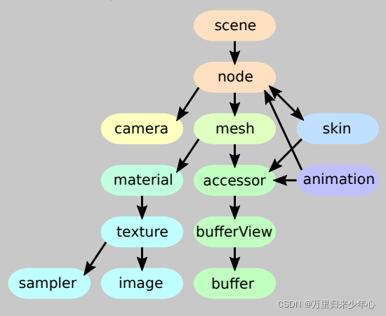

# 2021
## 11.24
### webpack配置路径别名duration
webpack.base.conf.js
resolve -> alias -> 配置项
例子：
```
alias: {
    'vue$': 'vue/dist/vue.esm.js',
    '@': path.resovle(__dirname, 'src'),
}
```
### transition(过渡)

transition-property
transition-duration
transition-timing-function
transition-delay

### animation(动画) + @keyframes

animation-name
animation-duration
animation-timing-function
animation-delay
animation-iteration-count
animation-direction

@keyframes ani {
    20% { opacity: 0.3; }
    40% { border-readius: 100px; }
}

### 3D地图
创建地图
```
const map = new FMap3D.Map(el, {
    zoom: 16, 
    center: [116.461753, 39.908391], 
    pitch: Math.PI / 3 //地图倾斜角度
})
```
鼠标事件:
地图容器接受到鼠标事件之后，会被分发给不同的layer, layer根据事件做出响应。


```
layer.on('click', (feature, event, lnglat) => {
    if(feature) {
        feature.setStyle({
            fill: {
                color: 'red'
            }
        })
    }
})
```

### onclick与addEventListener区别

onclick事件在同一时间只能指向唯一对象
addEventListener可以给一个事件注册多个listener
addEventListener对任何DOM都是有效的，而onclick仅限于HTML
addEventListener可以控制listener的触发阶段，(捕获/冒泡)。对于多个相同的事件处理器，不会重复触发, 不需要手动手机用removeEventListener清楚
IE9使用attachEvent和detachEvent

addEventListener(event, function, useCapture)
useCapture: true(捕获) false(冒泡)

### js原生属性方法

getComputedStyle(element, pseudo-element) 返回当前元素所有最终使用的css属性值
getPropertyValue("color") 取出元素最终计算出的css样式
window.getComputedStyle(a).getPropertyValue("color");

### foreach和map的区别

foreach不会返回执行结果，而是undefined,foreach会修改原来的数组。而map()方法会得到一个新的数组并返回

## 11.25
### FGL
FGL提供两种渲染器:

WebGL渲染器: 将一般物体用WebGL方式渲染到画布上
DOM渲染器: 将普通DOM元素置于正确的世界坐标系下

光源种类:
环境光: 不产生阴影，改变物体的颜色
平行光: 太阳光
聚光灯: 圆锥形的光线
点光源: 球状光线

物体:
由Geometry,Material组成

## 11.26
### WebGL绘制流程
1. 准备数据阶段
2. 生成顶点着色器
3. 图元装配(画出一个个三角形) 顶点坐标 -> 图元
4. 生成片元着色器
5. 光栅化(生成像素点，生成片元) 图元 -> 片元

#### 获取顶点坐标
三维软件导出顶点坐标 -> 将顶点坐标写入缓存区

#### 图元装配
顶点坐标 -> 传入顶点着色器 -> 图元装配

顶点着色器会先将坐标转换完毕，然后由GPU进行图元装配，有多少顶点，这段顶点着色器程序就运行了多少次。

#### 光栅化

图元 -> 生成片元 -> 片元 -> 光栅化 -> 片元

#### 片元着色器处理流程

图元 -> 传入顶点 -> 片元着色器 -> 光栅化
片元着色器是生成多少像素，运行多少次

### Three.js
#### Three.js具体流程
创建场景 -> 配置场景 -> 创建模型 -> 创建材质 -> 生成着色器 -> 渲染

#### Three.js目录结构
```
/build three源码，一份压缩，一份未压缩
/docs 帮助文档, 可以查看构造函数，方法，属性的属性说明
/editor 可视化编辑器，创建在线预览的三维场景
/examples 各种三维的demo
/src three.js引擎每一个主要构造函数对应的源代码
```

### CDN
CDN是建立并覆盖在承载网之上，由分布在不同区域的边缘节点服务群组成的分布式网络
CDN支持多种场景加速: 图片小文件，大文件下载，音视频点播，直播流媒体，全站加速，安全加速

CDN全过程:
1.当终端用户向www.a.com下的指定资源发起请求时，首先向本地DNS发起域名解析请求
2.本地DNS检查缓存中是否有www.a.com的IP地址记录。如果有，则直接返回给终端用户，如果没有，则向授权DNS查询。
3.当授权DNS解析www.a.com时，返回域名CNAME www.a.tbcdn.com对应的IP地址。
4.域名解析请求发送至阿里云DNS调度系统，并为请求分配最佳节点IP地址
5.LDNS获取DNS返回的解析IP地址。
6.用户获取解析IP地址
7.用户向获取的IP地址发起对该资源的访问请求

## 11.29
### three.js
#### 渲染要素
几何体 Geometry
场景对象 Scene
网络模型 Mesh
光源 点光源 环境光
相机设置 
创建渲染器对象

#### 动画
requestAnimationFrame
专门为动画设计的API，不展示的时候不会渲染，与浏览器重绘的频率一致

#### 鼠标操作三维场景旋转缩放
three.js控件OrbitControls.js
可以控制视角，进行旋转缩放平移

#### 光照设置
AmbientLight 环境光
PointLight 点光源
DirectionalLight 平行光
SpotLight 聚光源

#### 顶点
BufferGeometry
1. geometry.attributes 
attributes.postion
attributes.color
attributes.normal
attributes.uv
attributes.uv2
2. geometry.index 顶点索引属性
3. BufferAttribute 对象

## 11.30
#### 照相机
透视投影相机 (远大近小)
THREE.PerspectiveCamera(fov, aspect, near, far)
fov: 张角, aspect: canvas的宽高比 
正交投影  (远近都一样大)

Geometry本质都是一个一个三角形拼接而成的,所以可以通过设置三角形的法线方向向量来表示集合提表面各个位置的法线方向向量

#### 常用材质介绍
点材质: PointsMaterial
线材质: LineBasicMaterial LineDashedMaterial 
网格材质: MeshBasicMaterial MeshLambertMaterial MeshPhongMaterial MeshStandardMaterial MeshPhysicalMaterial MeshDepthMaterial MeshNormalMaterial
精灵Sprite材质: SpriteMaterial
自定义着色器材质: RawShaderMaterial ShaderMaterial

#### 层级模型和组对象
对于每个几何物体，我们可以将其组合成一个Group,Group又可以组成新的Group从而形成树状结构，对多个几何物体进行相同的操作，并可以进行一系列遍历。

## 12.1
### Geometry渲染参数
#### CubeGeometry
width, height, depth, widthSegments, heightSegments, depthSegments
#### PlaneGeomtry
width, height, widthSegments, heightSegments
#### SphereGeometry
radius, segmentsWidth, segmentsHeight, phiStart, phiLength, thetaStart, thetaLength
#### CircleGeometry
参数类似球体
#### Cylinder
radiusTop radiusBottom height radiusSegments heightSegments openEnded
#### 正多面体
指定半径就行
#### ToursGeometry
圆环面 
radius 圆环半径 tube 管道半径 

### 曲线
#### ArcCurve(圆弧线)
ArcCurve(aX, aY, aRadius, aStartAngle, aEndAngle, aClockwise)
getyPoints() 按照一定的细分精度返回沿着圆弧线分布的顶点坐标,返回一组由二维向量或者是三维向量的数组

#### 样条曲线和贝塞尔曲线
样条曲线设置多个顶点，形成一条光滑的曲线
贝塞尔曲线有两个起始点和一个控制点,二次贝塞尔曲线有两个起始点和两个控制点

CurvePath可以把多个圆弧线,样条曲线，直线等组合成一个曲线

TubeGeometry 曲线路径管道成型

LatheGeometry 旋转成型
LatheGeometry(points, segments, phiStart, phiLength)
points  坐标数据组成的数组
segments  圆周方向细分数,默认12
phiStart 开始角度,默认0
phiLength 旋转角度,默认2pai

ShapeGeometry 轮廓填充
根据轮廓的顶点使用三角面Face3自动填充中间区域

```
var shape = new THREE.Shape(points);
var geometry = new THREE.ShapeGeometry(shape, 25);
```

ExtrudeGeometry 拉伸成型
五点可以描述一条曲线,再进行拉伸
```
var geometry = new THREE.ExtrudeGeometry(
    shape, //二维轮廓 
    //拉伸参数
    {
        amount: 123, //拉伸长度
        bevelEnabled: false 
        
    }
)
```

## 12.3
### 纹理贴图
纹理贴图加载器TextureLoader的load方法加载一张图片可以返回一个纹理对象Texture,纹理对象Texture可以作为模型材质颜色贴图.map属性的值
```
var textureLoader = new THREE.TextureLoader();
textureLoader.load(url, function(texture) {
    let material = new THREE.MeshLambertMaterial({
        map: texture,
    })
});
let mesh = new THREE.Mesh(geometry, material);
scene.add(mesh);
```

图片的url要用import引入，如果是字符串则不会进行解析，直接当成字符串处理

访问uv坐标
geometry.attributes.uv

## 12. 6
### uv贴图
uv贴图中的坐标和真实坐标一一对应，通过点的坐标进行关联
### 渲染管线流程
顶点数据->顶点着色器->几何着色器->图元装配->剪切->光栅化->片元着色器
1. 首先接受用户传进来的数据
2. 顶点着色器(常用的三个修饰符attribute,uniform, varying)
attribute只在顶点着色器才有，片元没有(只读,不能声明数组或结构体)
uniforms修饰的是全局变量,一般表示变换矩阵，材质，光照参数，颜色(只读，因为顶点着色器和片元着色器可以共享同一个uniform块,因此在两个着色器中,uniform声明要一致)
varying顶点着色器计算每个顶点的值写入varying变量,然后片元着色器使用该值,因此varying在顶点着色器可写,在片元着色器只读。作为顶点着色器和片元着色器之间传递插值数据,因此也要声明一致。
3. 几何着色器
几何着色器位于顶点着色和片元着色之间,根据顶点信息批量处理几何图形，因此几何着色器输入变量都是数组类型。
4. 图元装配
前面着色阶段处理的都是顶点数据,那么这些顶点是如何构成几何的信息也会被传递到OpenGL,图元装配就是将这些顶点与相关的几何图元之间组织起来，将一堆顶点数据根据原始链接关系还原出网络结构，然后准备下一步的剪裁和光栅化。
5. 剪裁
顶点可能会落在我们绘制的窗口之外,要把它和相关的图元剪切。
6. 光栅化
剪切之后马上要执行的工作就是光栅化，就是将更新后的图元传递到光栅化单元,生成对应的片元。
比如找出三角形所覆盖的像素，这时候完成坐标的转换。
7. 片元着色器
前面讲顶点着色器的输出varying,varying变量在光栅化阶段被线性插值计算后,在片元着色器作为输入
samplers: 一种特殊的uniform,用于呈现纹理...
计算顶点法向量vNormal和入射光方向两个向量的点积,计算得到的diffuse就是点光源的强度


## 12.7
### GLSL语言学习
sampler2D 2D纹理
samplerCube 盒纹理

向量访问的方式
vector.xyzw 
vector.rgba
vector.stpq

需要进行显式的类型转换

函数参数限定符
in复制到函数中可读写
out返回时从函数中复制出来
inout复制到函数中并在返回时复制出来

构造函数
聚合类型对象需要使用构造函数来进行初始化

精度限定
highp, mediump, lowp 即可完成对该变量的精度声明

invariant关键字显式要求计算结果必须精确一致
```
\#pragma STDGL invariant(all)
invariant varying  texCoord
```

限定符的优先级
invariant关键字来显式要求计算结果一致
在一般变量中  invariant > storage > precision
在参数中 storage > parameter > precision

预处理命令
```
#define 定义宏
#undef 取消已定义的宏
#if 如果给定条件
#ifdef 如果宏已经定义,则编译下面代码
#ifndef 如果宏没有定义,则编译下面代码
#elif 如果前面的#if给定条件不为真,当前条件为真,则编译一下代码
#endif 结束一个#if......#else条件编译块
```

内置的特殊变量
glsl程序使用一些特殊的内置变量与硬件沟通.他们大致分成两种,一种是input类型,他负责向硬件(渲染管线)发送数据.另一种是output类型，负责向程序回传数据，以便变成时需要。

vertex Shader中
output类型的内置变量
highp vec4 gl_Position;  (顶点坐标信息vec4)
mediump float gl_PointSize; (顶点的大小float)

fragment Shader中
input类型的内置变量 
mediump vec4 gl_FragCoord 片元在framebuffer画面的相对位置vec4
四维的最后一维是布尔值,非零代表三维空间中的一个点(x,y,z),若是0,则表示一个向量

bool gl_FrontFacing 标志当前图元是不是正面图元的一部分bool
mediump vec2 gl_PointCoord 经过插值计算后的纹理坐标 vec2

output类型的内置变量
mediump vec4 gl_FragColor 设置当前片点的颜色 vec4 RGBA color
mediump vec4 gl_FragData[n] 设置当前片点的颜色,使用glDrawBuffers数据数组 vec4 RBGA color

### 图形绘制管线的三个阶段
应用程序阶段
几何阶段
光栅阶段

1. 应用程序阶段
在该阶段的末端,几何体数据通过数据总线传送到图形硬件
2. 几何阶段
主要负责顶点坐标,光照,剪裁,投影以及屏幕映射,该阶段基于GPU进行计算
3. 基于几何阶段的输出数据,为像素正确配色,以便绘制完整图像,该阶段进行的都是单个像素的操作,每个像素的信息存储在颜色缓冲器中
光照计算涉及视点,光源,和物体的世界坐标,所以通常放在世界坐标中进行计算,而雾化以及涉及物体透明度的计算属于光栅化阶段.

## 12.8### 顶点坐标顺序
模型坐标空间(object space) -> 世界坐标空间(world space) -> 观察坐标空间(camera / eye space) -> 屏幕坐标空间(project space)
给予一个世界坐标来描述四阶矩阵控制 world matrix
观察坐标空间的生成也就是形成视锥体的过程,超出视锥体范围的东西都会被剪裁掉
观察坐标空间 -> 屏幕坐标空间总共有3步
1. 用透视变换矩阵把顶点从视锥体中变换到剪裁空间的CVV中
2. 在CVV进行图元剪裁
3. 屏幕映射: 将经过前述过程得到的坐标映射到屏幕坐标系上

图元装配(Primitive Assembly)
将顶点根据primitive(原始的连接关系)还原出网格结构。网格由顶点和索引组成,在之前的流水线中是对顶点的处理,在这个阶段是根据索引将顶点连接在一起,组成线,面单元。之后就是对超出屏幕外的三角形进行剪裁。

### 图形硬件
深度缓冲区(Z Buffer) -> 模板缓冲区(Stencil Buffer) -> 帧缓冲区(FrameBuffer) -> 颜色缓冲区(color Buffer)
Vertex program -> Fragment program 
前者的输出是后者的输入

### 矩阵
OpenGL有六种坐标
1. 物体或模型坐标系 Object or Model Coordinates
2. 世界坐标系 World Coordinates
3. 眼坐标或相机坐标 Eye or Camera Coordinates
4. 剪裁坐标系 Clip Coordinates
5. 标准设备坐标系 Normalized Devices Coordinates
6. 屏幕坐标系 Window or Screen Coordinates
坐标变换矩阵栈
vertexData -> (LOCAL SPACE 局部坐标) -> ModelMatrix(模型矩阵) -> (World Space 世界坐标) -> ViewMatrix -> (VIEW SPACE 相机坐标) -> ProjectionMatrix(投影矩阵) -> (Clip Space 齐次剪裁坐标) -> (同除以w) -> NDC (Normalized Device Coordinates) -> ViewportTransform(视口变换) -> Screen space => (Fragment Shader)


剪裁坐标和NDC不同，Vertex Shader的输出就是在Clip Space上，接下来 GPU会做剪裁，剔除在Clip Space范围之外的定点，然后GPU再做透视除法将定点转到NDC

### smoothstep函数
smoothstep(start,end,parameter)
```
float smoothstep(float t1, float t2, float x) {
    x = clamp((x - t1) / (t2 - t1), 0.0, 1.0);
    return x * x * (3 - 2*x);
}
```
x = start, y = 0,
x = end, y = 1,
实现更加平滑的渐变


## 12.9
### 画彩虹
```
gl_FragColor = texture2D(map, vec2(st.t, st.s));
```

### loadingmanager
其功能时处理并跟踪已加载和待处理的数据.如果为手动设置加强管理器,则会为加载器创建和使用全局实例加载器管理器
在各个不同的阶段,可以跟踪不同的数据
onStart 
onLoad
onProgress
onError

## 12.13
performance.now()的时间单位是毫秒
纹理平铺的相关属性
THREE.ClampToEdgeWrapping 表示纹理边缘与网格的边缘贴合,中间部分等比缩放。
THREE.RepeatWrapping 重复平铺
THREE.MirroredRepeatWrapping 先镜像再重复平铺

### 精灵模型模拟下雨
随机生成雨滴的位置
把所有雨滴加入group中,在render函数中改变每个雨滴的y坐标

### 帧动画模块
关键帧 KeyframeTrack
剪辑 AnimationClip
操作 AnimationAction
混合器 AnimationMixer

1. 编辑关键帧
KeyframeTrack + AnimationClip
关键帧动画
创建位置关键帧对象
```
let times = [0, 10];
let values = [0, 0, 0, 150, 0, 0]
let posTrack = new THREE.KeyframeTrack('Box.position', times, values)
```
创建颜色关键帧对象
let colorKF = new THREE.KeyframeTrack('Box.material.color', times, values)
创建关键帧数据
let scaleTrack = new THREE.KeyframeTrack('Sphere.scale', times, values)
多个帧动画作为元素创建一个剪辑clip对象,命名default,持续时间20
let clip = new THREE.AnimationClip("default", duration, [posTrack, colorKF, scaleTrack])
2. 播放关键帧
AnimationAction + AnimationMixer
```
let mixer = new THREE.AnimationMixer(group);
let AnimationAction = mixer.clipAction(clip);
通过操作Action设置播放方式
AnimationAction.timeScale = 20;
AnimationAction.play();
```
mixer.update(clock.getDelta());

## 12.14
### geometry的偏移和mesh偏移的区别
geometry的偏移是物体的网格偏移了,但是物体的世界坐标还在原来的位置,这样可以实现一个绕着世界坐标的中心点旋转的物体效果
geometry.translate(x,y,z);
mesh.rotateY(Math.PI * 0.5)
mesh的偏移是将物体的世界坐标改变,因此让其旋转,是在原地旋转
mesh.translateOnAxis(new THREE.Vector3(1,0,1), 30);

### 旋转矩阵的推导及其应用
Xnew = Xold + Tx;
Ynew = Yold + Ty;
二维坐标系下，旋转矩阵是
cos -sin
sin cos
三维坐标系下,旋转矩阵是
绕x轴旋转
1  0  0
0 cos sin
0 -sin cos
绕y轴进行旋转
cos 0 -sin
0   1  0
sin 0  cos
绕z轴进行旋转
cos sin 0
-sin cos 0
  0   0  1

### 旋转一个点
旋转轴
旋转方向
旋转角度

## 12.15
### WeakMap
属性: WeakMap.prototype.constructor
```
let wm = new WeakMap([[k1, v1], [k2, v2]])
```
WeakpMap初始化参数是一个Iterable的对象,可以是二元数组或者其他可迭代的键值对的对象。每个键值对会被加到新的WeakMap里
WeakMap对key有限制,它必须是Object

方法: 
WeakMap的方法也特别少,只有四个: delete, get, has, get
一般用于以DOM节点为键名的场景

### for in 和 for of
使用foreach遍历数组,使用break不能中断循环
for in 遍历对象 index索引为字符串型数字,不能进行几何运算
遍历顺序有可能不是按照实际数组的内部顺序
for in 会遍历数组所有的可枚举属性,包括原型。for in 遍历的是数组的索引,而for of遍历的是数组元素值
for in 更适合遍历对象, for in不适合遍历数组
for of 遍历数组的value
## 12.16
### THREE源码
Core::Object3D
属性parent和children说明,通常需要使用树来管理众多Object3D对象。
比如一辆行驶的汽车是一个Object3D对象，控制汽车行驶路线的逻辑在该对象内部实现，汽车的每个顶点经过模型矩阵的处理后，都位于正确的位置；但是汽车摆动的雨刮器，其不但随着汽车行驶方向运动，而且自身相对汽车也在左右摆动，这个摆动的逻辑无法在汽车这个对象内部的实现。解决的方法是，将雨刮器设定为汽车的chidren，雨刮器内部的逻辑只负责其相对于汽车的摆动。在这种树状结构下，一个场景Scene实际上就是最顶端的Object3D，它的模型矩阵就是视图矩阵（取决于相机）的逆矩阵。

属性matrix和matrixWorld就很好理解了，matrix表示本地的模型矩阵，仅仅表示该对象的运动，而matrixWorld则需要依次向父亲节点迭代，每一次迭代都左乘父亲对象的本地模型矩阵，直到Scene对象——当然，实际上是左乘父亲对象的全局模型矩阵。

## FGL源码阅读
### core
1. Base类
主要的存储结构是weakmap
deepObject对对象进行深度遍历把路径写入到key中,splitObject对对象进行分拆,与deepObject是一个反过程
2. SkyObject类
继承自THREE.Object3D
3. SkyBox类

### Map
1. MeshBasicEarth
INIT 
通过INIT_GEOMETRY和INIT_MATERIAL生成网格模型
并且把配置中的position和scale写入到生成的MESH中

INIT_GEOMETRY
通过配置生成对应的geometry

INIT_MATERIAL
通过配置生成对应的Material,配置中的map可能是对象,或者是一张贴图,根据map的不同类型不同处理

INITIONS
将def,opt合并,形成新的配置参数

setEnvMap
设置环境地图

dispose
删除地图上对应的Mesh实例

2. GeojsonPointMap
与上面类似，不同的是需要遍历json文件来生成球状地图
多了一个CREATE_POINT方法,根据json文件的数据来生成对应的球面坐标

3. GeojsonLineMap
因为是线状图,所以首先就有CREATE_LINE这样的一个方法,循环coordinates数组,数组中的前后两项构成线
同时在INIT_GEOMETRY中添加自定义属性
在fs文件中处理动画相关的亮度
setMaterialUniform

4. GeojsonInteractionMap
INIT_GEOMETRY
生成PlaneBufferGeometry,
并将几何体平移到中心点

5. MyFamilyBuckets 
INIT 
循环initions创建动画,将动画的id加入到map中


## 12.22
vuepress插件
文档实例的最佳实践方案
Demo Container使用Vuepress的chainMarkdown,extendMarkdown API 拓展了其内部的markdown对象

### vuepress-plugin-demo-block
通过Vuepress clientRootMixin API混入页面的mounted,updated生命周期,读取示例代码分离template,script,style代码块
template包裹的代码块直接插入示例节点
script包裹的代码块通过Vue.extend编译出Vue对象,再调用其$mount()方法挂载到示例dom
style包裹的代码块直接插入document
这么做的问题是template代码块中不能包含Vuepress中全局注册的组件

### vuepress-plugin-demo-code
通过Vuepress extendMarkdown API 拓展内部markdown对象,进而识别::: demo xxx :::代码块,将其包裹的示例代码直接插入Markdown文档等待vue-loader处理。

### vuepress-plugin-extract-code
提供了一个RecoDemo组件用于在Markdown中构造示例页面,并通过Vuepress chainMarkdown API给Vuepress内部的markdown添加一个插件,该插件负责,手动解析RecoDemo中的<<< @/docs/.vuepress/demo/demo.vue?template语法

### 插件配置
component
类型: string
默认值: demo-block
包裹代码与示例的组件名称
通过Slot demo(被渲染成示例), Slot description(被渲染成示例描述信息), Slot source(被渲染成示例的源代码)

## 12.23
### Reflect.ownKeys()
返回一个由目标对象自身的属性键的数组
### Map和Object的区别
Object本质上是哈希结构的键值对的集合,它只能用字符串,数字或者Symbol等简单数据类型当作
将dom节点作为键,但是由于对象只接受字符串作为键名,所以键被自动转为字符串[object HTMLDivElement]
Map类继承了Object,并对Object功能做了一些拓展,Map的键可以是任意的数据类型

同名碰撞
对象其实就是在堆开辟了一块内存,其实Map的键存的就是这块内存的地址。只要地址不一样,就是两个不同的键,这就解决了同名属性的碰撞问题,object属性名相同的话,就只能覆盖先前的值

可迭代
Map实现了迭代器,可以同for...of遍历,而Object不行

长度
Map可以直接拿到长度,而Object不行

有序性
填入Map的元素,会保持原有的顺序,而Object无法做到。

可展开
Map可以使用省略号展开,而Object不行。

### 不可迭代对象变成可迭代对象(Symbol.iterator)
设计一个迭代器
迭代器本身是一个对象,这个对象有next()方法返回结果对象,这个结果对象有下一个返回值value,迭代器完成布尔值done,
```
function createIterator(items){
    let i = 0;
    return{
        next(){
            let done = (i>=items.length);
            let value = !done ? items[i++] : undefined;
            return{
                done,
                value
            }
        }
    }
}
let arrayIterator = createIterator([1,2,3])
```
创建迭代器
ES6封装了generator用来创建迭代器。显然生成器是返回迭代器的函数,这个函数通过function后的*号表示,并使用新的内部专用关键字yield指定迭代器next()方法的值
用ES6生成器创建一个迭代器
```
let obj = {
    *createIterator(items){
    for(let i in items){
        yield items[i];
    }
  }
}
```
let someIterator = createIterator([123, 'mge']);
可迭代对象具有Symbol.iterator属性,即具有Symbol.iterator属性的对象都有的默认迭代器
判断是否可迭代
```
const isIterator = obj => obj != null && typeof obj[Symbol.iterator] === 'function';
```

## 12.24
### LatheGeometry
旋转造型,可以利用已有的二维数据生成三维顶点,二位数据可以通过二维向量对象Vector2定义,默认绕y轴旋转
样条曲线插值计算
借助Shape对象的方法.splineThru,把上面的三个顶点进行样条插值计算,可以得到一个光滑的旋转曲面
```
var shape = new THREE.Shape();//创建Shape对象
var points = [...vector2]
shape.splineThru(points);
var splinePoints = shape.getPoints(20); //二维形状
var geometry = new THREE.LatheGeometry(splinePoints,30); //旋转
```

## 12.27
设置index的时候节点按逆时针顺序连接,顺序不对就看不见了
shapeGeometry顶点顺序和加入时相反,shape.arc的圆心是相对于上一个节点的相对坐标
glsl mix(x,y,a)
a控制混合结果 x(1-a)+y*a

Material的公有属性
webgl深度缓冲

## 12.28
### OpenGL的空间变换
#### 世界空间
相对于其他空间来说是不变的，所以,它也被用作空间变换的参考系
#### 模型空间
可以以世界坐标系中的某点来作为模型空间的原点
模型变换(模型-世界变换)
默认情况下模型坐标系的原点位于世界坐标系的原点,我们可以通过一系列缩放,旋转,平移,将模型以任意角度摆在任意位置。
这种情况下,模型的顶点以及模型自身的坐标系都会相对世界坐标系变化。

假设有一个模型坐标系表示为矩阵 M（基于世界坐标系来描述），一个顶点在该模型坐标系上的坐标表示为列向量 D。 那么，该顶点在世界坐标系中的坐标 D‘，有如下变换关系：M·D = D’。M 也称为模型矩阵。模型矩阵本质上是一系列缩放、旋转和*移矩阵的复合矩阵。
#### 视图空间
是以摄像机的角度来定义的一个空间。
正交投影中,摄像机与视图坐标系的位置关系图类似于模型-世界坐标系
世界坐标系是父坐标系

视图变换的实质就是将某个顶点在世界空间中的描述，转换为在视图空间中的描述。假设有一个顶点在在世界坐标系中的坐标表示为列向量 D‘，一个视图坐标系表示为矩阵 V（基于世界坐标系来描述的），那么该顶点在视图坐标系 V 中的坐标 D，有如下变换关系：V·D = D’（道理和模型变换类似）。设 V 的逆矩阵为 V’，可以推导出变换关系 V‘·D‘ = D，V’ 也被我们称为视图矩阵。

采用模型视图矩阵的优点
渲染一个模型时，我们通常需要将模型坐标转换成世界坐标，世界坐标转成视图坐标
将模型矩阵和视图矩阵结合在一起就形成了模型视图矩阵
1. 一次矩阵变换比两次矩阵变换更高效
2. 一次矩阵变换的精确性更高

透视投影的剪裁规则
在变换到裁剪空间之后，我们将赋予齐次坐标的 w 分量更加丰富的含义：作为一个临界值来判断一个经过裁剪变换后的顶点是否位于景视体内。如果变换后的坐标值 x、y、z 均在区间 [-w, w] 内，则表明该顶点在视景体内。否则，表明该顶点不在视景体内，将会被抛弃。

正交投影的剪裁规则
如果变换后的坐标值 x、y 、z 均在区间 [-1, 1] 内，则表明该顶点在视景体内。而且这里的 w 为 1，所以其裁剪的判断规则与透视投影中是一致的。

### 标准设备坐标空间（NDC Space）
对于正交投影，任意顶点在裁剪空间的坐标值 x、y 、z 均在区间 [-1, 1] 内，这种情况下无需任何变换，裁剪空间本身也是标准设备坐标空间。

对于透视投影，我们只需要对顶点在裁剪空间的坐标执行齐次坐标标准化，使其 w 分量变为 1。对应的 x、y、z 也将会缩小到范围 [-1, 1] 内。这种情况下，标准化的过程其实也是将顶点从裁剪空间坐标变换到到标准设备坐标空间的过程。

## 12.30
### PlaneGeometry的绘制顺序 右下 -> 左下 -> 右上 -> 左上 

## 1.5
### this.$router和this.$route的区别
this.$router相当与全局的路由器对象,包含了很多属性和对象,任何页面都可以调用其push(), replace(), go() 等方法
this.$route表示当前路由对象,每一个路由都会有一个route对象,是一个局部对象,可以获取对应的name,path,params,query等属性

### v-for和v-if优先级的高低
v-for优先级更高

### import
import * as xxx from 
这种导入是把所有的输出包裹到对象中

es6 重命名 当引入的两个模块变量名相同时，可以使用重命名的方式

## 1.6
### 本地测试npm包
npm link 可以在本地项目和本地npm模块之间建立连接,进入包内 npm link,包会被映射到全局中的node_global -> node_modules中
进入本地项目中, npm link 模块名 (package.json中的name)

## 1.18
### THREE新版本和旧版本orbitControls的区别
新版本 1.35
旧版本 0.92

旧版本使用需要使用引入orbitControls作为以来
新版本则是直接导出构造函数

旧版本还需要每一帧更新control
```
this.$controls.update();
this.$renderer.render(this.$scene, this.$camera);
```

## 1.20
### Material 学习
基于深度着色的MeshDepthMaterial
可以通过相机的near和far参数来控制物体是否可见
改变场景中的所有的物体的材质
```
var scene = new THREE.Scene();
scene.overrideMaterial = new THREE.MeshDepthMaterial();
```
#### blending属性
NoBlending:z-buffer值较大的像素将会遮挡z-buffer值较小的像素,没有纹理融合的效果,设置纹理透明度无效
NormalBlending:默认选项,根据z-buffer正常显示纹理,这是标准混合模式,它单独使用顶层,而不将其颜色与其下面的层混合
AdditiveBlending:此混合模式只是将一个图层的像素值添加到另一个图层,如果值大于1，则显示白色。线性减淡颜色值,由于它总是产生与输入相同或更浅的颜色，因此它也被称为"加亮"
SubtractiveBlending:此混合模式将一个图层的像素值减去另一个图层像素值，如果为负数，则显示黑色。
MultiplyBlending:颜色混合,源图像的RGB分量与目标图像RGB分量的相乘。

#### 深度缓冲区
深度测试的意义在于舍弃片元与否。
深度写入的意义在于深度测试的基础上，要不要覆盖深度缓冲，即重新设立深度测试的标准。
深度写入可以保证像素级的深度关系
GPU的渲染流程

片元 -> 模板测试 -> 深度测试 -> 混合 -> 颜色缓冲区

blending: THREE.AdditiveBlending 把源和目标的RGB三通道分别进行相加
混合设置要传给WebGLRenderer渲染材质的RGB和透明度, 所以材质参数中要开启透明度设置

深度测试的大概流程：

开始深度测试 -> 是否开启了深度测试 -> 比较该片元的深度和已经存在于深度缓冲区中的深度值(如果当前 fragment 的 Z 值小于取出来的值则更新 depth buffer 里面的值, 如果大于取出来的值说明该点在一个物体后面这个 fragment 将会被丢弃) -> 是否通过了深度测试 -> 是否开启了深度写入 -> 将深度值写入深度缓冲区

混合的大概流程: 

开始混合 -> 是否开启了混合 -> 得到片元的颜色值 和 已经存在与颜色缓冲区的颜色值 -> 进行混合操作 -> 更新颜色缓冲区的值

AlphaTest(透明度测试)

仅渲染在一定范围内的像素,和深度测试一样,也可以定义比较的规则


半透明模型和不透明模型
在进行不透明物体渲染时,我们需要开启深度缓冲区,进行深度写入操作,保证场景中的不透明物体间有正常的深度关系。
半透明模型需要需要遵循画家算法由远及近进行绘制,最终效果才会正确

## 1.24

### z-fighting
两个图形在同一个像素上的深度相同而出现闪烁
解决z-fighting的思路
1.设置不同的深度
2.设置合适的near和far值
near和far与深度缓冲也密切相关,深度缓冲其实是非线性的,靠近相机的地方精度越高,

### 四元数
q = ((x,y,z), w) 


## 1.29
### 矩阵变换
Object3D的3种矩阵对象
Object3D.matrix 相对于其父对象的局部模型变换矩阵
Object3D.matrixWorld 对象的全局模型变换矩阵
Object3D.modelViewMatrix 表示对象相对于相机坐标系的变换,


## 2.8
### 齐次坐标
点位置: (x,y,z,w) w不为0
向量: (x,y,z,0)
用矩阵来表示三维空间中的对象
### 四元数
表达式(a, b, c, d)
a = sin(theta / 2) * A.x
b = sin(theta / 2) * A.y
c = sin(theta / 2) * A.z
d = cos(theta / 2)


## 2.10
### 屏幕射线的计算
1. 首先确定相机的原点
2. 随后计算点击像素点坐标在world frame中的坐标
3. 最后,在world frame中使用点击的像素点的世界坐标减去相机位置,标准化后得到方向矢量
   
### 射线和几何体相交检测
射线和几何体相交检测实际上是要计算出屏幕射线和构成几何体的所有三角形是否相交,只要射线和其中至少一个三角形相交，我们就认为射线和几何体相交。
通常使用绑定容积进行保守检测计算。 bounding volume通常为围绕几何体的球体胡后者方形体, 这些sphere或者box一般根据几何体的顶点数据近似获得。

使用几何体的顶点表达来获得Bounding Volume, 不管是sphere还是box,比较容易确定。

ray-geometry相交检测的原理
屏幕射线和几何体的多个面中有一个相交就相交

## 2.17
### 齐次坐标与仿射变换
在三维空间一个点(x, y, z)可以在齐次坐标中用一族来表示
仿射变换是两种简单变换的叠加，一个是线性变换， 一个是平移变换

### console.log() 的延迟打印问题
chrome的控制台出于性能考虑,对引用数据类型的数据读取是存在延迟的,默认读取一层数据,当你点击展开时，会重新去堆内存中读取属性值和下一层的数据


## 2.22
### Vue中extend和mixins,extends
Vue.component是用来注册或获取全局组件的方法
```
Vue.component('global-component', Vue.extend(baseOptions));
Vue.component('global-component', baseOptions);
上面两行代码等价
//获取注册的组件
var MyComponent = Vue.component('my-component')
```
Vue.extend扩展Vue构造器,从而用预定义选项创建可复用的组件构造器

mixins是合并一个对象，mixins中的data会合并到data中,有冲突的话，data中数据覆盖mixins中的数据，钩子函数则是先执行mixins的钩子函数

### composition-api
ref  (用来包装基础数据类型)
reactive (用来包装引用数据类型)
toRefs  (把一个响应式对象转换成普通对象, 该普通对象的每个property都是一个Ref)
toRef   (将reactive包装后的引用数据类型的值, 通过ref包装为响应式, 但可新增属性)
readonly  (被readonly包装后, 变为只读属性, 不可更改数据 ）
readonly() 和 Object.freeze() 冻结属性有些相似
不同的 是 Object.freeze() 直接将原数据冻结
readonly() 返回一个新的数据，不改变原数据
watchEffect 
computed
生命周期


### Object.freeze,Object.seal,Object.preventExtensions
Object.freeze过程
1.设置Object.preventExtensions(),禁止添加新属性
2.设置writable为false,禁止修改
3.设置configurable为false,禁止配置
4.禁止更改访问器属性
Object.freeze禁止了所有可设置内容
Object.isFrozen()判断一个对象是否是冻结对象

Object.seal过程
1.设置Object.preventExtension(), 禁止添加新属性
2.设置configurable为false, 禁止配置
3.禁止更改访问器属性

Object.freeze 禁止修改对象的所有属性
Object.seal   可以修改属性，但不能新增，删除属性

### 函数传参
基本类型传值，复杂数据类型传引用

## 2.24
### 自定义插件
外界调用Vue.use(), 就会调用本身的install方法，同时传一个Vue这个类的参数
```
const Loading={
    install:function(Vue){
        Vue.component('Loading',LoadingComponent)
    }
}
```
外界在use这个组建的时候，就会调用本身的install方法,同时传一个Vue这个类的参数
全局组件
```
Vue.component('globalcomponent',globalcomponent)
```
局部组件
在组件中注册子组件 
```
components: {subcomponent}
```
编写一个插件需要注意的东西

插件哪些数据是需要从外界获取的，那些属性是computed,watch,数据更新之后如何响应式的更新
遍历所有的子节点，props接收所有的属性
### 碰撞检测
碰撞检测，最主要的就是包围盒，常用的包围盒有Sphere包围盒,AABB包围盒,OBB包围盒,k-Dops
Sphere包围球法: 包含目标对象的最小球体，紧密性差，包围的目标对象会产生大量的冗余空间，剔除效率低，但是其构
造简单、存储空间小且由于球的对称性，不受旋转变化的影响，只需要根据平移量对球心位置进行变化，不需要对包围球结构进
行任何更新操作，适用于检测精度要求不高的运动环境，且很容易计算两个物体的包围球是否发生碰撞。
AABB六边形包围法: 是一个简单的六面体
OBB: 更加精确，但计算也更多

### MVC MVP MVVM
MVC Model View Controller
MVVM Vue实现的是MVVM模式
在Vue中,
View指的是各种template, 
ViewModel指的是对应的js,声明绑定的元素及绑定的数据, 
Binder处理template与js的绑定逻辑，
Model指的是获取数据的逻辑

# 2022

## 9.27
### DevServer 
before方法: 能够在其他所有中间件之前执行自定义的中间件
### resolve
使用resolve字段来配置模块的相关解析策略。本质上是通过resolve库的使用
来解析模块路径,帮助webpack找到bundle中以require/import引入的模块代码。
配置别名
resolve.alias
extensions扩展名选项在resolve追踪到的文件如果没有扩展名时,会尝试在其提供的扩展名选项中进行匹配

### webpack5.x 模块缓存 
多处引用同一模块，最终只会产生一次模块执行和一次导出。 所以, 会在运行时中保存
一份缓存。删除此缓存，则会产生新的模块执行和新的导出。

```
var d1 = require('dependency')

```
### pnpm与npm,yarn
pnpm是一种更高效快捷的包管理器
1. 安全: 代码执行前对其进行检查，以确保安装的完整性
2. 离线模式: pnpm将所有已下载包的压缩文件保存在本地镜像仓库,以实现离线使用,只需要配置--offline参数
3. 快速： 速度是npm和yarn的三倍
pnpm软链接，但是通过软链接把每个包自身的依赖组合在一起，而且每个包只会共享同一份依赖，同时pnpm会把所有直接或间接依赖的项目都注册到package.json里


### ECS + Studio

Studio: pnpm link:ecs
pnpm serve

ECS: npm link
pnpm serve

## 9.28
### localforage 与常用浏览器存储方案对比

Cookie 
缺点: 存储空间有限 4k
每次向服务器都会被携带，增加Web请求大小
只能存储字符串

Web Storage
缺点: 操作过程是同步的会阻塞主线程
存储大小约5MB
只能存储字符串

IndexedDB
浏览器提供的本地数据库，它可以被网页脚本创建和操作。IndexedDB允许储存大量数据,提供查找接口,还能建立索引

支持事务:
只要有异步失败,整个事务都取消，数据库回滚到事务发生之前的记录,
不存在只改写部分数据的情况

localForage的好处
异步离线存储，以免阻塞应用程序
用法上靠近promise,方便执行回调
写法简单,类似Web Storage API
支持存储多种类型数据

## 9.29
### ts回顾
React组件Props
React定义接口，保证各个参数都有

类型断言
```
let num1 = res as number
```

断言
类型断言
类型推断


接口
最好约束一个规范，约束对象或者函数的类型
```
interface Post {
    title: string,
    content: number,
    subTitle?: string,
    readonly task: string,
}
```

泛型
```
function reverse<T>(items: T[]): T[] {
} 
```
保持类型一致

联合类型 string[] | string
交叉类型 extend是一种非常常见的模式

```
function extend(T extends object, U extends object)(first: T, second: U): T & U {
    const result = <T & U>{};
    for(let id in first) {
        (<T>result)[id] = first[id];
    }
    for(let id in second) {
        if(!result.hasOwnProperty(id)) {
            (<U>result)[id] = second[id];
        }
    }
    return result;
}

const x = extend({ a: 'hello' }, { b: 42 });
const a = x.a;
const b = x.b;
```

ts支持元组

类型别名
```
type StrOrNum = string | number;
let sample: StrOrNum;
sample = 123;
sample = '123';
```

### canvas 
canvas创建一个固定大小的画布，会公开一个或多个渲染上下文，使用渲染上下文来绘制和处理要展示的内容
绘制路径(path)
图形的基本元素是路径。
```
function draw(){
    var canvas = document.getElementById('tutorial');
    if (!canvas.getContext) return;
    var ctx = canvas.getContext("2d");
    ctx.beginPath();
    ctx.moveTo(50, 50);
    ctx.lineTo(200, 50);
    ctx.lineTo(200, 200);
    ctx.fill(); //填充闭合区域。如果path没有闭合，则fill()会自动闭合路径。
}
```

### SVG

SVG基于XML语言
SVG代码以`<svg>`元素开始，包括开启标签`<svg>`和`</svg>`,这是根元素。width和height属性可设置此SVG文档的宽度和高度。
version属性可定义所使用的SVG的版本,xmlns属性可定义为SVG命名空间。
rect用来创建矩形，circle创建一个圆
SVG在HTML页面，SVG文件可通过以下标签嵌入HTML文档，`<embed>,<object>或者<iframe>`

SVG预定义元素
rect circle ellipse line polyline polygon path 

SVG填充 
nonzero 和 evenodd
nonzero 计算某点发出射线和顺时针，逆时针路径相交数量是否相等
evenodd 计算某点发出射线相交的数量是奇数还是偶数

SVG渐变 
线性渐变linearGradient


### configureWebpack与chainWebpack
两个只是修改webpack配置的方式不同
configureWebpack通过操作对象的形式,来修改的webpack配置,该对象将会被webpack-merge合并入最终的webpack配置
chainWebpack通过链式编程的形式,来修改默认的webpack配置
```
configureWebpack: {
  resolve: {
    // 别名配置
    alias: {
      'assets': '@/assets',
      'common': '@/common',
      'components': '@/components',
      'network': '@/network',
      'configs': '@/configs',
      'views': '@/views',
      'plugins': '@/plugins',
    }
  }
}
```
chainWebpack
Vue CLI内部的webpack配置是通过webpack-chain维护的。
这个库提供了一个webpack原始配置的上层抽象,使其可以定义具名的loader规则和具名插件，并有机会在后期进入这些规则并对它们的选项进行修改
```
config.plugin(name).use(WebpackPlugin, args)
```
name是webpack-chain 里的key,就是要加入的插件在 webpack-chain 配置里的 key ，就是我们自定义插件的名字,一般我们都保持跟插件名称相同。


## 10.11
### three camera lookAt API
场景中添加了控制器OrbitControls,想要改变相机的聚焦点设置camera.lookAt()是无效的，
需要改变控制器的target属性,需要改变控制器的target
OrbitControls的实例
cameraControls.target.set(0, 1, 0);

### webGL
初始化着色器函数

创建顶点着色器对象 -> 创建片元着色器 -> 引入顶点,片元着色器代码 -> 编译顶点,片元着色器 -> 创建程序对象program 
-> 附着顶点着色器和片元着色器到program -> 链接program -> 使用program -> 返回program

drawArrays(mode, first, count)
从向量数组中绘制图元
mode的取值: 
gl.POINTS  绘制一系列点 
gl.LINE_STRIP  绘制一个线条
gl.LINE_LOOP 绘制一个线圈
gl.LINES 间断线段
gl.TRIANGLE_STRIP 绘制一个三角带
gl.TRIANGLE_FAN 绘制一个三角扇
gl.TRIANGLES 绘制一系列三角形

first: 指定从哪个点开始绘制

count: 绘制需要使用到多少点

### attribute的作用
var aposLocation = gl.getAttribLocation(program, 'apos');
//创建缓冲区对象
var buffer = gl.createBuffer();
//绑定缓冲区对象,激活buffer
gl.bindBuffer(gl.ARRAY_BUFFER, buffer);
//顶点数组data数据传入缓冲区
gl.bufferData(gl.ARRAY_BUFFER, data, gl.STATIC_DRAW);
//缓冲区中的数据按照一定的规律传递给位置变量pos
gl.vertexAttribPointer()
//允许数据传递
gl.enableVertexAttribArray(aposLocation);


//开始绘制图形
gl.drawArrays(gl.LINE_LOOP,0,4);

drawArrays整体执行顺序
内存顶点数据 -> 显存缓冲区 -> 顶点着色器 -> 片元着色器 -> 帧缓冲区 -> 显示器

## 10.12
var indexesBuffer = gl.createBuffer();
gl.bindBuffer(gl.ELEMENT_ARRAY_BUFFER,gl.indexesBuffer);
gl.bufferData(gl.ELEMENT_ARRAY_BUFFER, indexes, gl.STATIC_DRAW);

### webgl API
#### bufferData
创建并初始化了Buffer对象的数据存储区
gl.bufferData(target, ArrayBuffer, usage)

target指定Buffer绑定目标
value: gl.ARRAY_BUFFER(包含顶点属性的BUffer, 如顶点坐标,纹理坐标数据或顶点颜色数据) | gl.ELEMENT_ARRAY_BUFFER: 用于元素索引的Buffer
srcData: 一个ArrayBuffer, SharedArrayBuffer或者ArrayBufferView类型的数组对象,将被复制到Buffer的数据存储区。如果为null,数据存储区仍被创建,但是不会进行初始化和定义。
usage: gl.STATIC_DRAW(缓冲区的内容可能经常使用, 而不会经常更改) | gl.DYNAMIC_DRAW(缓冲区的内容可能经常被使用，并且经常更改) | gl.STREAM_DRAW 缓冲区的内容可能不会经常使用。

gl.drawElements(mode, count, type, offset)  
mode: 绘制模式 gl.LINE_LOOP, gl.LINES, gl.TRIANGLES
count: 绘制顶点个数 整型数
type: 数据类型
offset: 从第几个点开始绘制 整数型，以字节为单位

#### vertexAttribPointer
告诉显卡从当前绑定的缓冲区中读取顶点数据
webgl.vertexAttribPointer(index, size, type, normalized, stride, offset)

#### enableVertexAttribArray
可以打开属性数组列表中指定索引处的通用顶点属性数组
在WebGL中,作用于顶点的数据会存储在attributes。这些数据仅对JavaScript代码和顶点着色器可用。属性由索引号引用到GPU维护的属性列表
这个方法的主要作用就是激活一个属性，方便将来API能够获取。


## 10.13
### WebGL纹理贴图

gl.getAttribLocation(program, 'a_Position');
gl.getAttribLocation(program, 'a_TexCoord');
gl.getUniformLocation(program, 'u_Sampler');

var image = new Image();
image.src = 'texture.jpg';
image.onload = texture;

### 辅助函数initShaders内部流程

在使用webgl渲染着色器的时候,将渲染的详细流程封装在一个函数，方便调用,有助于理解WebGL原生API如何将字符串形式的GLSL ES代码显卡中运行的着色器代码

1. 创建着色器对象 gl.createShader(type),所有的着色器对象都必须通过调用该函数创建
2. 设置着色器程序的源代码 gl.shaderSource(shader, source),通过该函数向着着色器指定GLSL ES源代码
3. 编译着色器: gl.compileShader(shader),向着色器传入源代码后,须对其进行编译才可以使用,将GLSL代码编译成二进制的可执行文件WebGL系统使用
4. 创建程序对象: gl.createProgram()
5. 为程序对象分配着色器对象: gl.attachShader(program, vertexShader); gl.attchShader(program, fragmentShader);
6. 链接程序对象: gl.linkProgram(program); 链接顶点着色器和片元着色器
7. webgl系统使用程序对象: gl.useProgram(program) 通过该函数告诉WebGL系统绘制时使用哪个程序对象


### webgl最后渲染阶段
片元着色器 - 模板测试 - 深度测试 - 混合测试 - 颜色缓冲区

模板测试(stencil test)
本质是镂空,核心是持有一个模板缓冲,每个像素和片段都有一个模板值,每个模板值是8位，值范围是0-255,也就是可以有256种不同的值，
可以设置我们想要的模板值来丢弃或保留一个片段。

stencilFunc(func, ref, mask)

stencilOp: 根据测试结果决定要如何处理缓存中的数据
根据测试结果决定要如何处理缓冲中的数据

stencilOp(fail, zfail, zpass)
fail 指定模板测试不同过的行为
zfail 指定当前模板测试通过但是深度测试未通过的行为
zpass 指定当前模板测试通过，深度测试也通过的情况

在渲染管线，模板测试发生在片元处理器和透明度测试之后,深度测试之前

模板测试是一个不可编程,但是可以配置的管线阶段
ReadMask和writeMask两个掩码是对模板值和参考值的额外处理,

深度测试：只保留离眼睛近的片元，同一个屏幕坐标位置的所有片元离观察点远的会被抛弃。
如果开启深度测试的同时还开启了a融合,如果想要a融合起作用，需要关闭深度测试，a融合会在深度测试之后进行
a融合是把先后绘制的RGB值分别乘以一个系数得到新的RGB值

混合测试: 
多个有透明度的物体颜色混合: 启动混合需要关闭深度写入
color(RGBA) = (sourceColor * sfactor) + (destinationColor * dfactor) * RGBA

开启模板缓冲的代码
```
var gl = canvas.getContext("webgl", { stencil: true });
```

```
//清除着色缓冲与深度缓冲
gl.clear(gl.COLOR_BUFFER_BIT | gl.DEPTH_BUFFER_BIT);

//清除模板缓存
gl.clear(gl.STENCIL_BUFFER_BIT);
//关闭深度检测
gl.disable(gl.DEPTH_TEST);
//允许模板测试
gl.enable(gl.STENCIL_TEST);

//设置模板测试参数
gl.stencilFunc(gl.ALWAYS, 1, 1);
//设置模板测试后的操作
gl.stencilOp(gl.KEEP, gl.KEEP, gl.REPLACE);
ms.pushMatrix();
ms.scale(0.3, 0.3, 0.3);
//绘制反射面地板
rectdb.drawSelf(ms, texMap["db"]);
ms.popMatrix();

//设置模板测试参数
gl.stencilFunc(gl.EQUAL, 1, 1);
//绘制镜像体
drawmirror();
//禁用模板测试 这里关闭
gl.disable(gl.STENCIL_TEST);
//开启混合
gl.enable(gl.BLEND);
//设置混合因子
gl.blendFunc(gl.SRC_ALPHA, gl.ONE_MINUS_SRC_ALPHA);
ms.pushMatrix();
ms.scale(0.3, 0.3, 0.3);
//绘制半透明反射面地板
rectdb.drawSelf(ms, texMap["tm"]);
ms.popMatrix();
//开启深度检测
gl.enable(gl.DEPTH_TEST);
//关闭混合
gl.disable(gl.BLEND);

//绘制实际物体
drawball();
```

模板缓冲实现区域高亮

几何碰撞
比较直接的方案是采用几何碰撞计算，判断绘制物是否在高亮区域内以决定叠加哪种颜色，但几何计算CPU消耗高且无法解决跨区域内外的物体渲染问题

垂直投影映射
若一个绘制物区域内外需要显示不同颜色,那可以在片元着色时进行处理，一种可行方案是在帧缓冲中渲染


### git hooks简介与使用
git hooks,即git 钩子,定义为能在特定的重要动作时触发自定义脚本
git的hook分为两种，客户端hooks和服务端hooks
客户端钩子由提交和合并这样的操作所调用,而服务端钩子作用于接收被推送的提交这样的联网操作

hook类型
1.applypatch-msg
它接收单个参数: 包含请求合并信息的临时文件的名字。你可以用该脚本来确保提交信息符合格式,或直接用脚本修正格式错误

2.commit-msg
钩子在启动提交信息编辑器之前,默认信息被创建之后运行。它允许你编辑提交者所看到的默认信息。

3.post-update
仅在所有的ref被push之后执行一次。它与post-receive很像,但是不接收旧值与新值。
主要用于通知。每个被push的repo都会生成一个参数,参数内容是ref的名称。

4.pre-applypatch
实际上的调用时机是应用补丁之后,变更commit之前。如果以非0状态退出,会导致变更成为uncomitted状态。可用于在实际进行commit之前检查代码树的状态或用它在提交前检查快照。

5.pre-commit
钩子在键入提交信息前运行。它用于检查即将提交的快照。例如,检查是否有所遗漏,确保测试运行，以及核查代码。如果该钩子以非零值退出,git将放弃此次提交,不过你可以用git commit --no-verify来绕过这个环节。

6.prepare-commit-msg
钩子在启动提交信息编辑器之前,默认信息被创建之后运行。它允许你编辑提交者所看到的默认信息。该钩子接收一些选项: 存有当前提交信息的文件路径，提交类型和修补提交的SHA-1校验。

7.pre-push
钩子会在git push运行期间,更新了远程引用但尚未传送对象时被调用。它接受远程分支的名字和位置作为参数，同时从标准输入中读取一系列待更新的引用。

8.pre-rebase
钩子基于变基之前,以非零值退出可以终止变基过程。你可以使用这个钩子来禁止对已经推送尚未提交变基

9.pre-receive
处理来自客户端的推送操作时，最先被调用的脚本是pre-receive。它从标准输入获取一系列被推送的引用

10.update
update脚本和pre-receive脚本十分相似,不同之处在于它会为每一个准备更新的分支各运行一次。

11.post-receive
post-receive挂钩在整个过程完结以后运行，可以用来更新其他系统服务或者通知用户。它的用途包括给某个邮件列表发信，通知持续集成的服务器，或者更新问题追踪系统 --- 甚至可以通过分析提交信息来决定某个问题是否应该被开启,修改或关闭。

12.post-checkout
更新工作树后调用checkout时调用，或者执行git clone后调用。主要用于验证环境,显示变更,配置环境。在git checkout成功运行后,post-checkout钩子会被调用。

13.post-rewrite
本hook在git命令重写已经被commit的数据时调用。post-rewirte钩子会被那些会替换提交记录的命令调用 git commit --amend 和 git rebase


## 10.17
### Webhook
git push之后,git webhook机制发出请求，告知Jenkis服务器你要自动构建
webhook与异步编程中"订阅-发布模型"非常类似,一端触发事件,一端监听执行。


## 10.18
### canvas MeasureText方法和TextMetrics对象

CanvasRendringContext2D.measureText()方法
ctx.measureText(text) 需要测量的string
TextMetrics对象

TextMetrics.width只读
使用CSS像素计算的内联字符串的宽度,基于当前上下文字体考虑
TextMetrics.actualBoundingBoxLeft
double类型,平行于基线，从CanvasRenderingContext2D.textAlign属性确定的对齐点到文本矩形边界左侧的距离,使用CSS像素计算。


## 10.20
### async
async等到的不是一个promise对象,await表达式的运算就是它等到的东西
如果它的等到的是一个Promise对象,await就忙起来了，它会阻塞后面的代码，等着Promise对象resolve,然后得到resolve的值，作为await表达式的运算结果
async函数，本质是Generator的语法糖

async正常使用
```
let a = async () => {
    let a = await Promise.resolve(1);
    let b = await 2;
    return a + b;
}
async的返回值是一个promise,
a().then(res => console.log(res))
```

async错误处理
```
let a = async () => {
    await Promise.reject(1)
    console.log('这里不会执行')
}
a().catch(err => console.log(err))
```
async函数的实现原理就是将Generator函数和自动执行器包装在一个函数里
async function fn(args) => {
   
} 等同于
function fn(args) {
    return spawn(function * () {
        ....
    })
}
```
function spawn(genF) {
    return new Promise((resolve, reject) => {
        //genF是Generator函数,gen是生成的遍历器对象
        let gen = genF();
       //定义分步函数
       let step = (nextF) => {
        try {
            let next = nextF()
        } catch(err) {
            return reject(e);
        } 
        if(next.done) {
            return resolve(next.value)
        }
        Promise.resolve(next.value).then(
            v => {step{ () => gen.next(v) }},
            e => {step{ () => gen.throw(e) }}
        )
       }
       step( () => gen.next() )
    })
}
```

### Generator函数
1. generator函数特征
function关键字与函数名之间有一个星号
函数体内使用yield表达式，定义不同的内部状态
直接调用Generator函数并不会执行,也不会返回运行结果,而是返回一个遍历器对象(Iterator Object)
依次调用遍历器对象的next方法,调用Generator函数内部的每一个状态

yield表达式本身总是返回undefined,


### SVG动画

在svg要实现动画要用到两个元素:<animateMotion>和<animateTransform>
<animateMotion>元素的作用是使元素沿着动作路径移动
<animateTransform>元素的作用是变动了目前元素上的一个变形属性，从而允许动画控制转换,缩放，旋转或斜切


色调映射加色相
环境光
GLTF 2.0


## 10.25
### HDR(High Dynamic Range) 
一般来说，当存储在帧缓冲中时，亮度和颜色的值是默认被限制在0.0和1.0之间
但如果有多个光源使某个特定区域,其中有多个光源使这些数值总和超过了1.0
如果亮度和颜色值一直被限制在1.0,则会造成场景的混乱，难以分辨
通过是片段的颜色值超过1.0，我们有了一个更大的颜色范围，这也被称作HDR(High Dynamic Range 高动态范围)

HDR渲染转换成LDR,低动态范围。
HDR -> LDR 的过程叫做色调映射,现在有很多的色调映射算法

### PBR（Physically-Based-Rendering）
PBR = BRDF + IBL 
基于物理的渲染,这样的渲染更加真实,更加写实
双向反射分布函数BRDF
迪士尼的BRDF原则 = 镜面高光 * 几何遮蔽 * 菲涅尔效应


### 色调映射
全局方法
指的是整幅图像，都采用相同映射函数的方法。
Gamma校正就是一种全局色调映射方法
常见的色调映射算法: Gamma校正,对数校正,直方图规定化，分段灰度变换

局部方法
映射前颜色相同的像素点，映射后颜色可能不同
局部算法一般较全局方法更加复杂,速度相对较慢

色调映射针对高动态图像,突出主体

## 10.26
### Webpack第N遍复习

常见loader(开始报菜名)
1.raw-loader 加载文件原始内容
2.file-loader 把文件输出到一个文件夹中,在代码中通过相对URL去引用输出的文字
3.url-loader 与file-loader类似，区别是用户可以设置一个阈值,大于阈值交给file-loader处理，
小于阈值时返回文件base64形式编码
4.source-map-loader 加载额外的Source Map文件,以方便断点调试
5.svg-inline-loader 将压缩的SVG内容注入代码中
6.image-loader 加载并且压缩图片文件
7.json-loader 加载JSON文件
8.babel-loader 将ES6转换成ES5
9.ts-loader 将Typescript转换成JavaScript
10.css-loader 加载css,支持模块化,压缩,文件导入等特性
11.style-loader 将css代码注入到JavaScript中
12.postcss-loader 扩展CSS语法,使用下一代CSS

常见Plugin
1.define-plugin 定义环境变量
2.html-webpack-plugin 简化HTML文件创建
3.uglifyjs-webpack-plugin 不支持ES6压缩
4.terser-webpack-plugin 支持压缩ES6
5.webpack-parallel-uglify-plugin 多进程压缩执行代码压缩,提升构建速度
6.mini-css-extract-plugin 分离样式文件,css提取为独立文件,支持按需加载
7.serviceworker-webpack-plugin 为网页应用增加离线缓存功能
8.clean-webpack-plugin 目录清理

Webpack构建流程
Webpack的运行流程
初始化参数: 从配置文件和Shell语句中读取与合并参数,得出最终的参数
开始编译: 用上一步得到的参数初始化Compiler对象,加载所有配置的插件,执行对象的run方法开始编译
确定入口: 根据配置中的entry找出所有的入口文件
编译模块: 从入口文件出发,调用所有配置的Loader对模块进行编译,再找出该模块的依赖的模块,再递归本步骤
直到所有入口依赖的文件都经过了本步骤的处理
完成模块编译: 在经过第4步使用Loader翻译完所有模块后,得到了每个模块被翻译后的最终内容以及它们之间的依赖关系
输出资源: 根据入口和模块之间的依赖关系,组装成一个个包含多个模块的Chunk,再把每个Chunk转换成一个单独的文件加入到输出列表,这步是可以修改输出内容的最后机会
输出完成: 在确定好输出内容,根据配置输出的路径和文件名,把文件内容写入文件系统


文件监听原理
在发生源码变化时,自动重新构建处新的输出文件
原理: 轮询判断文件的最后编辑时间是否变化,如果某个文件发生了变化,并不会立刻告诉监听者,而是先缓存起来,
等aggregateTimeout后再执行

HMR
不用刷新浏览器而将新变更的模块替换掉旧的模块

HMR的核心就是客户端从服务端去更新后的文件,准确的说是chunk diff,实际上WDS与浏览器之间维护了一个Websocket,当本地资源发生变化时,WDS会想浏览器推送更新,并带上构建时的hash,让客户端与上一次资源进行对比。客户端对比差异后向WDS发起Ajax请求来获取更改内容(文件列表,hash),这样客户端就可以再借助这些信息继续向WDS发起jsonp请求获取该chunk的增量更新。

后续的部分(拿到增量更新之后如何处理,哪个状态该保留,哪些又需要更新)又HotModulePlugin来完成,提供了
相关API以供开发者针对自身场景进行处理,像react-hot-loader和vue-loader都是借助这些API来实现HMR

对bundle体积进行监控和分析
webpack-bundle-analyzer 生成bundle的模块组成图,显示所占体积

文件指纹
文件指纹是打包输出的文件名的后缀
Hash: 和整个项目的构建相关,只要项目文件有修改,整个项目构建的hash值就会更改
Chunkhash: 和Webpack打包的chunk有关,不同的entry会生成不同的chunkhash
Contenthash: 根据文件内容来定义hash,文件内容不变,则contenthash不变

JS的文件指纹设置
设置output的filename,用chunkhash
JS -> Chunkhash
CSS -> contenthash
IMG -> hash

优化Webpack的构建速度
1.多进程构建 thread-loader
2.压缩代码 
多进程并行压缩  webpack-paralle-uglify-plugin uglify-webpack-plugin terser-webpack-plugin 开启parallel参数
通过mini-css-extract-plugin提取Chunk的CSS代码到单独文件,通过css-loader的minimize选项开启cssnano压缩CSS。
3.图片压缩
基于Node库的imagemin
配置image-webpack-loader
4.缩小打包作用域
exclude/include(确定loader规则范围)
resolve.modules 指明第三方的绝对路径(减少不必要的查找)
resolve.mainFields只采用main字段作为入口文件描述字段(减少搜索步骤,需要考虑到所有运行时依赖的第三方模块的入口文件描述字段)
resolve.extensions 尽可能减少后缀尝试的可能性
noParse 对完全不需要解析的库进行忽略(不去解析但仍会打包到bundle中,注意被忽略掉的文件里不应该包含import,require,define等模块化语句)
IgnorePlugin(完全排除模块)
合理使用alias

提取页面公共资源
基础包分离:
使用html-webpack-externals-plugin,将基础包通过CDN引入,不打入bundle中
使用SplitChunksPlugin进行分离,替代了CommonsChunkPlugin插件

DLL:
使用DllPlugin进行分包,使用DllReference(索引链接)对manifest.json引用,让一些基本不会改动的代码打包成静态资源,避免反复编译浪费时间。
HashModuleIdsPlugin可以解决模块数字id问题

充分利用缓存二次构建速度
babel-loader开启缓存
terser-webpack-plugin开启缓存
使用cache-loader或者hard-source-webpack-plugin

Tree-shaking
打包过程中检测工程中没有引用过的模块并进行标记,在资源压缩时将它们从最终的bundle中去掉开发中尽可能使用ES6 Module模块,提高tree shaking效率

禁用babel-loader的模块依赖解析,否则Webpack接收到的就都是转换过的CommonJs形式的模块,无法进行tree-shaking
使用PurifyCSS或者uncss去除无用CSS代码
prugecss-webpack-plugin 和 mini-css-extract-plugin配合使用

Scope hoisting
构建后的代码会存在大量闭包,造成体积增大,运行代码时创建的函数作用域变多,内存开销变大。Scope hoisting将所有模块的代码按照
引用顺序放在一个函数作用域里,然后适当的重命名一些变量以防止变量名冲突
必须是ES6的语法,因为有很多第三方库仍采用CommonJS形式的模块,无法进行tree-shaking

动态Polyfill
建议采用polyfill-service只给用户返回需要的polyfill

plugin编写
compiler暴露了和Webpack整个生命周期相关的钩子
compilation暴露了与模块和依赖有关的粒度更小的事件钩子
插件需要在其原型上绑定apply方法,才能访问到compiler实例
传给每个插件的compiler和compilation对象都是同一个引用,若在一个插件中修改了它们身上的属性,会影响后面的插件
找出合适的事件点去完成想要的功能
emit事件发生时,可以读取到最终输出的资源,代码块,模块及其依赖,并进行修改(emit事件是修改Webpack输出资源的最后时机)
watch-run 当依赖的文件发生变化时会触发

异步的事件需要在插件处理完任务时调用回调函数通知和Webpack进入下一流程,不然会卡住

Webpack常见配置
配置本地服务
```
devServer: {
   contentBase: path.resolve(__dirname, 'public'),  //静态文件目录
   compress: true,  //启动压缩gzip
   port: 8080,  //端口号
   open: true  //是否自动打开浏览器
}
```

## 2022.11.1
### GLTF2.0
GLTF主要包括以下元素
scenes,nodes 场景基本结构
cameras 相机
meshes 三维几何
buffers,bufferViews,accessors 数据块
materials 材质
textures,images,samplers 纹理,图片,采样器
skins 蒙皮
animations 动画
GLTF中元素的关系图


scenes,nodes
GLTF中可以定义若干个场景,每个场景引用若干个节点,节点以树形结构的方式组织
buffers,bufferViews,accessors
buffers包含了场景的几何数据,一般是二进制数据的形式。
bufferViews中的数据可以使用glBindBuffer绑定到openGL的缓冲区,accessor可以指定该缓冲区定义了顶点的属性数据,
并通过glVertexAttribPointer告诉顶点着色器该如何解释和使用该缓冲区的数据。


## 2022.11.3
### rollup常见优化

配置peerDepsExternal,这个插件依赖package.json的peerDependencies生成到external配置中。
这个插件还有一个配置,可以把dependencies也加入到external中,可以把dependencies也加入到
external中,当时还在想为什么还有这种需求
```
peerDepsExternal({
    includeDependencies: !isProd,
})
```

rollup-plugin-visualizer 生成html可视化打包的整体情况

rollup打包图片不是太合适，图片资源较多的话不建议rollup打包

### Webpack,rollup,vite对比
rollup是一款ES Moduels打包器,从作用上看,rollup在除js以外的模块支持不是很好，更适合打包纯js文件,一般用来打包类库
rollup的插件机制设计得更加干净简洁,单个模块的resolve,load,transform跟打包环节完全解耦,所以Vite才能在开发时模拟rollup的插件机制,并且兼容大部分Rollup插件

vite主要特点:
快速的冷启动: vite会直接启动开发服务器,不需要进行打包操作,所以不需要分析模块的依赖,不需要编译,因此启动速度非常快
及时的模块热更新
真正的按需编译: 利用现代浏览器支持ES Module特性,当浏览器请求某个模块的时候,再根据需要对模块的内容进行编译,这种方式大大缩短了编译时间

vite优点:

1.vite热更新,实现按需编译,按模块更新

在Vite中,HMR是在原生ESM上执行的。当编辑一个文件时,Vite只需要精确地使已编辑的模块与其最近的HMR边界之间的链失效,使HMR更新始终快速,无论应用大小。

Vite同时利用HTTP头来加速整个页面的重新加载,源码模块的请求会根据304 Not Modified进行协商缓存,
而依赖模块请求则会通过Cache-Control： max-age = 100000 进行强缓存,因此一旦缓存它们将不需要再次请求。

热更新原理:在热模块HMR方面,当修改一个模块的时候,仅需让浏览器重新请求该模块即可,无需像webpack那样需要把该模块的相关依赖模块全部编译一次,效率更高


## 2022.11.8
### React Hooks
渲染属性
```
  <DataProvider>
     {data => (
       <Cat target={data.target} />
     )}
  </DataProvider>
```
高阶组件
一个函数接收一个组件作为参数,经过一系列加工返回一个新的组件

State Hooks
useState是react自带的一个hook函数,它的作用就是用来声明状态变量。
useState这个函数接收的参数是我们的状态初始值,它返回了一个数组,这个数组的第0项是当前的状态值,
第1项是可以改变状态值的方法函数

```
const [count, setCount] = useState(0);
```

useContext

该钩子的作用是,在组件之间共享状态。

useReducer(): Action钩子


Effect Hooks
副作用清除
我们在useEffect副作用函数返回一个新的函数,这个新的函数将会在组件下一次渲染之后执行
```
 useEffect(() => {
    ChatAPI.subscribeToFriendStatus(props.friend.id, handleStatusChange);
    // 一定注意下这个顺序：告诉react在下次重新渲染组件之后，同时是下次调用ChatAPI.subscribeToFriendStatus之前执行cleanup
    return function cleanup() {
      ChatAPI.unsubscribeFromFriendStatus(props.friend.id, handleStatusChange);
    };
  });
```


## 2022.11.11
### openGL内置坐标变量比较

gl_Position, gl_FragCoord, gl_PointCoord 分别描述渲染管线中的顶点,片元,点域图元(PointSprite)光栅化的片元在各自坐标系中的大小

gl_Position是世界坐标,gl_FragCoord是屏幕坐标(单位是像素),gl_PointCoord描述的是点域图元光栅化后的片元,表示的坐标定义的片元坐标(坐标是相对的,范围是[0,1])


## 11.14
### ThreeJS中阴影的显示
渲染器开启阴影渲染: renderer.shadowMapEnabled = true;
灯光需要开启投射阴影: light.castShadow = true;
物体开启投射阴影和接收阴影 mesh.castShadow = mesh.receiveShadow = true;
对于平行光
还需要设置light.shadow.camera下的6个属性: near, far, left, right, top, bottom
材质要设置成感光材质

### WebAssembly 和 JavaScript
WebAssembly优势
快速高效: WebAssembly被设计为Size和Load Time进行优化的格式,可以在各个硬件平台上以native speed运行
安全性: WebAssembly是运行在沙盒内的
开放性: WebAssembly开放标准,不受任何一家厂商控制
WebAssembly的主要作用是实现一些高性能组件

## 11.17
### 边缘检测技术
边缘检测是用来识别图像明暗变化形成的区域的技术。它可以用来检测物体的边界和表面的拓扑变化。
Sobel算子是基于卷积的最简单的边缘检测技术之一。Sobel算子利用图像像素亮度的差分进行工作。
它使用了两个3乘3过滤器。使用这两个过滤器的结果是垂直成分和水平成分的亮度差分。
我们可以使用这些差分数据发现物体的边缘。当差分数据大于某个值时,我们认为这个像素位于物体边缘上。
Sobel算子使用的3乘3过滤核如下所示

分别使用两个矩阵对图像进行计算记为x,y
g = sqrt(x * x + y * y)
如果g的值大于某个设定的值,我们就认为这个像素处于边缘上,将它在生成的图像中高亮
我们需要两次渲染来完成它,在第一次渲染时,我们将图像渲染到纹理中,第二次渲染时,我们对纹理使用过滤器,并将过滤后的结果输出到屏幕上
创建和窗口大小相同的帧缓冲对象。第一遍处理时,将场景渲染到纹理中。在这里,我们将纹理的缩放过滤都设置为GL_NEAREST,来避免openGL进行插值处理。

### shader 的 in 和 out
in: 表示从外部输入到本Shader中
out: 本Shader的数据要向后传递
shader处理数据
VBO(buffer缓冲) 连续内存
VAO(Array) VAO解释了连续内存如何切块,换行
VAO把VBO转换成了数据库表
每一行都对应一个显卡核心 = 每个核心运行一个shader
VAO保证有16个4分量的定点的属性

## 11.21
### Phong shading model
ambient light color, diffuse light color, specular light color
环境光的强度
Ia = La * Ka 入射光强和反射系数的乘积
漫反射强度
Id = Ld * Kd(s * n) s是入射光的单位向量
n是单位法向量
镜面反射强度
Is = Ls * Ks* pow((r * v), f)


## 11.24
### 纹理过滤
纹理过滤是物体在比较远的地方需要等比例缩小,多个像素映射到单个像素的规则
GL_NEAREST(临近过滤)是openGL默认的纹理过滤方式,该规则会选择最接近纹理坐标的那个像素
GL_LINEAR(线性过滤)它会基于纹理坐标附近的纹理像素,计算出一个插值,一个纹理像素的中心距离纹理坐标越近,那么这个纹理像素的颜色对最终样本颜色的贡献越大

### 多级渐远纹理(mipmap)
mipmap是一系列的纹理图像,后一个纹理图像是前一个的二分之一
当观察的距离超过阈值之后,openGL会使用不同的多级渐远纹理
mipmap的好处
得到的颜色更加精确并且性能更好
mipmap采用迭代的方式进行进行插值计算，上一级的纹理经过线性过滤之后得到下一级的纹理
设置多级渐远纹理的过滤方式
GL_NEAREST_MIPMAP_NEAREST
GL_LINEAR_MIPMAP_NEAREST

Mipmap的缺点
占用显存,可使用ue的纹理流缓存优化(IO换显存)

UE4的纹理流缓存(多级渐变纹理的内存优化)
UE4的纹理流缓存是动态的,在摄像机位置离物体远时,纹理流缓存会动态刷新
目前位置的多级渐变纹理,所以在远的时候缓存区小,近的时候缓存大

### three.js缓存
获取某个时刻的渲染结果作为缓存
var bufferScene = new THREE.Scene();
var bufferTexture = new THREE.WebGLRenderTarget(width, height)

renderer.setRenderTarget(bufferTexture)
renderer.render(bufferScene, camera)

renderer.setRenderTarget(null)

## 11.29
### 自定义后期通道
两个效果组合器bloomComposer和finalComposer,其中bloomComposer用来生成辉光效果,并将其渲染结果作为着色器材质的输入
传递给finalComposer。finalComposer则用来渲染整个场景,在材质通道ShaderPass将辉光效果整合到scene内

```
const initComposer = () => {
    bloomComposer = new EffectComposer(renderer)
    bloomComposer.renderToScreen = false;

    const renderScene = new RenderPass( scene, camera);

    const bloomoPass = new UnrealBloomPass(
        new THREE.Vector2(window.innerWidth, window.innerHeight),
        1.5,
        0.4,
        0.85
    );
    bloomPass.threshold = params.bloomThreshold;
    bloomPass.strength = params.bloomStrength;
    bloomPass.radius = params.bloomRadius;


    
}
```

## 12.6
### 图形学基础
抗锯齿
对原本的三角形做模糊处理在进行采样可以抗锯齿
时域与频域
频域是描述信号在频率方面特性时用到的一种坐标系
时域是描述数学函数或物理信号对时间关系的一种坐标系

### 纹理相关
纹理太小: 进行双线性插值,在水平和竖直都进行插值
纹理太大: mipmap


### 光线追踪
为什么需要光线追踪
光栅化难以将以下的效果做好
软阴影
毛玻璃材质的反射
间接光照

光线投射的步骤:

从出射点穿过成像平面打出一根光线到场景中
找到与场景中的最近交点
将交点和光源连接，判断物体是否在阴影中
计算着色情况写回像素中

递归光线追踪
光线不仅仅只会反射,还会折射,然后再与其他物体进行反射
光线每次反射折射都会有能量损耗,不然经过无限次的累加只会变成白色
递归过程需要设置一个最大次数


## 12.10
### 光，材质，着色器

BRDF 双向反射分布函数
radiance 辐射
inradiance 入射辐射

Blinn-Phong Material
Ambient + Diffuse + Specular = Blinn-Phong Reflection

Problem of Blinn-Phong
能量保守 
渲染不真实

基于预运算的全局光照 

Spherical HarMonics （球面调和函数） 
所有函数都可以描述成任意基函数的和
当用到的基函数个数越多，其跟描述的原函数就越接近
球谐函数的性质： 正交性，旋转不变性
而描述不同方向的光照时,我们一般用二阶或者三阶,
二阶是4个系数,三阶是9个系数
扩展到rgb就是27个系数
空间中的每个探针带一组SH系数，就可以描述这个位置的大致光照情况

SH Lightmap:Precomputed GI

Light Probe 光照采样

在游戏中，是不会使用实时全局光照 Realtime Global Illumination(资源耗费大,并不是完全实时)
为了弥补非静态物体的间接光照效果,需要使用光照探针

场景光源设置为Mixed Global Illumination
光源一般如果同时覆盖动态和静态物体,一定要设置为Mixed模式
物体和光源都设置好后,在场景中添加光照探针组,并且Generate LightMap生成光照贴图

光照探针的大致原理: 在某一光照探针的所在位置点上对光照信息进行采样,然后从该光照探针相邻的其他光照探针的位置上对光照信息进行采样,
把这些采样得到的光照信息进行插值运算，便可算出这些光照探针之间某个位置的光照信息。

光照探针作用
光照探针存储有关场景中照明的烘焙信息
光照贴图存储有关光线照射场景中表面的光照信息,但光照探测器存储有关光线穿过场景中空白空间的信息
光照贴图只存储mesh表面的光影信息,而光照探针,存储空白空间的光影信息,包括直接光和间接光,是对光照贴图的补充

## 12.19
### nodejs基础
核心模块,第三方模块,自定义模块
核心模块: nodejs内置模块,可以理解为nodejs的基础API,例如我们常用的path, os, fs
第三方模块: nodejs包管理工具安装的npm包
自定义模块: 这个通常指的是我们自己定义的文件模块

模块的加载编译
文件解析路径: 检查是否存在缓存 -> 检查是否为核心模块 -> 检查扩展名 -> 解析执行
缓存优先原则: 由文件解析路径我们可以看出nodejs会先检查内存中的缓存是否存在,如果存在则加载缓存

事件驱动
事件驱动其实是软件架构中一种常用的架构模式,简单的说就是通过创建事件并监听这个事件,根据事件的状态来进行处理
nodejs中大部分核心API都是围绕惯用的异步事件驱动架构构建的,另外node中的核心模块events可以自定义创建事件

全局变量
require(id)
内建模块直接从内存加载
文件模块通过文件查找定位到文件
包通过package.json里面的main字段查找入口文件

nextTick
process.nextTick 方法允许你把一个回调放在下一次事件轮询队列的头上

Buffer
如果没有提供编码格式,文件操作以及网络操作就会将数据作为Buffer类型返回

toString
默认转为UTF-8格式,还支持ascii, base64等等

events
const EventEmitter = require('events').EventEmitter

流

流是基于事件的API,用于管理和处理数据
流是能够读写的
是一个基于事件实现的一个实例

理解流的最好方式就是想象一下没有流的时候怎么处理数据
fs.readFileSync 同步读取文件,程序会阻塞,所有数据被读到内存
fs.readFile 阻止程序阻塞,但仍会将文件所有数据读取到内存中
希望少内存读取大文件,读取一个数据块到内存处理完再去索取更多的数据


流的类型
内置: 许多核心模块都实现了流接口,如fs.createReadStream
HTTP: 处理网络技术的流
解释器: 第三方模块XML,JSON解释器
浏览器: Node流可以被拓展使用在浏览器
Audio: 流接口的声音模块
RPC(远程调用): 通过网络发送流是进程间通信的有效方式
测试: 使用流的测试库


使用静态服务器

使用流
```
http.createServer((req, res) => {
    fs.createReadStream(`${__dirname}/index.html`).pipe(res);
}).listen(8000);
```

使用流基类
可读流 - JSON行解析器
继承自stream.Readable类
并实现一个 _read(size)方法

```
const fs = require('fs')
const readable = fs.createReadStream('./original.txt');
const writeable = fs.createWriteStream('./copy.txt');
readable.pipe(writeable);
```


## 12.20
### 光照探针
LightMap,静态物体的灯光烘焙，因为光照探针是对lightMap烘焙的一个补充
光照探针，是对lightMap的补充,我们在烘焙的时候，动态物体收到的光照影响是不能直接烘焙进bakedLightMap,用实时光照就会产生强大的额外开销
光照探针的主要用途是为场景中的移动对象提供高质量的光照（包括间接反射光）

## 12.21
### Express中间件
Express通过中间件接收客户端发来的请求,并对请求做出响应,也可以将请求交给下一个中间件继续处理
Express中间件指业务流程中的中间处理环节,可以把中间件理解为客户端请求的一系列方法。
中间件机制可以实现那些应用
1.路由保护
2.网站维护公告
3.自定义404页面

中间件主要有中间件方法和请求处理函数这两个部分构成,中间件方法由Express提供,负责请求拦截,请求处理函数由开发人员编写,负责处理请求

app.get()中间件
当客户端向服务器发送GET请求时,app.get()中间件方法会拦截GET请求,并通过app.get()中间件中的请求处理函数对GET请求进行处理
同一个请求路径可以设置多个中间件,表示对同一个路径进行多次请求

app.post()中间件
同上

app.use()中间件
既处理GET请求又处理POST请求

express.static()中间件处理静态资源
express.static()是express框架提供的内置中间件,它接收静态资源访问目录作为参数
使用express.static()内置中间件可以方便的托管静态文件,在客户端访问服务器的静态资源时使用
express.static()参数是静态资源所在的目录,它需要作为app.use()的参数使用
框架会直接读取静态资源下的文件内容

中间件处理错误
app.use((err, req, res, next) => {
    console.log(err.message);
})

进行文件读取操作,返回文件读取失败的错误信息
```
app.get("/readFile", (req, res, next) => {
    // 读取a.txt文件
    fs.readFile("./a.txt", "utf8", (err, result) => {
        if (err !== null) { // 如果错误信息不为空，将该信息传给下一个中间件
            next(err);
        } else {
            res.send(result);
        }
    })
})
// 错误处理中间件
app.use((err, req, res, next) => {
    // 设置响应状态码为500，并发送错误信息
    res.status(500).send(err.message);
})
```

Express模块化路由
const route = express.Router();
route对象下可以定义二级路由
app.use()注册route模块化路由
```
// 定义route对象
const route = express.Router();
// 在route路由下创建二级路由
route.get("/index", (req, res) => {
    res.send("欢迎来到主页");
})
// app.use()注册route模块化路由
app.use("/route", route);
```

接收GET请求参数
Exepress框架中的req.query用于获取GET请求参数,框架内部会将GET参数转换为对象并返回。
利用req.query获取GET请求参数的
app.get("/query", (req, res) => {
    res.send(req.query);
})

req.body获取POST请求参数,需要借助第三方body-parser将POST参数转换为对象形式。利用req获取POST请求
body-parser是一个解析HTTP请求体的模块,使用这个模块可以处理POST请求参数,使用起来非常方便
app.use(bodyParser.urlencoded({ extend: false }));

nodemon模块
安装nodemon模块后，当源程序改变，会自动重启服务器


3D模型格式： FBX,GLTF,GLB
GLTF: 一种JSON开源格式,已成为基于Web端的事实标准。描述存储模型和材质,动画数据,骨骼,蒙皮,场景层次以及灯光
GLB: 是GLTF的二进制文件,用于传输
FBX: Autodesk FBX,闭源格式。支持3D模型,场景层次,材质照明,动画,骨骼,蒙皮及混合形状。

## 12.22
### Koa2
Koa2框架是基于Node.js的下一代Web开发框架
通过async/await语法高效编写 Web Server
中间件机制,能合理拆分业务代码
使用Koa2编写代码
const Koa = require('koa');
const app = new Koa();
// 处理请求和响应 ctx => context 上下文
// use是这里的中间件
app.use( ctx => {
    ctx.body = '<h1>Hello World!</h1>'
})

app.listen(3000)

Koa2路由的本质就是中间件
处理不同的URL,处理不同的HTTP方法,解析URL上面的参数

Koa的中间件可以看成是一个洋葱模型

要想下一个中间件执行，则需要用到async和await
使用koa-router实现路由
使用ctx.body渲染页面

compose另一个应用场景
说洋葱模型之前一个函数式编程内容: 
原理是借助数组的reduce对数组的参数进行迭代

洋葱模型实现

能将有length属性的对象转换成数组(这个对象一定要有length属性)

let compose = function() {
    let args = [].slice.call()
}

### THREE的HDR压缩方法
在THREE中使用HDR需要经过PMREMGenerator处理才能使用
HDR原本的加载路径
RGBELoader -> PMREMGenerator -> 设置scene.environment
优化后的路径
TextureLoader -> 设置texture属性 -> 设置scene.environment


### three性能优化
https://blog.csdn.net/u014361280/article/details/124285654

1.创建大量物体时,使用基类BufferGeometry
2.合理执行render
3.减少不必要执行的代码在周期性渲染函数中的执行
4.减少模型面数,必要时用发现贴图增加模型细节
5.共享几何体和材质
6.渲染帧率优化
7.网格合并
8.尽量重用Material和Geometry
9.删除模型时,将材质和几何体从内存中清楚


### 模块联邦与微前端
模块联邦提供了一种Module跨站点实时共享的手段,Module提供者和Module消费者
站点可以生产某些模块给其他站点使用,同时也可以使用其他站点提供的某些模块
如何提供和加载Module,这就是模块联邦所能解决的问题
如何划分Module,这个就是目前所缺乏的
这里的模块指的是业务单元

微前端的两种使用方式
app-build-team 采用静态编译的方式集成
app-runtime-team 采用动态注入的方式集成

使用Lerna + Monorepo管理


## 12.26
### libuv

libuv的主要工作分为以下两部分:
围绕epoll, 处理那些被epoll支持的IO操作
线程池,处理那些不被epoll支持的IO操作


epoll简介

epoll是由linux内核提供的一个系统调用,我们的应用程序可以通过它:
告诉系统帮助我们同时监控多个文件描述符
当这其中的一个或多个文件描述符I/O可操作状态改变时,我们的应用程序会接收到来自系统的事件提示(event notification)


epoll的两种触发模式: 水平触发(Level-triggered),边缘触发(Edge-triggered)

我们通过一个例子来理解,比如我们有一个File descriptor表示刚建立的客户端链接,随后客户端给我们发送了5Bytes的内容

边缘触发不会唤醒应用，直到下一次客户端推送了一些内容
水平触发会不断触发,直到读完缓冲区为止
边缘触发是epoll默认的触发模式

局限性
epoll并不能够作用在所有的IO操作上,比如文件的读写操作,就无法享受epoll的便利性

所以libuv的工作可以大概概括为:

将各种操作系统上的类似epoll的系统调用抽象出统一的API(内部API)
对于可以利用系统调用的IO操作,优先使用统一后的API
对于不支持或者支持度不够的IO操作,使用线程池的方式模拟出异步API


### Node核心

模块编译
.js 通过fs模块同步读取文件后编译执行
.node文件 C/C++编写的扩展文件,通过dlopen()方法加载后编译生成的文件
.json文件 通过fs模块同步读取文件后, 使用JSON.parse()解析后返回结果

异步I/O
node利于单线程,远离多线程死锁,状态同步等问题。利用异步I/O,让单线程远离阻塞,以更好的使用CPU

阻塞I/O和非阻塞I/O
OS中对于I/O只有两种方式: 阻塞和非阻塞，非阻塞I/O想要获取数据则需要重复调用I/O操作来获取


## 12.27
### 软阴影
软阴影是因为现实中没有理想的点光源,把点光源拆成多个点光源来模拟,阴影边缘开始变得柔和了
软阴影实际是一种概率问题,而在计算机中如果想模拟多个点光源，造成的消耗是非常大的
所以，为了计算概率, 我们需要采样(阴影贴图)
阴影贴图也存在问题,物体接触阴影的地方和阴影本身脱节,物体看起来悬空

three中设置软阴影

```
var renderer = new THREE.WebGLRenderer();
renderer.shadowMap.shadowMapEnabled = true;
renderer.shadowMap.type = THREE.PCFSoftShadowMap;
```

light.shadow.radius = 10;

光照贴图的阴影不能算着物体的移动而移动
光照贴图创建假阴影

```
let map  = new THREE.TextureLoader.load('/')
planeGround.material.lightMap = map;
//指定uv映射

将纹理的那一部分映射到表面,只有这样才能将光照贴图与其他贴图分别开来
```

Shadowmap的原理与实现
阴影类型
CSM阴影和SSSM阴影

光源处想象成一台相机,通过该相机生成一张深度图,把需要投射阴影的物体渲染上去
深度相同时，那么Va是本身的渲染颜色额，Vb是Shadow map中词典的深度值b小于本身的深度值，
因此处在阴影中
解决自阴影的常见做法是bias因子

three中实时渲染效果不佳

阴影烘焙和假阴影只能适合静态物体,阴影不会随物体移动
阴影贴图用alphaMap设置为加载的阴影贴图,基础材质是black

## 12.30
### three阴影实现
数学基础
切比雪夫不等式

任意一个数据集中,位于其平均数+-m个标准差范围内的比例总是至少为1 - 1 / (m * m)

软阴影算法
VSM
PCSS中的第一部和第三步都需要对纹理进行多次的查询,且第三步中想要阴影越软,需要查询的范围越大
频繁的访问显存中的纹理会导致IO上的瓶颈,VSM的提出是为了解决这种多次查询带来的问题,其从统计的角度
出发,用一个概率分布来描述这一块区域中的深度,来代替原先的精确查询


纹理的多次查询,其本身的意义并非在于得到Shadow Map上查询区域内记录的每个像素深度值,我们希望得到的其实是阴影测试的结果
也就是说,我们想要得到的是查询区域中,深度大于当前着色点深度的范围占整个区域的比例
我们不需要知道每个像素的深度值,只需要知道这个比例关系即可

# 2023
## 1.6
### node错误监控
try catch
catch只能捕获同步错误,对于异步导致的错误情况,检测不到

浏览器监控错误
window.onerror 或者说 error事件的 addEventListener, 就是我们常用的在window层面监听错误的监控。

node层错误监控
process.on('uncaughtException')
process.on('unhandleRejection')

process相关的信息

//获取平台信息
process.arch  //x64
process.platform //darwin

//获取内存使用情况
process.memotyUsage()

//获取命令行参数
process.argv


### stream
流是基于事件的API,用于管理和处理数据

流是能够读写的
是基于事件实现的一个实例

fs.readFileSync 同步读取文件,程序会阻塞,所有数据被读到内存
fs.readFile 阻止程序阻塞,但仍会将文件所有数据读取到内存中
希望少内存读取大文件,读取一个数据块到内存处理完再去索取更多的数据

静态web服务器

想要通过网络高效且支持大文件的发送一个文件到一个客户端

使用流
```
const http = require('http')
const fs = require('fs')
const zlib = require('zlib')

http.createServer((req, res) => {
    res.writeHead(200, {
        'content-encoding': 'gzip',
    });
    fs.createReadStream(`${__dirname}/index.html`).pipe(zlib.createGzip()).pipe(res);
}).listen(8000);
```


使用流基类
可读流-JSON行解析器
继承自steam.Readable类
并实现一个_read(size)方法

可写流
可写的流可用于输出数据到底层I/O
继承自stream.Writable
实现一个_write方法向底层源数据发送数据

双工流
双工流允许发送和接收数据
继承自stream.Duplex
实现_read 和 _write方法

转换流
继承自stream.Transform
实现_transform方法

测试流
使用Node内置的断言模块测试

### 文件系统
POSIX文件系统

```
const fs = require('fs')
const assert = require('assert');

const fd = fs.openSync('./file.txt', 'w+');
const writeBuf = new Buffer('some data to write');
const writeSync(fd, readBuf, 0, writeBuf.length, 0);

const readBuf = new Buffer(writeBuf.length);
fs.readSync(fd, readBuf, 0, writeBuf.length, 0);
assert.equal(writeBuf.toString(), readBuf.toString());

fs.closeSync(fd);

```

### 读写流
```
const fs = require('fs');
const readable = fs.createReadStream('./txt')
const writable = fs.createWriteStream('./txt')
readable.pipe(writable) 
```

### 文件监控
fs.watchFile比fs.watch低效，但更好用

### 文件锁
协同多个进程同时访问一个文件,保证文件的完整性以及数据不能丢失:

强制锁 在内核级别执行
咨询锁 非强制,只在涉及到进程订阅了相同的锁机制
node-fs-ext通过flock锁住一个文件

使用锁文件
进程A尝试创建一个锁文件,并且成功了
进程A已经获得了这个锁,可以修改共享的资源
进程B尝试创建一个锁文件,但失败了,无法修改共享的资源

Node实现锁文件
使用独占标记创建锁文件
```
fs.writeFile(
    'config.lock', 
    process.pid,
    { flogs: 'wx'},
    (err) => {
        if( err ) return console.error(err);
    }
)
```
使用mkdir创建锁文件
```
fs.mkdir('config.lock', (err) => {
    if(err) return console.error(err);
    fs.writeFile(`/config.lock/${process.pid}`, (err) => {
        if(err) return console.error(err);
    })
})
```

递归文件操作


监视文件和文件夹
```
const fs = require('fs');
fs.watch('./watchdir', console.log); //稳定且快
fs.watchFile('./watchdir', console.log); //跨平台
```

逐行地读取文件流
```
const fs = require('fs');
const readline = require('readline');
const rl = readline.createInterface({
    input: fs.createReadStream('/etc/hosts'),
    crlfDelay: Infinity
})

rl.on('line', (line) => {
    console.log(`cc ${line}`)
    const extract = line.match()
})
```

TCP客户端

NodeJS使用net模块创建TCP连接和服务

启动与测试TCP
```
const assert = require('assert');
const net = require('net');
let client = 0;
let expectedAssertions = 2;

const server = net.createServer(function( client ) {
    clients++;
    const clientId = clients;
    console.log('Client connected', clientId);

    client.on('end', function() {
        console.log('Client disconnected:', clientId);
    });

    client.write('Welcome client: ' + clientId);
    client.pipe(client);
})


```

UDP客户端

利用dgram模块创建数据包socket,然后利用socket.send发送数据

文件发送服务
```
const dgram = require('dgram')
const fs = require('fs');
const port = 41230;
const defaultSize = 16;

function Client(remoteIP) {
    const inStream = fs.createReadStream(__filename)
    const socket = dgram.createSocket('udp4');

    inStream.on('readable', function() {
        sendData();
    });

    function sendData() {
        const message = inStream.read(defaultSize); //读取数据块
        
        if(!message) {
            return socket.unref();
        }

        socket.send(message, 0, message.length, port, remoteIP, function() {
            sendData();
        });
    }
}

function Server() {
    const socket = dgram.createSocket('udp4');

    socket.on('message', function(msg) {
        process.stdout.write(msg.toString());
    })

    socket.on('listening', function() {
        console.log('Serve ready:', socket.address());
    })

    socket.bind(port);
}

if(process.argv[2] === 'client') {
    new Client(process.argv[3]);
} else {
    new Server();
}
```

HTTP客户端

使用http.createServer 和 http.createClient 运行HTTP服务


## 1.11
### 粒子系统
粒子系统是个体发射器的集合
Particle System 
Spark Emitter + Flame Emitter + Smoke Emitter

Particle Spawn Position （粒子发射位置）

Particle Spawn Mode （粒子发射模式）

Simulate 
1.Gravity + Viscous Drag + Wind Fields
2.Simulate controls how the particles change over time
Each frame: Acceleration updates Velocity
Velocity updates position
3.position & rotation
4.color & size
5.collision

Particle Type
1.Billboard Particle
2.Mesh Particle
3.Ribbon Particle 样条曲线插值
Catmull-Rom interpolation

Particle Rendering
Particle Sort
Global
sort by emitter

Full-Resolution Particles
优化为Low Resolution Particles

GPU Particle
Processing Particles on GPU
Particle Pool is a single buffer storage containing particles data
通过视锥剪切

粒子碰撞
Depth Buffer Collision

Particle Animation Texture 状态机存储所有的动画形态

Navigation Texture  runtime behavior
群体模拟

## 1.12
### 卷曲噪声
在速度和动画控制上,通常首选程序方法为湍流流体设置动画,而不是模拟。
我们提供一种基于柏林噪声的非常简单的方法来高效的生成不可压缩湍流速度长,严格遵守固体边界，
并且其振幅可以根据需要在空间中进行调节

噪声算法
1.梯度噪声
2.细胞噪声


## 1.16
### useEffect详解
1. 不传递第二个参数 
所有更新都会执行

2. 传递空数组
仅在挂载和卸载时执行

3. 传递一个值
当前值更新的时候执行

4. 传入有多个值的数组
会比较每一个值, 有一个不相等就执行

5. 返回一个函数，在组件卸载时调用

### UseMemo

主要用于渲染过程优化，两个参数依次是计算函数和依赖状态列表，当依赖的状态发生变化时，才会触发计算函数的执行。
如果没有指定依赖,则每一次渲染过程都会执行该计算函数

### useContext
context 是在外部 create ，内部 use 的 state，它和全局变量的区别在于，如果多个组件同时 useContext，
那么这些组件都会 rerender，如果多个组件同时 useState 同一个全局变量，则只有触发 setState 的当前组件 rerender。


### useRef
useRef返回一个可变的ref对象,其.current属性初始化为传递的参数。返回的对象将持续整个组件的生命周期，事实上useRef是一个非常有用的API,

### HOC
高阶组件源于函数式编程,由于React中的组件也可以视为函数,因此天生就可以通过HOC的方式来实现代码复用。
可以通过属性代理和反向继承来实现，HOC可以很方便的操控渲染结果,
也可以对组件的props/state进行操作,从而可以很方便的进行复杂的代

### Render Props
renderProps就是将render方法作为props传递到子组件的方案,相比HOC的方案，renderProps可以保护原有的组件层次结构
renderProps返回的是render函数中的东西,而HOC返回的是被包裹的组件

React Hooks设计理念

基本原理


通常我们优化组件性能时,会优先采用纯组件的方式来减少单个组件的渲染次数

class Button extends React.PureComponent {}

React Hooks中采用useMemo代替,可以实现仅在某些数据变化时重新渲染组件,等同于自带了shallowEqual的shouldComponentUpdate

自定义Hooks
由于每一个Hooks API都是纯函数的概念,使用时更关注输入和输出,因此可以更好的通过组装函数的方式,
对不同特性的基础Hooks API进行组合,创造拥有新特性的Hooks

useState维护组件状态
useEffect处理副作用
useContext 监听 provider 更新变化

```
 const onSlide = (dir) => {
    console.log(dir)
  }
  const { domRef:domRef1 } = useSlide(onSlide,'v');
  const { domRef:domRef2 } = useSlide(onSlide,'h');

  return (
        <div className="App">
          <input type="range" ref={domRef1}/>
          <input type="range" ref={domRef2} style={{transform:'rotate(-90deg)',marginTop:'55px'}}/>
        </div>
      )
```

### React Fiber
React会递归比对VirtualDOM树,找出需要变动的节点,然后同步更新它们,这个过程成为Reconcilation(协调)

和操作系统的进程调度类似,让短进程优先执行

而对于长进程，React通过Fiber架构,让自己的Reconcilation过程变成可被中断。适时让出CPU执行权，
除了可以让浏览器及时地响应用户的交互

协程

协程不是系统级线程,很多时候被称为轻量级线程,微线程,纤程(fiber)等,
其实协程和线程并不一样,协程本身是没有并发或者并行能力的,它只是一种控制流程的让出机制。

普通函数的执行过程中无法被中断和恢复

而React Fiber的思想和协程的概念是契合的: React渲染的过程可以被中断,可以将控制权教会浏览器,
让位给高优先级的任务,浏览器空闲后再恢复渲染。


## 1.28
### CircleCI
持续集成是一种软件开发实践,它基于将代码频繁集成到共享代码仓库中。然后通过自动构建验证每个签入。
VCS -> CI SERVER -> APP SERVER

开发人员在本机检查代码并提交到代码仓库
代码仓库向CI系统发送请求(webhook)
CI服务器运行任务(测试, 覆盖率, 检查语法等)
CI服务器发布已保存的工件已进行测试
如果构建或者测试失败, CI团队会向团队发出报警


## 1.29
### ESbuild
js是单线程串行,esbuild是新开一个进程,然后多进程并行,充分发挥多核优势
go是纯机器码,肯定要比JIT
JIT(即时编译器)
Java代码的执行过程中,首先进行前端编译,通过编译器将.java文件编译成字节码,即.class文件
然后, 进行后端编译, 将字节码编译成机器码,在此过程中，有一个编译器将热点代码编译成本地平台相关的机器码，并进行优化。
不使用AST，优化了构建流程

Esbuild有命令行, js调用, go调用

在Webpack中使用esbuild
使用esbuild-loader替换babel-loader, ts-loader

首先你需要在plugin中引用esbuild-plugin,将esbuild的相关方法挂载在webpack中


